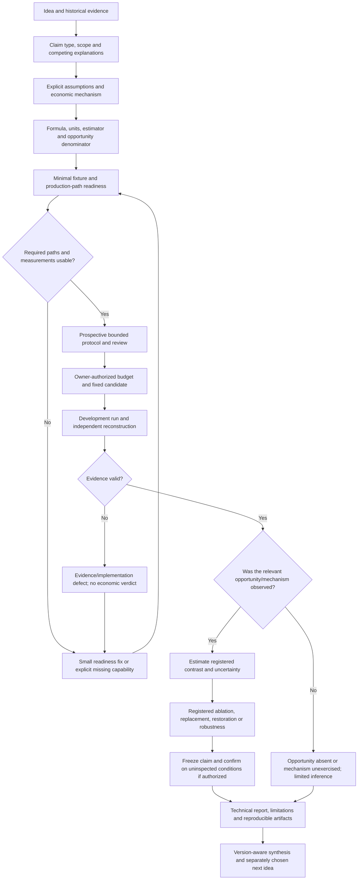

# One bounded research cycle

Start from the authoritative idea/protocol/report, not from an empty project.
Read consolidated navigation and disposition before following a historical ref.
Trace participant assumptions through decisions, execution, ledgers and market
effects to the opportunities of other participants. Capital feedback enters only
when its allocation/entry/exit rule is an explicit studied mechanism.

The opportunity branch is interpreted under the declared estimand. No trading
may be rational. Do not invalidate a well-observed no-action decision because
a desired intervention did not occur. An opportunity denominator may be absent,
unobservable, economically infeasible, or present with deliberate abstention.
Keep these explanations separate.

Identity fixtures need no holdouts; descriptive screens need no compulsory
restoration arm. Record N/A and why. A new gate cannot be invented after outcomes.

## Minimum intake

Identify predecessor sources and their strongest established claims.
List Policy, Actor, Deployment and Venue separately, with code/config links.
Specify the one question, competing explanations, intended claim class,
dependencies, opportunity denominator and authorized next action.
Label broad umbrella entries (for example ME-010) as requiring a named child
protocol before any run; they are not executable studies.

## Readiness and amendment

Follow effective configuration through production wiring and measurement.
Green unit tests alone do not prove that the configured path is exercised.
Fix only a concrete blocker within PREPARE authority. Keep economic choices
prospective. An analyzer correction may rescore immutable sufficient evidence;
a simulator change that may affect decisions requires a new trajectory under
separate authorization. Never repair historical trajectories offline.

Record invalid evidence, missing opportunities, valid economic nulls and
confounded designs differently. Retain the earlier result before amendments.
A real-data mismatch is a limitation, not automatic permission to recalibrate.

## Finite progression

Fixtures -> minimal counterpart environment -> two roles -> selected three-role
contrasts -> bounded ensemble -> separate institution/technology regimes ->
explicit adaptation and longer dynamics. This is a roadmap; proceed only to the
module needed for the current question. Do not run all combinations or import
every mechanism just because the platform implements it.
