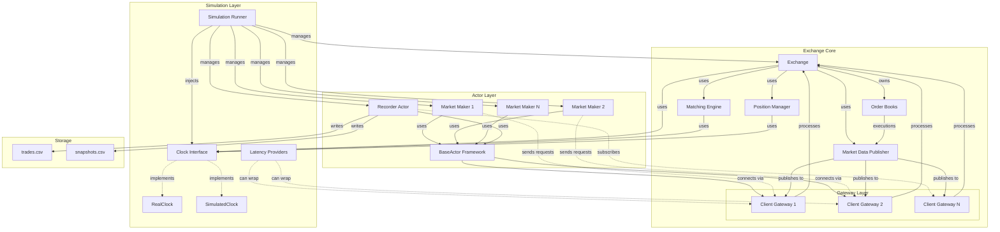
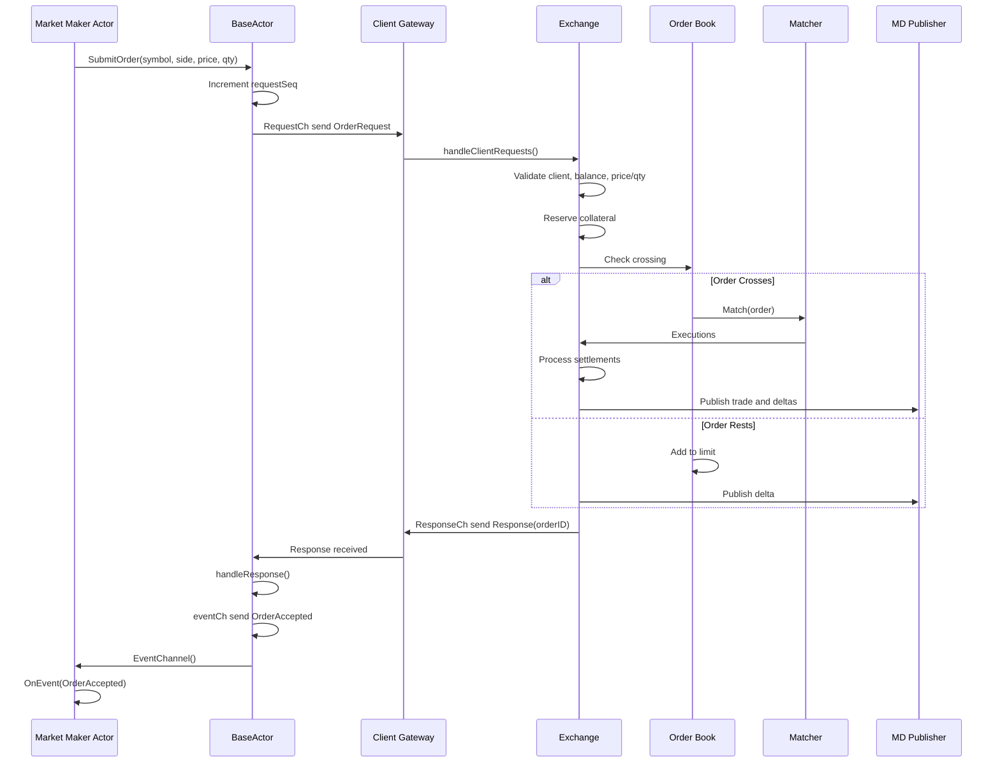
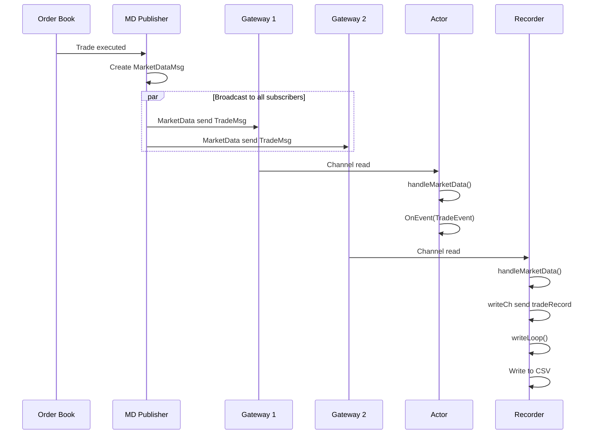
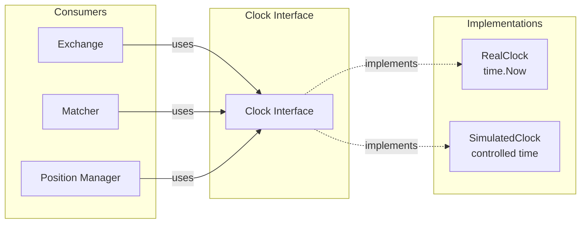
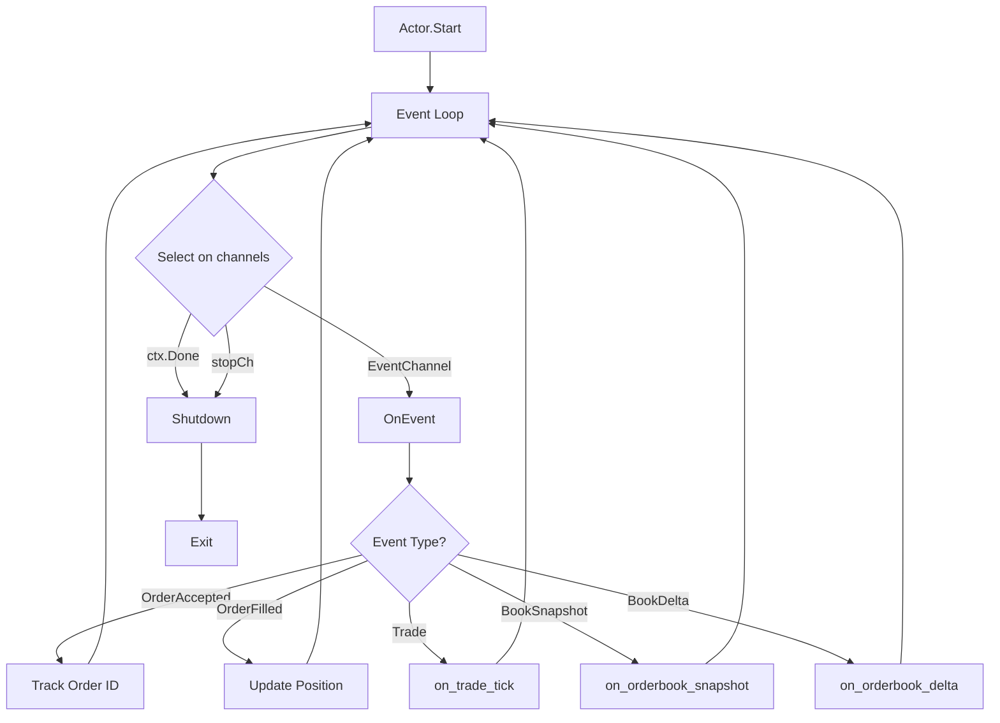
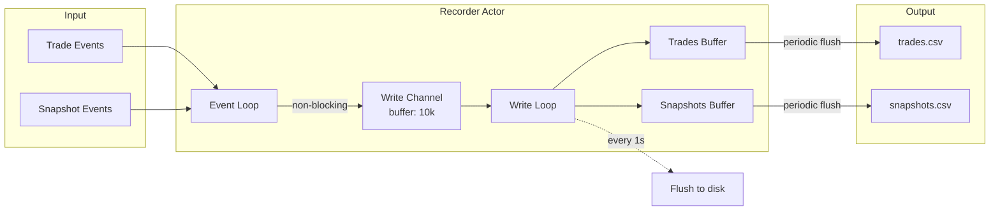
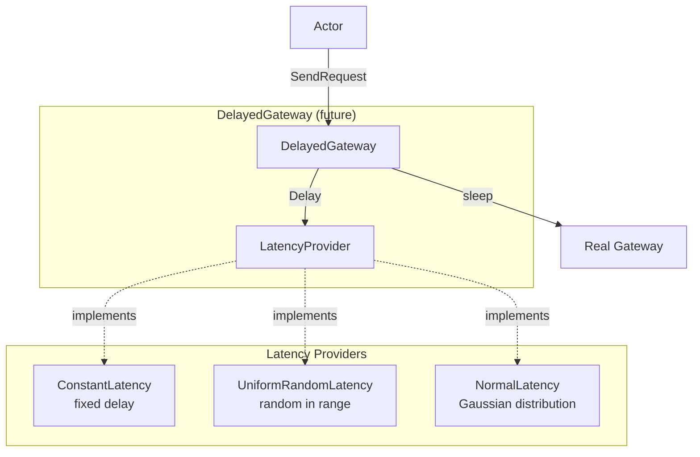

# Architecture Diagram

## System Overview



## Data Flow: Order Submission



## Data Flow: Market Data



## Clock Abstraction



## Actor Event Loop



## Recorder Actor Data Flow



## Latency Simulation



## Package Structure

```
exchange_simulation/
├── exchange/              # Core exchange (flat structure)
│   ├── types.go          # Enums, structs
│   ├── order.go          # Order linking
│   ├── book.go           # Order book
│   ├── matching.go       # Matching engine
│   ├── client.go         # Client accounts
│   ├── exchange.go       # Main exchange
│   ├── gateway.go        # Communication
│   ├── marketdata.go     # Market data pub
│   ├── funding.go        # Funding rates
│   ├── fee.go            # Fee models
│   ├── instrument.go     # Instruments
│   └── pools.go          # Object pools
│
├── actor/                # Actor framework
│   ├── events.go         # Event types
│   ├── actor.go          # BaseActor
│   ├── marketmaker.go    # Market maker
│   └── recorder.go       # Data recorder
│
├── simulation/           # Simulation infrastructure
│   ├── clock.go          # Clock abstraction
│   ├── latency.go        # Latency simulation
│   └── runner.go         # Simulation runner
│
└── cmd/sim/             # Entry point
    └── main.go
```

## Why Exchange Package Stayed Flat

Per the implementation plan:
> **Module Restructuring**: Current: 28 files flat in `exchange/`. Proposed: Keep flat for now, add new top-level directories.
>
> **Rationale**: Moving exchange files would break imports in 50+ tests. Not worth the disruption. New modules are cleanly separated.

Benefits of flat structure:
- ✅ Simple imports: `import "exchange_sim/exchange"`
- ✅ All tests work without changes
- ✅ No circular dependency issues
- ✅ Fast compilation (Go compiler optimizes flat packages)
- ✅ Easy navigation (all files in one place)

Alternative (if needed):
```
exchange/
├── core/        # Order, Book, Limit
├── matching/    # Matching engine
├── client/      # Client, Gateway
├── market/      # Instruments, Funding
└── pubsub/      # Market data
```

But this adds complexity without clear benefit for a simulation.
