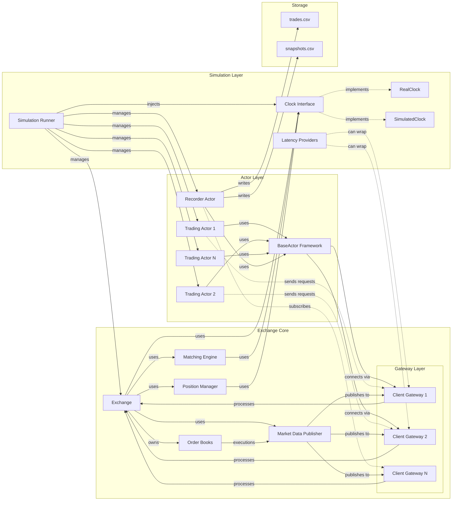
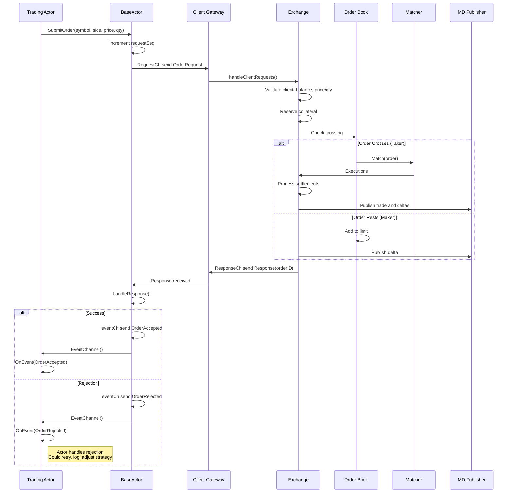
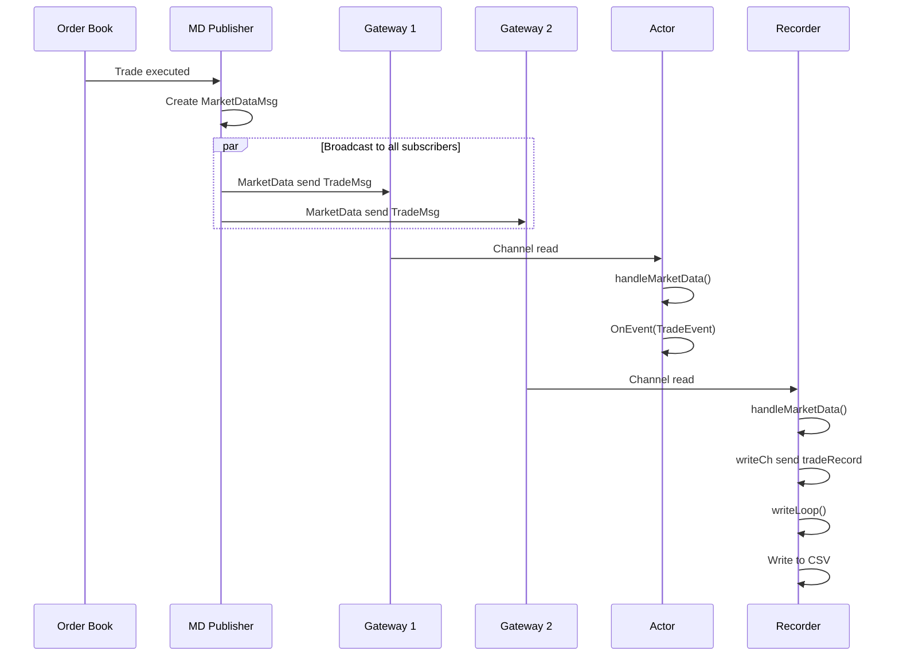
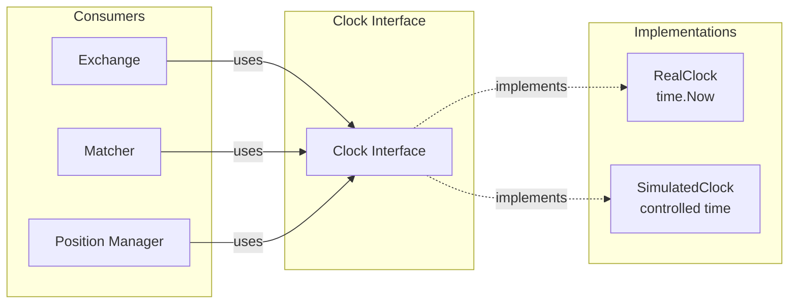
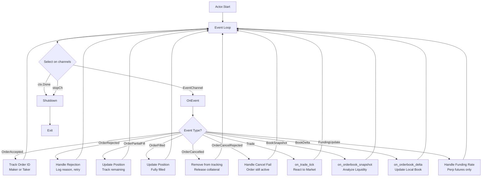
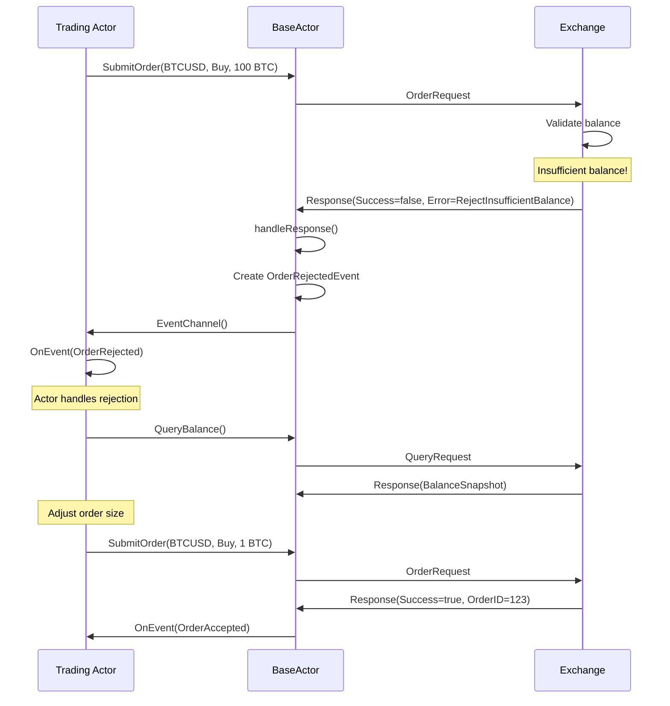
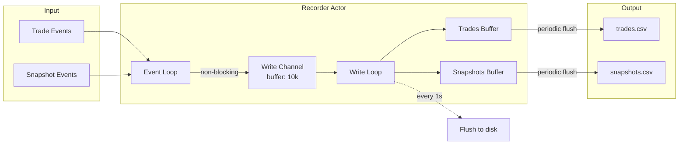
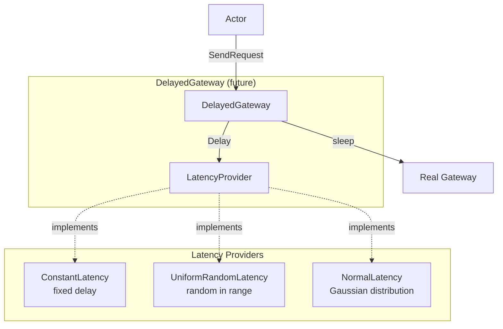

# Architecture Diagram

## System Overview



## Data Flow: Order Submission



## Data Flow: Market Data



## Clock Abstraction



## Actor Event Loop



### All Event Types (10 total)

**Order Lifecycle Events:**
1. `EventOrderAccepted` - Order placed successfully (returns OrderID)
2. `EventOrderRejected` - Order rejected (includes RejectReason)
3. `EventOrderPartialFill` - Order partially filled
4. `EventOrderFilled` - Order fully filled
5. `EventOrderCancelled` - Order cancelled successfully (includes remaining qty)
6. `EventOrderCancelRejected` - Cancel failed (includes RejectReason)

**Market Data Events:**
7. `EventTrade` - Trade executed on exchange
8. `EventBookDelta` - Orderbook level changed
9. `EventBookSnapshot` - Full orderbook snapshot

**Perp Futures Event:**
10. `EventFundingUpdate` - Funding rate updated

## Rejection Handling

### Order Rejection Reasons

When an order is rejected, actors receive `EventOrderRejected` with one of these reasons:

| Reject Reason | Code | Description | Actor Response |
|---------------|------|-------------|----------------|
| `RejectInsufficientBalance` | 0 | Not enough balance for order | Query balance, adjust size |
| `RejectInvalidPrice` | 1 | Price not multiple of tick size | Round to tick size, resubmit |
| `RejectInvalidQty` | 2 | Quantity below minimum | Increase qty or skip |
| `RejectUnknownClient` | 3 | Client ID not connected | Fatal error, reconnect |
| `RejectUnknownInstrument` | 4 | Symbol doesn't exist | Check ListInstruments() |
| `RejectSelfTrade` | 5 | Would match own order | Wait, adjust price |
| `RejectDuplicateOrderID` | 6 | OrderID collision (rare) | Retry |
| `RejectOrderNotFound` | 7 | Cancel failed - order doesn't exist | Already filled/cancelled |
| `RejectOrderNotOwned` | 8 | Cancel failed - not your order | Logic error |
| `RejectOrderAlreadyFilled` | 9 | Cancel failed - already filled | Order completed |

### Cancel Rejection Reasons

When a cancel request is rejected, actors receive `EventOrderCancelRejected`:

```go
type OrderCancelRejectedEvent struct {
    OrderID   uint64
    RequestID uint64
    Reason    exchange.RejectReason  // RejectOrderNotFound, RejectOrderNotOwned, RejectOrderAlreadyFilled
}
```

**Common scenarios:**
- `RejectOrderNotFound` - Order already filled or cancelled
- `RejectOrderNotOwned` - Logic error (trying to cancel someone else's order)
- `RejectOrderAlreadyFilled` - Order executed between cancel request and processing

### Example: Handling Rejections

```go
func (a *MyActor) OnEvent(event *Event) {
    switch event.Type {
    case EventOrderRejected:
        rejection := event.Data.(OrderRejectedEvent)

        switch rejection.Reason {
        case exchange.RejectInsufficientBalance:
            // Query balance, adjust position sizing
            a.QueryBalance()

        case exchange.RejectInvalidPrice:
            // Price not aligned to tick size
            // Recalculate and resubmit with proper rounding

        case exchange.RejectUnknownInstrument:
            // Symbol doesn't exist
            // Query available instruments
            instruments := a.exchange.ListInstruments("", "USD")

        case exchange.RejectSelfTrade:
            // Would cross our own order
            // Wait a bit, market will change

        default:
            // Log and move on
        }

    case EventOrderCancelRejected:
        rejection := event.Data.(OrderCancelRejectedEvent)

        switch rejection.Reason {
        case exchange.RejectOrderNotFound:
            // Order already gone (filled or cancelled)
            // Remove from local tracking

        case exchange.RejectOrderAlreadyFilled:
            // Order filled before cancel arrived
            // Update position, order completed successfully

        case exchange.RejectOrderNotOwned:
            // Logic error - trying to cancel wrong order
            // This should never happen, indicates bug
        }
    }
}
```

### Rejection Flow Diagram



## Recorder Actor Data Flow



## Latency Simulation



## Trading Actor Strategies

Actors are not limited to market making - they can implement any trading strategy:

### Actor Types

1. **Market Maker** (`actor/marketmaker.go`)
   - Provides liquidity on both sides
   - Places limit orders (maker)
   - Profits from bid-ask spread
   - Example: 2-sided quoting with configurable spread

2. **Taker Strategies** (extensible)
   - Consumes liquidity with market orders
   - Aggressive limit orders that cross the spread
   - Examples: momentum traders, arbitrageurs
   - React to market data events

3. **Mixed Strategies** (extensible)
   - Combine making and taking
   - Example: Place maker orders, occasionally take when opportunity arises
   - Adaptive strategies based on market conditions
   - Switch between making and taking based on signals

4. **Passive Actors**
   - Recorder actor (data collection)
   - Monitor-only actors
   - Risk management actors

### Strategy Implementation

All actors inherit from `BaseActor` and implement their strategy in `OnEvent`:

```go
type MyTakerActor struct {
    *BaseActor
    targetPrice int64
}

func (a *MyTakerActor) OnEvent(event *Event) {
    switch event.Type {
    case EventBookSnapshot:
        snap := event.Data.(BookSnapshotEvent)
        if len(snap.Snapshot.Asks) > 0 {
            bestAsk := snap.Snapshot.Asks[0].Price
            if bestAsk <= a.targetPrice {
                // Aggressive taker: use market order
                a.SubmitOrder(snap.Symbol, exchange.Buy, exchange.Market, 0, qty)
            }
        }
    case EventTrade:
        // React to market trades
        // Adjust strategy based on market direction
    }
}
```

### Maker vs Taker

- **Maker**: Order rests on book, provides liquidity, gets maker fee (lower/rebate)
- **Taker**: Order crosses spread immediately, removes liquidity, pays taker fee (higher)
- **Mixed**: Strategy determines when to make vs take based on signals

The exchange doesn't distinguish actor types - all actors can submit any order type and the matching engine determines if they're maker or taker based on order behavior.

## Package Structure

```
exchange_simulation/
├── exchange/              # Core exchange (flat structure)
│   ├── types.go          # Enums, structs
│   ├── order.go          # Order linking
│   ├── book.go           # Order book
│   ├── matching.go       # Matching engine
│   ├── client.go         # Client accounts
│   ├── exchange.go       # Main exchange
│   ├── gateway.go        # Communication
│   ├── marketdata.go     # Market data pub
│   ├── funding.go        # Funding rates
│   ├── fee.go            # Fee models
│   ├── instrument.go     # Instruments
│   └── pools.go          # Object pools
│
├── actor/                # Actor framework
│   ├── events.go         # Event types
│   ├── actor.go          # BaseActor
│   ├── marketmaker.go    # Market maker
│   └── recorder.go       # Data recorder
│
├── simulation/           # Simulation infrastructure
│   ├── clock.go          # Clock abstraction
│   ├── latency.go        # Latency simulation
│   └── runner.go         # Simulation runner
│
└── cmd/sim/             # Entry point
    └── main.go
```

## Why Exchange Package Stayed Flat

Per the implementation plan:
> **Module Restructuring**: Current: 28 files flat in `exchange/`. Proposed: Keep flat for now, add new top-level directories.
>
> **Rationale**: Moving exchange files would break imports in 50+ tests. Not worth the disruption. New modules are cleanly separated.

Benefits of flat structure:
- ✅ Simple imports: `import "exchange_sim/exchange"`
- ✅ All tests work without changes
- ✅ No circular dependency issues
- ✅ Fast compilation (Go compiler optimizes flat packages)
- ✅ Easy navigation (all files in one place)

Alternative (if needed):
```
exchange/
├── core/        # Order, Book, Limit
├── matching/    # Matching engine
├── client/      # Client, Gateway
├── market/      # Instruments, Funding
└── pubsub/      # Market data
```

But this adds complexity without clear benefit for a simulation.
