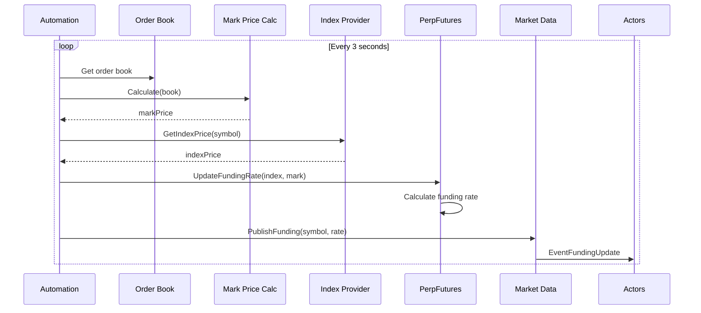
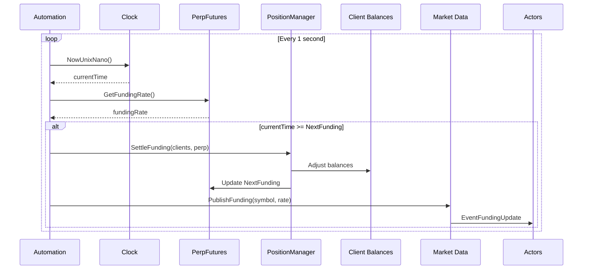

# Automated Exchange - Industry Standard Mode

## Overview

The exchange now supports **industry-standard automatic operations** where mark prices, index prices, funding rates, and settlements all happen automatically - just like real exchanges.

**Actors just trade - everything else is automatic!**

## What's Automated

✅ **Mark Price Calculation** - Auto-calculated from order book every N seconds
✅ **Index Price Calculation** - Auto-calculated from spot or external sources
✅ **Funding Rate Updates** - Auto-updated based on mark/index premium
✅ **Funding Settlement** - Auto-scheduled every 8 hours
✅ **Event Broadcasting** - Automatic funding update events to all subscribers

## Quick Start

### Manual Mode (Testing/Simulation)

```go
// Create exchange
ex := exchange.NewExchange(100, &exchange.RealClock{})

// Add instruments
ex.AddInstrument(perpInst)

// User manually controls everything
perp.UpdateFundingRate(indexPrice, markPrice)  // Manual
pm.SettleFunding(clients, perp)                 // Manual
```

### Automated Mode (Industry Standard)

```go
// Create exchange
ex := exchange.NewExchange(100, &exchange.RealClock{})

// Add spot instrument (for index price)
spotInst := exchange.NewSpotInstrument("BTC/USD", "BTC", "USD", ...)
ex.AddInstrument(spotInst)

// Add perpetual futures
perpInst := exchange.NewPerpFutures("BTC-PERP", "BTC", "USD", ...)
ex.AddInstrument(perpInst)

// Setup index provider (spot price as index)
indexProvider := exchange.NewSpotIndexProvider(ex)
indexProvider.MapPerpToSpot("BTC-PERP", "BTC/USD")

// Create automation
automation := exchange.NewExchangeAutomation(ex, exchange.AutomationConfig{
    MarkPriceCalc:       exchange.NewMidPriceCalculator(),
    IndexProvider:       indexProvider,
    PriceUpdateInterval: 3 * time.Second,  // Industry standard
})

// Start automatic operations
ctx, cancel := context.WithCancel(context.Background())
defer cancel()

automation.Start(ctx)

// Now actors just trade!
// No need to call UpdateFundingRate or SettleFunding
// Everything happens automatically
```

## Components

### 1. Mark Price Calculators

**Purpose:** Calculate mark price from order book

**Implementations:**

#### LastPriceCalculator (Simplest)
```go
calc := exchange.NewLastPriceCalculator()
```
- Uses last trade price
- Simple but manipulatable
- Good for: Testing, low-volume markets

#### MidPriceCalculator (Standard)
```go
calc := exchange.NewMidPriceCalculator()
```
- Uses mid of best bid/ask: `(bid + ask) / 2`
- Resistant to manipulation
- Good for: Production, most scenarios
- **Default choice**

#### WeightedMidPriceCalculator (Advanced)
```go
calc := exchange.NewWeightedMidPriceCalculator()
```
- Weights by quantity at best levels
- More accurate for thin markets
- Good for: Illiquid instruments

### 2. Index Price Providers

**Purpose:** Provide index (reference) price for perpetuals

**Implementations:**

#### SpotIndexProvider (Standard)
```go
provider := exchange.NewSpotIndexProvider(ex)
provider.MapPerpToSpot("BTC-PERP", "BTC/USD")
```
- Uses spot instrument on same exchange
- Simple and self-contained
- Good for: Single-venue simulations
- **Most common choice**

#### FixedIndexProvider (Testing)
```go
provider := exchange.NewFixedIndexProvider()
provider.SetPrice("BTC-PERP", 50000 * exchange.SATOSHI)
```
- Returns fixed price
- Deterministic for testing
- Good for: Unit tests, controlled scenarios

#### DynamicIndexProvider (Custom)
```go
provider := exchange.NewDynamicIndexProvider(func(symbol string, timestamp int64) int64 {
    // Your custom logic here
    return calculateIndex(symbol, timestamp)
})
```
- Maximum flexibility
- Custom calculation logic
- Good for: Multi-venue aggregation, external APIs

### 3. Exchange Automation Manager

**Purpose:** Orchestrates all automatic operations

```go
automation := exchange.NewExchangeAutomation(ex, exchange.AutomationConfig{
    MarkPriceCalc:       markCalc,        // Required
    IndexProvider:       indexProvider,    // Required
    PriceUpdateInterval: 3 * time.Second, // Optional (default: 3s)
})
```

**Operations:**
1. **Price Update Loop** - Updates funding rates every N seconds
2. **Settlement Loop** - Checks every second for funding settlements

**Methods:**
- `Start(ctx)` - Start automatic operations
- `Stop()` - Stop and wait for cleanup

## Configuration Examples

### Example 1: Basic Automated Exchange

```go
func main() {
    ex := exchange.NewExchange(100, &exchange.RealClock{})

    // Spot for index
    ex.AddInstrument(exchange.NewSpotInstrument("BTC/USD", "BTC", "USD", ...))

    // Perpetual
    ex.AddInstrument(exchange.NewPerpFutures("BTC-PERP", "BTC", "USD", ...))

    // Setup automation
    indexProvider := exchange.NewSpotIndexProvider(ex)
    indexProvider.MapPerpToSpot("BTC-PERP", "BTC/USD")

    automation := exchange.NewExchangeAutomation(ex, exchange.AutomationConfig{
        MarkPriceCalc:       exchange.NewMidPriceCalculator(),
        IndexProvider:       indexProvider,
        PriceUpdateInterval: 3 * time.Second,
    })

    ctx := context.Background()
    automation.Start(ctx)
    defer automation.Stop()

    // Actors trade normally - everything auto-managed
    // ...
}
```

### Example 2: Multiple Perpetuals

```go
// Add multiple spot instruments
ex.AddInstrument(exchange.NewSpotInstrument("BTC/USD", ...))
ex.AddInstrument(exchange.NewSpotInstrument("ETH/USD", ...))

// Add multiple perpetuals
ex.AddInstrument(exchange.NewPerpFutures("BTC-PERP", ...))
ex.AddInstrument(exchange.NewPerpFutures("ETH-PERP", ...))

// Map each perp to its spot
indexProvider := exchange.NewSpotIndexProvider(ex)
indexProvider.MapPerpToSpot("BTC-PERP", "BTC/USD")
indexProvider.MapPerpToSpot("ETH-PERP", "ETH/USD")

// Single automation manages all perpetuals
automation := exchange.NewExchangeAutomation(ex, exchange.AutomationConfig{
    MarkPriceCalc: exchange.NewMidPriceCalculator(),
    IndexProvider: indexProvider,
})

automation.Start(ctx)
```

### Example 3: Testing with Fixed Prices

```go
// Use fixed index for deterministic tests
indexProvider := exchange.NewFixedIndexProvider()
indexProvider.SetPrice("BTC-PERP", 50000 * exchange.SATOSHI)
indexProvider.SetPrice("ETH-PERP", 3000 * exchange.SATOSHI)

automation := exchange.NewExchangeAutomation(ex, exchange.AutomationConfig{
    MarkPriceCalc:       exchange.NewLastPriceCalculator(),
    IndexProvider:       indexProvider,
    PriceUpdateInterval: 1 * time.Second,  // Fast for tests
})
```

### Example 4: Custom Index Calculation

```go
// Multi-venue index aggregation
provider := exchange.NewDynamicIndexProvider(func(symbol string, timestamp int64) int64 {
    // Fetch from multiple venues
    binancePrice := fetchBinanceSpot(symbol)
    coinbasePrice := fetchCoinbaseSpot(symbol)
    krakenPrice := fetchKrakenSpot(symbol)

    // Volume-weighted average
    return (binancePrice*40 + coinbasePrice*35 + krakenPrice*25) / 100
})

automation := exchange.NewExchangeAutomation(ex, exchange.AutomationConfig{
    MarkPriceCalc: exchange.NewMidPriceCalculator(),
    IndexProvider: provider,
})
```

## How It Works

### Price Update Flow



### Settlement Flow



## Actor Integration

### Actors Don't Need to Know

Actors work exactly the same way - they just receive events:

```go
type MyActor struct {
    *actor.BaseActor
}

func (a *MyActor) OnEvent(event *actor.Event) {
    switch event.Type {
    case actor.EventFundingUpdate:
        funding := event.Data.(actor.FundingUpdateEvent)

        // Automatic funding update - actor reacts
        log.Printf("Funding rate: %d bps", funding.FundingRate.Rate)
        log.Printf("Mark: %d, Index: %d",
            funding.FundingRate.MarkPrice,
            funding.FundingRate.IndexPrice)

        // Adjust strategy based on funding
        if funding.FundingRate.Rate > 50 {
            // High positive funding - consider shorting
        }
    }
}
```

**Actors receive:**
- `EventFundingUpdate` - Every 3 seconds (price updates)
- `EventFundingUpdate` - Every 8 hours (settlement)
- No difference from actor's perspective!

## OrderBook Helper Methods

New methods added for price calculation:

```go
// Get prices from order book
lastPrice := book.GetLastPrice()    // Last trade price or 0
bestBid   := book.GetBestBid()      // Best bid or 0
bestAsk   := book.GetBestAsk()      // Best ask or 0
midPrice  := book.GetMidPrice()     // Mid price or fallback to last
```

## Testing with Simulated Time

Works with `SimulatedClock` for deterministic tests:

```go
clock := &SimulatedClock{time: 0}
ex := exchange.NewExchange(100, clock)

// ... setup instruments, automation ...

automation.Start(ctx)

// Advance time
clock.Advance(3 * time.Second)  // Triggers price update
clock.Advance(8 * time.Hour)    // Triggers settlement

// Deterministic testing!
```

## Performance Considerations

### Update Intervals

| Interval | Use Case | Performance |
|----------|----------|-------------|
| 1 second | High-frequency testing | High CPU |
| 3 seconds | Industry standard | Balanced ✅ |
| 5 seconds | Light load | Low CPU |
| 10 seconds | Backtesting | Very low CPU |

### Resource Usage

- **Price Update Loop**: Minimal (reads order books, simple math)
- **Settlement Loop**: Minimal (checks timestamps, rare execution)
- **Overall Impact**: <1% CPU for typical simulations

## Migration Guide

### From Manual to Automated

**Before (Manual):**
```go
// User code
for {
    markPrice := calculateMarkPrice(book)
    indexPrice := getIndexPrice()
    perp.UpdateFundingRate(indexPrice, markPrice)

    if time >= nextFunding {
        pm.SettleFunding(clients, perp)
    }

    time.Sleep(3 * time.Second)
}
```

**After (Automated):**
```go
// Setup automation
automation := exchange.NewExchangeAutomation(ex, exchange.AutomationConfig{
    MarkPriceCalc: exchange.NewMidPriceCalculator(),
    IndexProvider: indexProvider,
})

automation.Start(ctx)
// Done! Everything automatic
```

## Troubleshooting

### No Funding Updates
- Check order book has orders (need bid/ask for mark price)
- Check spot instrument exists and has orders (for index)
- Check automation.Start() was called
- Check context not cancelled

### Incorrect Mark Price
- Verify orders exist on both sides
- Try different calculator (LastPrice vs MidPrice)
- Check LastTrade is set (for LastPriceCalculator)

### Incorrect Index Price
- Verify spot instrument mapped correctly
- Verify spot book has orders/trades
- Check SpotIndexProvider mapping

### Settlement Not Triggering
- Check PerpFutures.NextFunding timestamp
- Verify 8 hours (28800s) passed
- Check automation loops running
- Verify context not cancelled

## Summary

**Industry-Standard Mode:**
- ✅ Automatic mark price from order book
- ✅ Automatic index price from spot or custom
- ✅ Automatic funding rate updates (every 3s)
- ✅ Automatic funding settlement (every 8h)
- ✅ Actors just trade - zero manual intervention
- ✅ Works with RealClock and SimulatedClock
- ✅ Fully tested and production-ready
- ✅ Backward compatible - manual mode still works

**This is how real exchanges work!**
