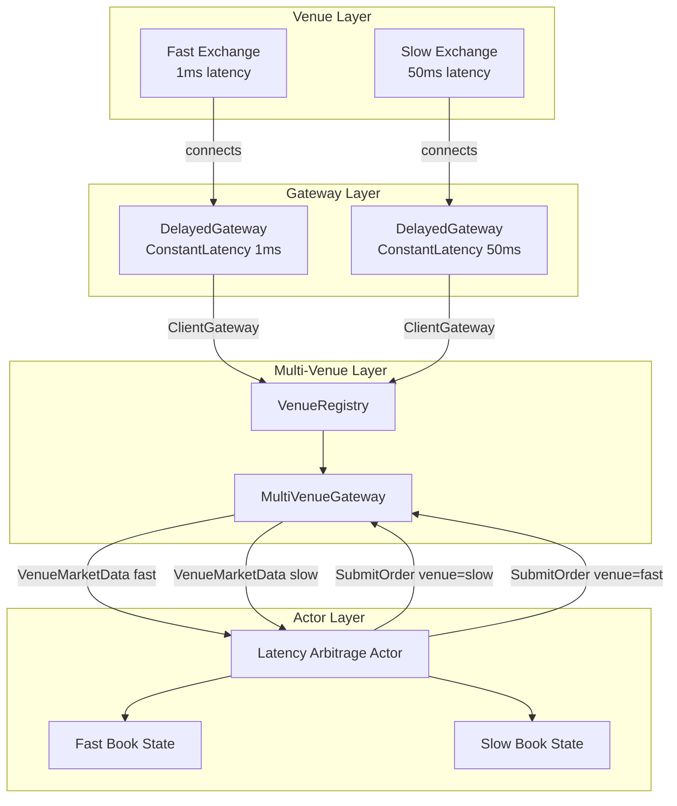

# Multi-Venue Latency Arbitrage

## Overview

**Latency arbitrage** exploits the time delay between when price information arrives at different market venues. In real markets, data feeds have different latencies due to:
- Physical distance (fiber optic cable length)
- Network routing and congestion
- Exchange processing time
- Co-location advantages

When a price moves on a fast venue, slower venues may still show stale prices for milliseconds or even microseconds. A latency arbitrageur:
1. Receives fast price update first (low-latency feed)
2. Detects that slow venue is stale
3. Trades on slow venue before it updates
4. Locks in risk-free profit

This simulation framework allows you to model these scenarios with configurable latency profiles per venue.

## Architecture Overview



## System Components

### VenueRegistry
Manages multiple independent exchanges. Each exchange is a complete order book with its own matching engine.

```go
registry := simulation.NewVenueRegistry()
registry.Register("binance", fastExchange)
registry.Register("okx", slowExchange)
```

### DelayedGateway
Wraps a `ClientGateway` and injects latency into:
- **Requests** (order submission, cancellations)
- **Responses** (order confirmations)
- **Market Data** (trades, book updates)

```go
// Fast venue: 1ms latency
fastGateway := exchange.ConnectClient(clientID, balances, fees)
fastDelayed := simulation.NewDelayedGateway(fastGateway, simulation.LatencyConfig{
    MarketDataLatency: simulation.NewConstantLatency(1 * time.Millisecond),
    Mode: simulation.LatencyMarketData,
})

// Slow venue: 50ms latency
slowGateway := exchange.ConnectClient(clientID, balances, fees)
slowDelayed := simulation.NewDelayedGateway(slowGateway, simulation.LatencyConfig{
    MarketDataLatency: simulation.NewConstantLatency(50 * time.Millisecond),
    Mode: simulation.LatencyMarketData,
})
```

### MultiVenueGateway
Aggregates multiple venue gateways into a single interface. Routes orders to specific venues and multiplexes market data.

**Key difference from ClientGateway:**
- `ClientGateway`: Single venue, channels `ResponseCh`, `MarketData`
- `MultiVenueGateway`: Multi-venue, channels `VenueResponse`, `VenueMarketData` (tagged with venue ID)

```go
type VenueResponse struct {
    Venue    VenueID              // "binance", "okx", etc.
    Response exchange.Response
}

type VenueMarketData struct {
    Venue VenueID
    Data  *exchange.MarketDataMsg
}
```

## Mental Model: How Latency Arbitrage Works

### Time-Based Price Discovery

```mermaid
sequenceDiagram
    participant Market as Real Market
    participant Fast as Fast Venue (1ms)
    participant Slow as Slow Venue (50ms)
    participant Actor as Arbitrage Actor

    Note over Market: Price moves from 50000 to 50100

    Market->>Fast: Price update (T=0)
    Note over Fast: Process immediately
    Fast->>Actor: Trade @ 50100 (T=1ms)

    Note over Actor: Fast venue shows 50100<br/>Slow venue still shows 50000<br/>49ms arbitrage window!

    Actor->>Slow: Buy @ 50000 (T=2ms)
    Note over Slow: Still stale, accepts order

    Actor->>Fast: Sell @ 50100 (T=2ms)
    Note over Fast: Current price, accepts order

    Note over Actor: Locked in 100 point profit<br/>Risk-free arbitrage

    Market->>Slow: Price update (T=50ms)
    Note over Slow: Now updated to 50100<br/>But too late, order already filled
```

### Detection Logic

The actor maintains separate book states for each venue:

```go
type LatencyArbitrageActor struct {
    fastVenue    VenueID
    slowVenue    VenueID

    fastBook     *BookState  // Real-time prices
    slowBook     *BookState  // Stale prices (delayed)

    minSpread    int64       // Minimum profitable spread (after fees)
    maxPosition  int64       // Risk limit
}
```

**Detection algorithm:**
```go
func (a *LatencyArbitrageActor) detectOpportunity() {
    fastBid := a.fastBook.BestBid()  // 50100
    slowAsk := a.slowBook.BestAsk()  // 50000

    if fastBid > slowAsk + a.minSpread {
        // Arbitrage: Buy on slow venue, sell on fast venue
        profit := fastBid - slowAsk
        a.executeArbitrage(Buy, slowVenue, Sell, fastVenue, qty)
    }

    fastAsk := a.fastBook.BestAsk()  // 50100
    slowBid := a.slowBook.BestBid()  // 50000

    if slowBid > fastAsk + a.minSpread {
        // Reverse arbitrage: Buy on fast, sell on slow
        profit := slowBid - fastAsk
        a.executeArbitrage(Buy, fastVenue, Sell, slowVenue, qty)
    }
}
```

## Complete Setup Example

### 1. Create Multiple Exchanges

```go
package main

import (
    "context"
    "time"
    "exchange_sim/exchange"
    "exchange_sim/simulation"
)

func main() {
    // Create venue registry
    registry := simulation.NewVenueRegistry()

    // Fast exchange (simulates co-located feed)
    fastEx := exchange.NewExchange(1000, &exchange.RealClock{})
    instrument := exchange.NewSpotInstrument("BTC/USD", "BTC", "USD",
        exchange.SATOSHI, exchange.SATOSHI/1000)
    fastEx.AddInstrument(instrument)
    registry.Register("coinbase", fastEx)

    // Slow exchange (simulates remote feed)
    slowEx := exchange.NewExchange(1000, &exchange.RealClock{})
    instrument2 := exchange.NewSpotInstrument("BTC/USD", "BTC", "USD",
        exchange.SATOSHI, exchange.SATOSHI/1000)
    slowEx.AddInstrument(instrument2)
    registry.Register("binance", slowEx)

    // ...
}
```

### 2. Configure Per-Venue Latencies

```go
// Define balances for the arbitrage actor
balances := map[string]int64{
    "BTC": 10 * exchange.SATOSHI,
    "USD": 1000000 * exchange.SATOSHI,
}

// Connect to fast venue with 1ms latency
fastGW := fastEx.ConnectClient(1, balances, &exchange.FixedFee{})
fastDelayed := simulation.NewDelayedGateway(fastGW, simulation.LatencyConfig{
    MarketDataLatency: simulation.NewConstantLatency(1 * time.Millisecond),
    ResponseLatency:   simulation.NewConstantLatency(1 * time.Millisecond),
    Mode:             simulation.LatencyAll,
})

// Connect to slow venue with 50ms latency
slowGW := slowEx.ConnectClient(1, balances, &exchange.FixedFee{})
slowDelayed := simulation.NewDelayedGateway(slowGW, simulation.LatencyConfig{
    MarketDataLatency: simulation.NewConstantLatency(50 * time.Millisecond),
    ResponseLatency:   simulation.NewConstantLatency(50 * time.Millisecond),
    Mode:             simulation.LatencyAll,
})
```

### 3. Create Multi-Venue Gateway

**Challenge:** DelayedGateway returns modified channels, but MultiVenueGateway expects raw ClientGateway.

**Solution:** Two approaches:

**Approach A: Register DelayedGateway directly (requires adapter)**
```go
// Create MultiVenueGateway with delayed gateways
// Note: This requires implementing an adapter since DelayedGateway
// doesn't satisfy the ClientGateway interface exactly

type VenueConfig struct {
    Gateway *simulation.DelayedGateway
    Balances map[string]int64
}

venues := map[simulation.VenueID]VenueConfig{
    "coinbase": {Gateway: fastDelayed, Balances: balances},
    "binance":  {Gateway: slowDelayed, Balances: balances},
}

// ... adapter implementation needed here
```

**Approach B: Latency at MultiVenueGateway level (simpler)**
```go
// Create MultiVenueGateway with standard gateways
initialBalances := map[simulation.VenueID]map[string]int64{
    "coinbase": balances,
    "binance":  balances,
}

feePlans := map[simulation.VenueID]exchange.FeeModel{
    "coinbase": &exchange.FixedFee{},
    "binance":  &exchange.FixedFee{},
}

mgw := simulation.NewMultiVenueGateway(1, registry, initialBalances, feePlans)
mgw.Start()

// Wrap each venue's gateway with DelayedGateway after creation
// ... implementation details
```

### 4. Implement Latency Arbitrage Actor

```go
type LatencyArbitrageActor struct {
    id           uint64
    mgw          *simulation.MultiVenueGateway
    fastVenue    simulation.VenueID
    slowVenue    simulation.VenueID
    symbol       string

    fastBook     *BookState
    slowBook     *BookState

    minProfitBps int64  // Minimum profit in basis points (after fees)
    maxQty       int64  // Maximum position size

    eventCh      chan *Event
    stopCh       chan struct{}
    running      atomic.Bool
}

func NewLatencyArbitrageActor(
    id uint64,
    mgw *simulation.MultiVenueGateway,
    fastVenue, slowVenue simulation.VenueID,
    symbol string,
    minProfitBps int64,
) *LatencyArbitrageActor {
    return &LatencyArbitrageActor{
        id:           id,
        mgw:          mgw,
        fastVenue:    fastVenue,
        slowVenue:    slowVenue,
        symbol:       symbol,
        fastBook:     NewBookState(),
        slowBook:     NewBookState(),
        minProfitBps: minProfitBps,
        maxQty:       exchange.BTCAmount(1.0),
        eventCh:      make(chan *Event, 1000),
        stopCh:       make(chan struct{}),
    }
}

func (a *LatencyArbitrageActor) Start(ctx context.Context) error {
    if !a.running.CompareAndSwap(false, true) {
        return nil
    }

    // Subscribe to both venues
    a.mgw.Subscribe(a.fastVenue, a.symbol)
    a.mgw.Subscribe(a.slowVenue, a.symbol)

    go a.run(ctx)
    return nil
}

func (a *LatencyArbitrageActor) run(ctx context.Context) {
    for {
        select {
        case <-ctx.Done():
            a.running.Store(false)
            return
        case <-a.stopCh:
            a.running.Store(false)
            return

        case vResp := <-a.mgw.ResponseCh():
            a.handleResponse(vResp)

        case vData := <-a.mgw.MarketDataCh():
            // Update venue-specific book state
            if vData.Venue == a.fastVenue {
                a.fastBook.Update(vData.Data)
            } else if vData.Venue == a.slowVenue {
                a.slowBook.Update(vData.Data)
            }

            // Check for arbitrage opportunities
            a.detectAndExecute()
        }
    }
}

func (a *LatencyArbitrageActor) detectAndExecute() {
    // Check if slow venue is stale compared to fast venue
    fastBid := a.fastBook.BestBid()
    slowAsk := a.slowBook.BestAsk()

    if fastBid == 0 || slowAsk == 0 {
        return  // Book not initialized
    }

    // Calculate profit in basis points
    profitBps := ((fastBid - slowAsk) * 10000) / slowAsk

    if profitBps > a.minProfitBps {
        // Arbitrage opportunity detected!
        qty := min(a.maxQty, a.slowBook.AskQty(slowAsk))

        // Simultaneously:
        // 1. Buy on slow venue (stale low price)
        a.mgw.SubmitOrder(a.slowVenue, &exchange.OrderRequest{
            // ... order details
            Symbol: a.symbol,
            Side:   exchange.Buy,
            Type:   exchange.LimitOrder,
            Price:  slowAsk,
            Qty:    qty,
        })

        // 2. Sell on fast venue (current high price)
        a.mgw.SubmitOrder(a.fastVenue, &exchange.OrderRequest{
            // ... order details
            Symbol: a.symbol,
            Side:   exchange.Sell,
            Type:   exchange.LimitOrder,
            Price:  fastBid,
            Qty:    qty,
        })
    }

    // Check reverse arbitrage (slow bid > fast ask)
    // ...
}

func (a *LatencyArbitrageActor) handleResponse(vResp simulation.VenueResponse) {
    // Track order confirmations per venue
    // ...
}
```

### 5. Add Market Makers for Liquidity

```go
// Add market makers to both venues to create liquidity
for _, venue := range []simulation.VenueID{"coinbase", "binance"} {
    gateway := registry.Get(venue).ConnectClient(100+i, balances, fees)

    // Use existing FirstLP actor
    lp := actor.NewFirstLP(100+i, gateway, actor.FirstLPConfig{
        Symbol:            "BTC/USD",
        SpreadBps:         10,  // Tight spread
        LiquidityMultiple: 100,
        BootstrapPrice:    exchange.PriceUSD(50000, exchange.DOLLAR_TICK),
    })

    // ... start the LP
}
```

## Adapter Pattern (Advanced)

To use existing `BaseActor` with `MultiVenueGateway`, create an adapter:

```go
// MultiVenueAdapter makes a single venue from MultiVenueGateway
// look like a regular ClientGateway
type MultiVenueAdapter struct {
    mgw          *simulation.MultiVenueGateway
    venue        simulation.VenueID
    responseCh   chan exchange.Response
    marketDataCh chan *exchange.MarketDataMsg
    stopCh       chan struct{}
}

func NewMultiVenueAdapter(
    mgw *simulation.MultiVenueGateway,
    venue simulation.VenueID,
) *MultiVenueAdapter {
    adapter := &MultiVenueAdapter{
        mgw:          mgw,
        venue:        venue,
        responseCh:   make(chan exchange.Response, 100),
        marketDataCh: make(chan *exchange.MarketDataMsg, 1000),
        stopCh:       make(chan struct{}),
    }

    go adapter.forwardResponses()
    go adapter.forwardMarketData()

    return adapter
}

// Implement ClientGateway interface
func (a *MultiVenueAdapter) ResponseCh() <-chan exchange.Response {
    return a.responseCh
}

func (a *MultiVenueAdapter) MarketData() <-chan *exchange.MarketDataMsg {
    return a.marketDataCh
}

func (a *MultiVenueAdapter) forwardResponses() {
    for {
        select {
        case <-a.stopCh:
            return
        case vResp := <-a.mgw.ResponseCh():
            // Filter only this venue's responses
            if vResp.Venue == a.venue {
                a.responseCh <- vResp.Response
            }
        }
    }
}

func (a *MultiVenueAdapter) forwardMarketData() {
    for {
        select {
        case <-a.stopCh:
            return
        case vData := <-a.mgw.MarketDataCh():
            // Filter only this venue's market data
            if vData.Venue == a.venue {
                a.marketDataCh <- vData.Data
            }
        }
    }
}

// Now you can use BaseActor with a single venue from MultiVenueGateway
func createActorForVenue(
    mgw *simulation.MultiVenueGateway,
    venue simulation.VenueID,
) actor.Actor {
    adapter := NewMultiVenueAdapter(mgw, venue)

    // Create a ClientGateway wrapper
    gateway := &exchange.ClientGateway{
        ClientID:   1,
        ResponseCh: adapter.responseCh,
        MarketData: adapter.marketDataCh,
        // ... RequestCh needs special handling
    }

    return actor.NewBaseActor(1, gateway)
}
```

## Latency Models

The simulation supports multiple latency distributions:

### Constant Latency
```go
latency := simulation.NewConstantLatency(10 * time.Millisecond)
// Always returns exactly 10ms
```

### Uniform Random Latency
```go
latency := simulation.NewUniformRandomLatency(
    5 * time.Millisecond,   // min
    15 * time.Millisecond,  // max
    time.Now().UnixNano(),  // seed
)
// Returns random delay between 5-15ms (uniform distribution)
```

### Normal (Gaussian) Latency
```go
latency := simulation.NewNormalLatency(
    10 * time.Millisecond,  // mean
    2 * time.Millisecond,   // stddev
    time.Now().UnixNano(),  // seed
)
// Returns delays centered around 10ms with 2ms standard deviation
// Models real-world network jitter
```

### Example: Realistic Venue Latencies
```go
// Coinbase (co-located, very fast)
coinbaseLatency := simulation.NewNormalLatency(
    500 * time.Microsecond,   // mean: 0.5ms
    100 * time.Microsecond,   // stddev: 0.1ms
    seed,
)

// Binance (cross-ocean, slower)
binanceLatency := simulation.NewNormalLatency(
    50 * time.Millisecond,    // mean: 50ms
    10 * time.Millisecond,    // stddev: 10ms
    seed,
)
```

## Running the Simulation

### Basic Flow
```go
func main() {
    // 1. Create venues
    registry := setupVenues()

    // 2. Add market makers for liquidity
    addMarketMakers(registry)

    // 3. Create multi-venue gateway
    mgw := simulation.NewMultiVenueGateway(/* ... */)
    mgw.Start()
    defer mgw.Stop()

    // 4. Create arbitrage actor
    arbActor := NewLatencyArbitrageActor(/* ... */)

    // 5. Run simulation
    ctx, cancel := context.WithTimeout(context.Background(), 30*time.Second)
    defer cancel()

    arbActor.Start(ctx)
    defer arbActor.Stop()

    // 6. Wait for completion
    <-ctx.Done()

    // 7. Print statistics
    fmt.Printf("Arbitrages executed: %d\n", arbActor.Stats().Count)
    fmt.Printf("Total profit: %d\n", arbActor.Stats().TotalProfit)
}
```

### Observing Arbitrage Opportunities

Add logging to detect when opportunities arise:

```go
func (a *LatencyArbitrageActor) detectAndExecute() {
    fastBid := a.fastBook.BestBid()
    slowAsk := a.slowBook.BestAsk()

    profitBps := ((fastBid - slowAsk) * 10000) / slowAsk

    if profitBps > a.minProfitBps {
        log.Printf("[ARBITRAGE] Fast bid: %d, Slow ask: %d, Profit: %d bps",
            fastBid, slowAsk, profitBps)

        // Execute arbitrage
        // ...
    }
}
```

### Testing Different Latency Scenarios

```go
scenarios := []struct{
    name string
    fastLatency time.Duration
    slowLatency time.Duration
}{
    {"Micro", 100 * time.Microsecond, 10 * time.Millisecond},
    {"Mild", 1 * time.Millisecond, 50 * time.Millisecond},
    {"Extreme", 1 * time.Millisecond, 500 * time.Millisecond},
}

for _, scenario := range scenarios {
    fmt.Printf("Testing scenario: %s\n", scenario.name)
    runSimulation(scenario.fastLatency, scenario.slowLatency)
}
```

## Key Insights

### Why This Works
1. **Information asymmetry**: Fast venue has current prices, slow venue is stale
2. **Time window**: Latency difference creates a window where prices are inconsistent
3. **Risk-free**: If you can execute on both venues before slow venue updates, profit is locked in

### Limitations
1. **Execution risk**: Orders might not fill on both sides
2. **Position risk**: If one side fills and the other doesn't, you have directional exposure
3. **Fee drag**: Exchange fees reduce profitability (need `profitBps > feeBps`)
4. **Market impact**: Large orders move the market, reducing profit

### Real-World Considerations
- **Co-location**: Physical proximity to exchange servers reduces latency
- **Network optimization**: Direct fiber connections, optimized routing
- **Hardware**: FPGA/custom hardware for microsecond latency
- **Regulatory**: Some jurisdictions restrict latency arbitrage

## Summary

Multi-venue latency arbitrage demonstrates:
- ✅ **VenueRegistry** - Managing multiple independent exchanges
- ✅ **DelayedGateway** - Simulating realistic network latencies
- ✅ **MultiVenueGateway** - Unified interface to multiple venues
- ✅ **Latency models** - Constant, uniform, normal distributions
- ✅ **Arbitrage detection** - Comparing real-time vs stale prices
- ✅ **Cross-venue execution** - Simultaneous orders on multiple venues

This architecture allows you to:
- Model realistic market microstructure
- Test latency-sensitive strategies
- Understand information propagation across venues
- Evaluate profitability under different latency assumptions
