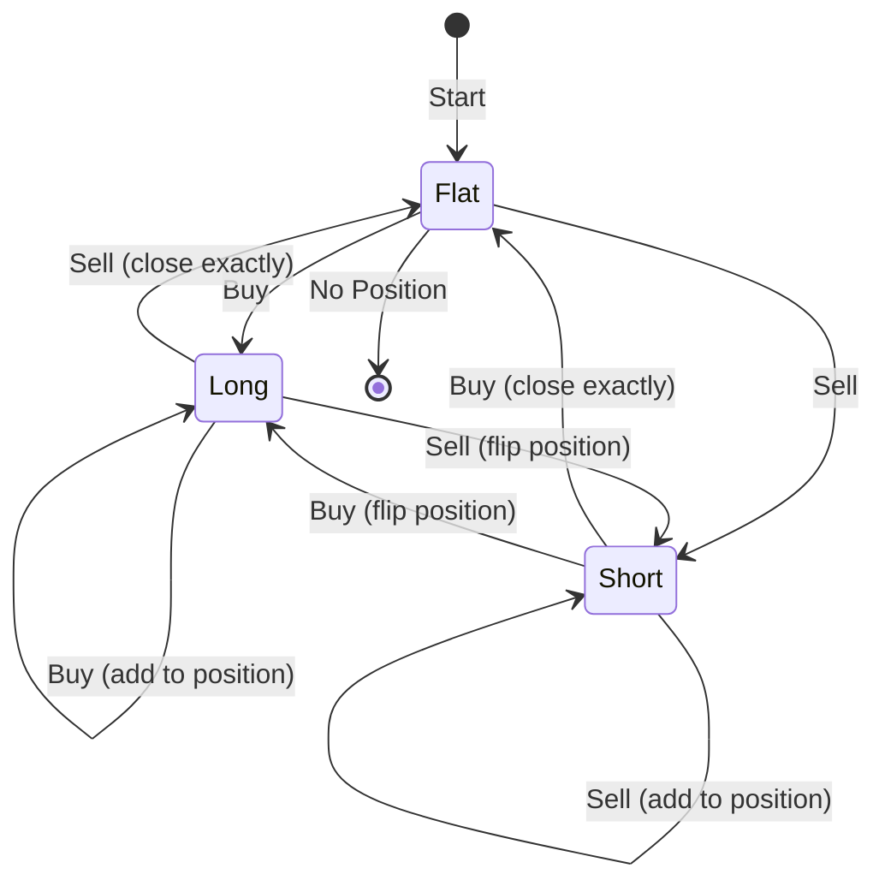
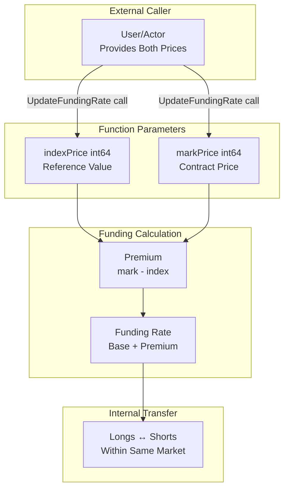
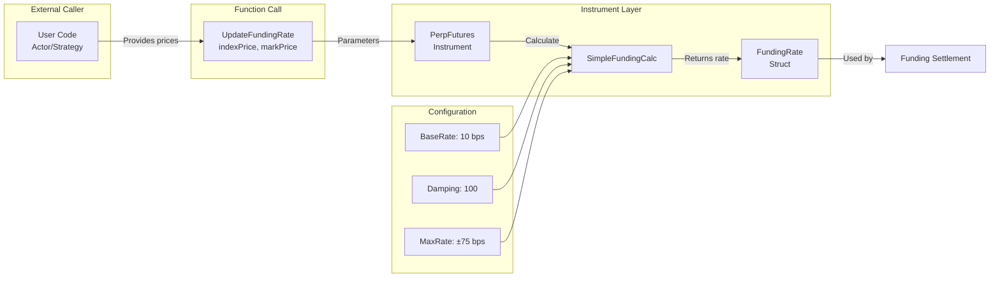
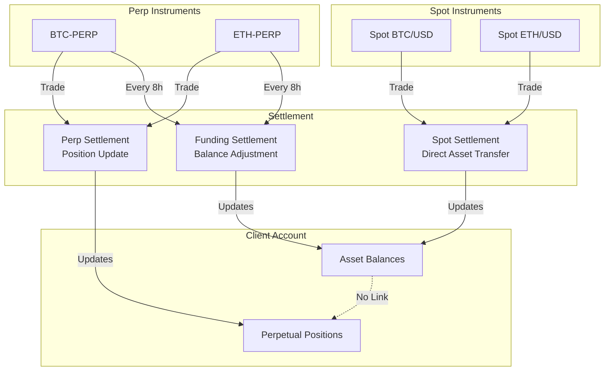

# Position Netting and Funding Mechanism

## Overview

This document describes how the exchange simulation handles position netting, funding payments, and the relationship between spot and perpetual futures instruments.

## Key Implementation Facts

**Funding is ONLY an internal transfer:**
- Longs pay → Shorts receive (or vice versa)
- Within the same perpetual market only
- No external spot markets involved
- No exchange capital involved
- Pure peer-to-peer transfer mechanism

**Prices are user-provided parameters:**
- `UpdateFundingRate(indexPrice, markPrice)` accepts prices from caller
- No external data fetching in the code
- User decides what "index" and "mark" represent
- Code is agnostic - just does math with given values

## Core Concepts

### 1. Spot vs Perpetual Futures

**Spot Instruments:**
- Direct ownership of assets
- No position tracking, only balance changes
- Buy 1 BTC → +1 BTC in balance, -price in USD balance
- No funding payments
- No leverage

**Perpetual Futures:**
- Contract representing exposure to underlying asset
- Position tracking (long/short/flat)
- Funding payments every interval
- Leverage possible (not currently enforced)
- Never expires (unlike quarterly futures)

## Position Netting for Perpetual Futures

### What is Position Netting?

**Position netting** means you can only hold ONE position per instrument at a time:
- Either LONG (positive size)
- Or SHORT (negative size)
- Or FLAT (zero size)

You **cannot** be simultaneously long and short the same instrument.

### Netting Behavior

```go
// Initial state: No position
Position: 0

// Action: Buy 10 BTC-PERP @ $50,000
Position: +10 BTC (long)
Entry Price: $50,000

// Action: Buy 5 more BTC-PERP @ $51,000
Position: +15 BTC (long) ✅ Added to existing long
Entry Price: $50,333 (weighted average)

// Action: Sell 20 BTC-PERP @ $52,000
Position: -5 BTC (short) ✅ Flipped to short!
Entry Price: $52,000 (new position)
```

### Position Netting Flow



### Implementation Logic

**File:** `exchange/funding.go`, lines 28-70

```go
func (pm *PositionManager) UpdatePosition(clientID uint64, symbol string, qty int64, price int64, side Side) {
    // Calculate delta
    deltaSize := qty
    if side == Sell {
        deltaSize = -qty  // Sells reduce position
    }

    newSize := pos.Size + deltaSize

    // Case 1: Position closes completely
    if newSize == 0 {
        pos.Size = 0
        pos.EntryPrice = 0
    }

    // Case 2: Opening new position
    else if pos.Size == 0 {
        pos.Size = newSize
        pos.EntryPrice = price
    }

    // Case 3: Adding to existing position
    else if (pos.Size > 0 && newSize > pos.Size) || (pos.Size < 0 && newSize < pos.Size) {
        // Calculate weighted average entry price
        totalNotional := (pos.Size * pos.EntryPrice) + (deltaSize * price)
        pos.EntryPrice = totalNotional / newSize
        pos.Size = newSize
    }

    // Case 4: Flipping position (long → short or short → long)
    else if (pos.Size > 0 && newSize < 0) || (pos.Size < 0 && newSize > 0) {
        pos.EntryPrice = price  // New entry price
        pos.Size = newSize
    }

    // Case 5: Reducing position (same direction)
    else {
        pos.Size = newSize
        // Entry price unchanged
    }
}
```

## Mark Price vs Index Price

### Implementation Reality

**In this codebase, both prices are INPUTS from external caller:**

```go
// File: exchange/instrument.go, line 128
func (p *PerpFutures) UpdateFundingRate(indexPrice int64, markPrice int64) {
    p.fundingRate.IndexPrice = indexPrice
    p.fundingRate.MarkPrice = markPrice
    p.fundingRate.Rate = p.fundingCalc.Calculate(indexPrice, markPrice)
}
```

**The system does NOT fetch prices** - it's the caller's responsibility to provide them.

### Price Parameters

**Index Price (parameter):**
- Reference price for "fair value" calculation
- Caller decides what this represents (could be spot, oracle, average, anything)
- Used only for calculating premium
- Example: Caller passes `50000 * SATOSHI`

**Mark Price (parameter):**
- Reference price for the perpetual contract
- Caller decides what this represents (last trade, mid-price, TWAP, anything)
- Used for calculating premium
- Example: Caller passes `50200 * SATOSHI`

**The code is agnostic** - it just does math with whatever values you give it.

### Price Relationship (Conceptual)



### Premium and Funding Transfer

**Premium** = (markPrice - indexPrice) / indexPrice

**Funding is ONLY a transfer between longs and shorts in the same perpetual market:**
- NOT involving the exchange's capital
- NOT involving external spot markets
- NOT involving any third parties
- Pure internal transfer: longs ↔ shorts

**Transfer Direction:**
- **Positive Premium** (mark > index): More demand for longs
  - Longs PAY → Shorts RECEIVE
  - Transfer from bulls to bears

- **Negative Premium** (mark < index): More demand for shorts
  - Shorts PAY → Longs RECEIVE
  - Transfer from bears to bulls

- **Zero Premium** (mark = index): Balanced market
  - Base rate (10 bps) still applies
  - Small transfer from longs to shorts

## Funding Rate Calculation

### Formula Implementation

**File:** `exchange/instrument.go`, lines 138-157

```go
func (c *SimpleFundingCalc) Calculate(indexPrice, markPrice int64) int64 {
    if indexPrice == 0 {
        return 0
    }

    // Calculate premium in basis points (0.01%)
    premium := ((markPrice - indexPrice) * 10000) / indexPrice

    // Funding Rate = BaseRate + (Premium × Damping / 100)
    rate := c.BaseRate + (premium * c.Damping / 100)

    // Apply caps: ±75 basis points
    if rate > c.MaxRate {
        return c.MaxRate
    }
    if rate < -c.MaxRate {
        return -c.MaxRate
    }

    return rate
}
```

### Configuration

```go
SimpleFundingCalc{
    BaseRate: 10,   // 10 bps (0.01%) - base funding
    Damping:  100,  // 100% of premium applied to rate
    MaxRate:  75,   // ±75 bps (0.075%) cap
}
```

### Funding Rate Examples

| Index Price | Mark Price | Premium | Funding Rate | Who Pays |
|-------------|------------|---------|--------------|----------|
| $50,000 | $50,000 | 0% | +10 bps | Longs (base) |
| $50,000 | $50,250 | +0.5% | +60 bps | Longs (premium) |
| $50,000 | $50,500 | +1.0% | **+75 bps** | Longs (capped) |
| $50,000 | $49,750 | -0.5% | -40 bps | Shorts (discount) |
| $50,000 | $49,000 | -2.0% | **-75 bps** | Shorts (capped) |

### Funding Rate Dependency Flow



## Funding Settlement Process

### Settlement Flow

```mermaid
sequenceDiagram
    participant Trigger as External Trigger
    participant PM as PositionManager
    participant Perp as PerpFutures
    participant Clients as Client Balances
    participant MD as Market Data
    participant Actor as Actors

    Note over Trigger: Every 8 hours (28800s)

    Trigger->>PM: SettleFunding(clients, perp)
    PM->>Perp: GetFundingRate()
    Perp-->>PM: FundingRate{Rate, MarkPrice, IndexPrice}

    loop For each position
        PM->>PM: Calculate position value
        PM->>PM: Calculate funding payment

        alt Long Position (size > 0)
            Note over PM: Funding = PositionValue × Rate / 10000
            PM->>Clients: SubBalance(USD, funding)
            Note over Clients: Long PAYS funding
        else Short Position (size < 0)
            Note over PM: Funding = PositionValue × Rate / 10000
            PM->>Clients: AddBalance(USD, funding)
            Note over Clients: Short RECEIVES funding
        end
    end

    PM->>Perp: Update NextFunding timestamp

    PM->>MD: PublishFunding(symbol, fundingRate)
    MD->>Actor: EventFundingUpdate
    Note over Actor: Actors notified of funding
```

### Settlement Calculation

**File:** `exchange/funding.go`, lines 85-110

```go
func (pm *PositionManager) SettleFunding(clients map[uint64]*Client, perp *PerpFutures) {
    fundingRate := perp.GetFundingRate()
    precision := perp.TickSize()  // e.g., SATOSHI for BTC

    for clientID, clientPos := range pm.positions {
        pos := clientPos[perp.Symbol()]
        if pos == nil || pos.Size == 0 {
            continue  // Skip if no position
        }

        client := clients[clientID]
        if client == nil {
            continue
        }

        // Position Value = |Size| × EntryPrice ÷ Precision
        positionValue := abs(pos.Size) * pos.EntryPrice / precision

        // Funding = PositionValue × Rate ÷ 10000
        funding := (positionValue * fundingRate.Rate) / 10000

        // Apply payment (in quote asset, e.g., USD)
        if pos.Size > 0 {
            // Long position PAYS funding
            client.SubBalance(perp.QuoteAsset(), funding)
        } else {
            // Short position RECEIVES funding
            client.AddBalance(perp.QuoteAsset(), funding)
        }
    }

    // Schedule next funding
    fundingRate.NextFunding = pm.clock.NowUnixNano() + (fundingRate.Interval * 1e9)
}
```

### Funding Settlement Example

**Scenario:** BTC-PERP with 0.5% premium (bullish market)

```
Initial State:
  - Index Price: $50,000
  - Mark Price: $50,250 (0.5% premium)
  - Funding Rate: +60 bps (0.06%)
  - Settlement Interval: 8 hours

Positions:
  Client A: Long 10 BTC @ $50,000 entry
  Client B: Short 5 BTC @ $50,200 entry

Settlement Calculation:

  Client A (Long):
    Position Value = 10 × $50,000 = $500,000
    Funding Payment = $500,000 × 0.06% = $300
    Action: SubBalance("USD", $300)
    Result: Client A PAYS $300

  Client B (Short):
    Position Value = 5 × $50,200 = $251,000
    Funding Payment = $251,000 × 0.06% = $150.60
    Action: AddBalance("USD", $150.60)
    Result: Client B RECEIVES $150.60

Net Effect:
  - Long positions collectively pay $300
  - Short positions collectively receive $150.60
  - In this example, imbalance exists because position sizes differ
  - In real markets, open interest is balanced (total long ≈ total short)
  - The code processes each position independently
  - No exchange capital involved - pure peer-to-peer transfer
```

## Spot and Perpetual Separation

### No Cross-Instrument Netting

The exchange maintains **complete separation** between spot balances and perpetual positions.



### Example: Spot + Perp Holdings

```
Client has:
  Balances (Spot):
    BTC: 10.0 BTC
    USD: $100,000

  Positions (Perp):
    BTC-PERP: -5.0 BTC (short) @ $50,000 entry

Net Exposure (NOT calculated by exchange):
  Spot BTC:  +10.0 BTC
  Perp BTC:   -5.0 BTC
  ---------------------
  Net:        +5.0 BTC equivalent

Exchange View:
  ✅ Spot: 10 BTC in wallet
  ✅ Perp: Short 5 BTC-PERP position
  ❌ NO automatic netting
  ❌ NO unified margin
  ❌ NO cross-collateral
```

### Why No Cross-Netting?

**Design Principle (from CLAUDE.md):**
- Library-first architecture
- Users must be able to extend without modifying library
- Configuration, not hardcoding

**Implementation Reality:**
- Spot and perp are different instrument types
- Different settlement mechanisms
- Different risk profiles
- Users implement custom hedging logic in their actors

**Real Exchange Behavior:**
- Most exchanges keep spot and derivatives separate
- Portfolio margining is opt-in (Binance, Deribit)
- Cross-collateral is separate system
- Users manually manage hedges

## Complete Dependency Graph

```mermaid
graph TB
    subgraph "External Caller"
        UserCode[User Code/Actors<br/>Provides Prices]
        TimeSource[Time Source<br/>Clock Interface]
    end

    subgraph "Price Parameters"
        IndexPrice[indexPrice param<br/>User-Provided]
        MarkPrice[markPrice param<br/>User-Provided]
        Premium[Premium<br/>Calculated: mark - index]
    end

    subgraph "Instrument Layer"
        SpotInst[SpotInstrument<br/>No Funding]
        PerpInst[PerpFutures<br/>Has Funding]
        FundCalc[SimpleFundingCalc]
    end

    subgraph "Position Layer"
        SpotBalance[Asset Balances<br/>No Positions]
        PerpPosition[Position Tracking<br/>Long/Short/Flat]
    end

    subgraph "Settlement Layer"
        SpotTrade[Spot Trade<br/>Asset Transfer]
        PerpTrade[Perp Trade<br/>Position Update]
        FundingSettlement[Funding Settlement<br/>Internal Transfer]
    end

    subgraph "Client State"
        ClientBalances[Client.Balances<br/>map[asset]int64]
        ClientPositions[Position.Size<br/>int64 per symbol]
    end

    subgraph "Event Layer"
        MDPublisher[Market Data Publisher]
        FundingEvent[EventFundingUpdate]
        Actors[Trading Actors]
    end

    UserCode -->|UpdateFundingRate call| IndexPrice
    UserCode -->|UpdateFundingRate call| MarkPrice

    IndexPrice --> Premium
    MarkPrice --> Premium

    Premium --> FundCalc
    FundCalc --> PerpInst

    TimeSource --> FundingSettlement
    PerpInst --> FundingSettlement
    UserCode -->|SettleFunding call| FundingSettlement

    SpotInst --> SpotTrade
    PerpInst --> PerpTrade

    SpotTrade --> SpotBalance
    PerpTrade --> PerpPosition

    SpotBalance --> ClientBalances
    PerpPosition --> ClientPositions

    FundingSettlement -->|Longs pay| ClientBalances
    FundingSettlement -->|Shorts receive| ClientBalances
    PerpPosition -->|Read positions| FundingSettlement

    FundingSettlement --> MDPublisher
    MDPublisher --> FundingEvent
    FundingEvent --> Actors

    SpotBalance -.->|No Link| PerpPosition
    ClientBalances -.->|Separate| ClientPositions
```

## System Interactions

### Trade Execution Flow

```mermaid
sequenceDiagram
    participant Actor as Trading Actor
    participant Exchange as Exchange
    participant Book as Order Book
    participant PM as PositionManager
    participant Client as Client Balances
    participant MD as Market Data

    Actor->>Exchange: SubmitOrder(BTC-PERP, Buy, 10 BTC)
    Exchange->>Book: Match Order

    alt Spot Instrument
        Book->>Exchange: Execution
        Exchange->>Client: Transfer BTC
        Exchange->>Client: Transfer USD
        Note over PM: No position update
    else Perp Instrument
        Book->>Exchange: Execution
        Exchange->>PM: UpdatePosition(clientID, symbol, qty, price, side)
        PM->>PM: Calculate new position size
        PM->>PM: Update entry price (if adding)
        Note over Client: Balance unchanged (except fees)
    end

    Exchange->>MD: Publish Trade
    MD->>Actor: EventTrade
```

### Funding Cycle

```mermaid
gantt
    title Funding Cycle (8 Hour Intervals)
    dateFormat HH:mm
    axisFormat %H:%M

    section Mark/Index
    Update Mark Price :active, mark1, 00:00, 08:00
    Update Index Price :active, index1, 00:00, 08:00

    section Funding Rate
    Calculate Rate :crit, calc1, 07:50, 08:00

    section Settlement
    Settle Funding :done, settle1, 08:00, 08:01
    Publish Event :done, event1, 08:01, 08:02

    section Next Cycle
    Update Mark Price :active, mark2, 08:02, 16:00
    Update Index Price :active, index2, 08:02, 16:00
    Calculate Rate :crit, calc2, 15:50, 16:00
    Settle Funding :done, settle2, 16:00, 16:01
```



## Key Takeaways

### Position Netting

✅ **Implemented**: Intra-instrument position netting for perpetuals
- One position per client per symbol
- Automatic netting on trades
- Position flips from long to short (or vice versa)
- Weighted average entry price calculation

❌ **Not Implemented**: Cross-instrument netting
- No automatic offset between spot and perp
- No unified margin calculation
- No portfolio margining

### Funding Mechanism

✅ **Fully Functional**:
- Mark and index price based calculation
- Premium-driven funding rates
- Automatic settlement every interval
- Long pays when premium positive, short receives
- Event notifications to all actors

### Design Philosophy

**Library-First Approach:**
- Core exchange provides primitives
- Users compose custom strategies
- Hedging logic in actor implementations
- Configuration via dependency injection

**Matches Real Exchanges:**
- BitMEX-style netting (cannot be long and short simultaneously)
- Binance-style separation (spot and futures independent)
- Standard funding intervals (8 hours)
- Premium-based funding rates

## References

**Implementation Files:**
- `exchange/funding.go` - Position tracking and settlement
- `exchange/instrument.go` - Funding rate calculation
- `actor/events.go` - Funding event definitions
- `actor/actor.go` - Event dispatch to actors

**Documentation:**
- `ARCHITECTURE.md` - System overview
- `PRECISION_GUIDE.md` - Integer arithmetic and precisions
- `REJECTION_HANDLING.md` - Order rejection flows
- `MULTI_VENUE_LATENCY_ARBITRAGE.md` - Multi-venue patterns
