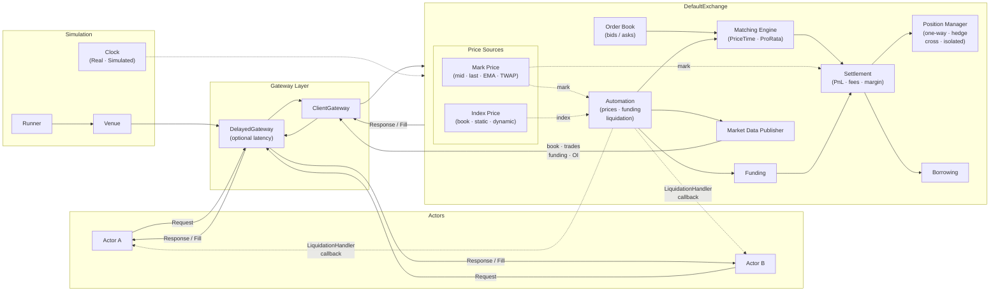

# Exchange Simulation

A Go library for cryptocurrency exchange simulation. Designed for market microstructure research, strategy backtesting, and multi-actor algorithm development.

This is a **library**, not an application. You write actors and wire them to exchanges. The library provides the exchange mechanics, matching engine, position tracking, funding settlement, and simulation infrastructure.

---

## Architecture



**Request flow**: Actor sends `Request` → `DelayedGateway` (optional per-channel latency) → `ClientGateway` → `Exchange.HandleClientRequests` → order validation → matching engine → settlement → `Response` + `FillNotification` back through the same gateway stack. Market data (book snapshots/deltas, trades, funding, open interest) flows one-way from `MDPublisher` to all subscribed gateways filtered by `MDType`.

**Automation**: `DefaultExchange` runs background goroutines — recalculates mark and index prices on a configurable interval, updates funding rates, publishes them via `MDPublisher`, settles periodic funding payments, and checks margin ratios after every price update. Liquidation force-closes positions through the `MatchingEngine`. Margin call warnings and liquidation events are delivered to the `LiquidationHandler` interface — a direct callback, not routed through the gateway. Start with `ex.ConfigureAutomation(cfg)` then `ex.StartAutomation(ctx)`.

**Latency modeling**: `DelayedGateway` wraps any `ClientGateway` and introduces per-channel (request / response / market data) delay drawn from a pluggable `LatencyProvider`. Five implementations ship: constant, uniform random, normal, log-normal (heavy tail), and Hawkes (self-exciting, models exchange queue congestion). Multiple actors on the same exchange can have independent latency profiles.

**Multi-venue**: `Venue` pairs an `Exchange` with a `LatencyConfig`. `Runner` orchestrates any number of venues and actors, advancing a shared `SimulatedClock` or running in wall-clock time. Gateway channel identity carries venue identity — no tagging needed.

---

## Packages

| Package | Contents |
|---------|----------|
| `exchange/` | `DefaultExchange` (`Exchange` alias), `Client`, `ClientGateway`, `PositionManager`, settlement, funding, borrowing, order routing, automation |
| `types/` | Value types: `Order`, `Side`, `FillNotification`, `AssetBalance`, `PositionSnapshot`, `AccountSnapshot`, interfaces (`Venue`, `SpotExchange`, `PerpExchange`, `FeeModel`, `Instrument`, `PositionStore`, `Logger`, `Clock`, `TickerFactory`) |
| `book/` | `OrderBook` — price-time ordered bid/ask levels with iceberg and hidden order support |
| `matching/` | `PriceTimeMatcher` (FIFO), `ProRataMatcher` |
| `price/` | Mark price calculators (last, mid, weighted-mid, Binance, BitMEX, Bybit) and index price providers (spot-derived, GBM, fixed) |
| `instrument/` | `SpotInstrument`, `PerpFutures`, `FundingCalculator` |
| `fee/` | `FixedFee`, `PercentageFee` (maker/taker bps, fee in any asset) |
| `clock/` | `RealClock`, `RealTickerFactory` |
| `marketdata/` | `MDPublisher` — fan-out with per-subscription `MDType` filter |
| `logger/` | NDJSON event logger |
| `simulation/` | `Venue`, `Runner`, `DelayedGateway`, `SimulatedClock`, `Scheduler`, `EventScheduler`, latency providers |
| `actor/` | `Actor` interface, `BaseActor` (order submission helpers, response/fill dispatch, order tracking) |

---

## What the library provides

**Exchange core** — price-time FIFO and pro-rata matching engines; order book with iceberg and hidden order support; position manager with cross and isolated margin, one-way and hedge mode, PnL tracking and liquidation; perpetual funding settlement; margin borrowing and interest; NDJSON event logging.

**Account model** — Binance-style balances: `Free / Locked / Borrowed / NetAsset` for spot and perp wallets. `ReqQueryBalance` returns `BalanceSnapshot`; `ReqQueryAccount` returns the full `AccountSnapshot` including open positions with mark price, unrealized PnL, leverage, and liquidation price.

**Fee model** — `FeeModel.CalculateFee(FillContext)` receives the full execution context and returns `Fee{Amount, Asset}`. Fee asset is arbitrary — BNB-style fee-in-any-asset works out of the box.

**Market data** — `MDPublisher` delivers `MDSnapshot`, `MDDelta`, `MDTrade`, `MDFunding`, `MDOpenInterest` to subscribed gateways. Each subscription carries a type filter; actors receive only the streams they asked for.

**Simulation layer** — `SimulatedClock` with deterministic advancement; `Runner` manages venues and actors with wall-clock duration or iteration count limits; five `LatencyProvider` implementations for network/queue modeling. `SimulatedClock` + `TickerFactory` enables 100,000×+ speedup vs wall time.

**Actor framework** — `BaseActor` handles channel routing, order tracking, and response dispatch. Embed it for submission helpers (`SubmitOrder`, `CancelOrder`, `Subscribe`, `QueryBalance`, `QueryAccount`). Multi-venue actors own multiple gateways and multiplex them in a single `select` loop.

---

## Extension points

Every non-trivial behavior is injectable:

| Interface | Implementations |
|-----------|-----------------|
| `MatchingEngine` | `PriceTimeMatcher` (FIFO), `ProRataMatcher`, custom |
| `FeeModel` | `FixedFee`, `PercentageFee`, custom (any fee asset) |
| `FundingCalculator` | Custom funding formula per instrument |
| `MarkPriceCalculator` | Last, mid, weighted-mid, Binance, BitMEX, Bybit |
| `PriceSource` | Spot-derived, GBM process, static, dynamic, custom |
| `LiquidationHandler` | `OnMarginCall`, `OnLiquidation`, `OnInsuranceFund` callbacks |
| `Clock` / `TickerFactory` | `RealClock`, `SimulatedClock`, historical replay |
| `LatencyProvider` | Constant, uniform, normal, log-normal, Hawkes, load-scaled |
| `Actor` | Any trading strategy — embed `BaseActor` |
| `PositionStore` | `PositionManager` (default), custom (e.g. database-backed) |
| `Instrument` | `SpotInstrument`, `PerpFutures`, custom |

---

## Capability interfaces

`types/` defines composable capability interfaces that `DefaultExchange` satisfies, usable for dependency injection and testing:

| Interface | Methods |
|-----------|---------|
| `Venue` | `ConnectClient`, `Shutdown`, `IsRunning` |
| `Instrumentable` | `AddInstrument`, `ListInstruments` |
| `ClientLifecycle` | `CancelAllClientOrders`, `DisconnectClient`, `SetLogger` |
| `MarginLending` | `EnableBorrowing`, `BorrowMargin`, `RepayMargin` |
| `PerpWallet` | `AddPerpBalance`, `Transfer` |
| `SpotExchange` | `Venue` + `Instrumentable` + `ClientLifecycle` + `MarginLending` |
| `PerpExchange` | `Venue` + `Instrumentable` + `ClientLifecycle` + `PerpWallet` |

---

## Logging

The exchange uses NDJSON event logging. Each log line is a JSON object with `sim_time`, `server_time`, `event`, `client_id`, plus event-specific fields. Loggers are assigned per key via `exchange.SetLogger(key, logger)`.

### Logger keys

Two categories: a single `_global` logger for exchange-wide events, and one logger per instrument symbol for trade and book events.

```
exchange.SetLogger("_global", logger.New(globalFile))   // exchange-wide
exchange.SetLogger("BTC/USD", logger.New(spotFile))     // spot instrument
exchange.SetLogger("BTC-PERP", logger.New(perpFile))    // futures instrument
```

### `_global` events

| Event | Description | Key fields |
|-------|-------------|------------|
| `balance_snapshot` | Periodic snapshot of all client balances (spot + perp) | `client_id`, `spot_balances[]`, `perp_balances[]`, `borrowed{}` |
| `balance_change` | Any wallet mutation with no instrument context (funding settlement, transfers) | `client_id`, `reason`, `changes[]{asset, wallet, old_balance, new_balance, delta}` |
| `fee_revenue` | Exchange fee collected per trade | `symbol`, `trade_id`, `taker_fee`, `maker_fee`, `asset` |
| `realized_pnl` | Perp position close PnL (non-zero only) | `client_id`, `symbol`, `trade_id`, `closed_qty`, `entry_price`, `exit_price`, `pnl`, `side` |
| `position_update` | Every perp position state change | `client_id`, `symbol`, `old_size`, `old_entry_price`, `new_size`, `new_entry_price`, `trade_qty`, `trade_price`, `trade_side`, `reason` |
| `margin_interest` | Periodic interest charged on borrowed amounts | `client_id`, `asset`, `amount` |
| `borrow` | Margin loan taken | `client_id`, `asset`, `amount`, `reason`, `margin_mode`, `interest_rate_bps`, `collateral_used` |
| `repay` | Margin loan repaid | `client_id`, `asset`, `principal`, `interest`, `remaining_debt` |
| `liquidation_check` | Debug: margin ratios when maintenance margin breached | `client_id`, `symbol`, `position_size`, `mark_price`, `equity`, `margin_ratio`, `threshold` |

### Per-symbol events (spot: `"BTC/USD"`, futures: `"BTC-PERP"`)

| Event | Description | Key fields |
|-------|-------------|------------|
| `Trade` | Every matched execution | `trade_id`, `price`, `qty`, `side`, `taker_order_id`, `maker_order_id` |
| `OrderFill` | Per-participant fill record (logged twice: taker and maker) | `order_id`, `symbol`, `qty`, `price`, `side`, `position_side`, `filled_qty`, `remaining_qty`, `is_full`, `trade_id`, `role`, `fee_amount`, `fee_asset`, `realized_pnl`, `new_size`, `new_entry_price` |
| `balance_change` | Spot/perp wallet mutation tied to this trade | `client_id`, `reason: "trade_settlement"`, `changes[]{asset, wallet, old_balance, new_balance, delta}` |
| `BookSnapshot` | Periodic full book state (all price levels) | `bids[]`, `asks[]` |

### Futures-only per-symbol events

| Event | Description | Key fields |
|-------|-------------|------------|
| `mark_price_update` | Recalculated mark and index price | `symbol`, `mark_price`, `index_price` |
| `funding_rate_update` | Updated funding rate | `symbol`, `rate`, `next_funding` |

### Wallet names in `balance_change`

| Wallet | Meaning |
|--------|---------|
| `spot` | Spot balance (`client.Balances`) |
| `perp` | Perp margin balance (`client.PerpBalances`) |
| `reserved_spot` | Spot locked in open orders (`client.Reserved`) |
| `reserved_perp` | Perp locked as order margin (`client.PerpReserved`) |
| `borrowed` | Margin loan outstanding (`client.Borrowed`) |

### Setup example

```go
globalLog := logger.New(globalWriter)
spotLog   := logger.New(spotWriter)
perpLog   := logger.New(perpWriter)

ex.SetLogger("_global", globalLog)
ex.SetLogger("BTC/USD",  spotLog)
ex.SetLogger("BTC-PERP", perpLog)

ex.EnableBalanceSnapshots(5 * time.Second) // periodic balance_snapshot to _global
```

---

## Minimal example

```go
ex := exchange.NewExchange(100, &clock.RealClock{})

ex.AddInstrument(exchange.NewSpotInstrument(
    "BTC/USD", "BTC", "USD",
    exchange.BTC_PRECISION, exchange.USD_PRECISION,
    exchange.DOLLAR_TICK, exchange.USD_PRECISION/1000,
))

gw := ex.ConnectClient(1, map[string]int64{
    "BTC": 10 * exchange.BTC_PRECISION,
    "USD": 100_000 * exchange.USD_PRECISION,
}, &fee.PercentageFee{MakerBps: 2, TakerBps: 5, InQuote: true})

go ex.HandleClientRequests(gw)

// Implement Actor interface — OnEvent, Start, Stop, ID, Gateway
myActor := mypackage.NewMyActor(1, gw)
myActor.Start(context.Background())
```

## Perpetual futures example

```go
ex := exchange.NewExchange(100, &clock.RealClock{})

perp := exchange.NewPerpFutures(
    "BTC-PERP", "BTC", "USD",
    exchange.BTC_PRECISION, exchange.USD_PRECISION,
    exchange.DOLLAR_TICK, exchange.SATOSHI/100,
)
ex.AddInstrument(perp)

ex.ConfigureAutomation(exchange.AutomationConfig{
    MarkPriceCalc:       exchange.NewMidPriceCalculator(),
    IndexProvider:       exchange.NewStaticPriceOracle(map[string]int64{"BTC-PERP": 50_000_000_000}),
    PriceUpdateInterval: 3 * time.Second,
    LiquidationHandler:  myRiskManager,
})
ex.StartAutomation(context.Background())
defer ex.StopAutomation()

gw := ex.ConnectClient(1, map[string]int64{
    "USD": 100_000 * exchange.USD_PRECISION,
}, &fee.PercentageFee{MakerBps: 2, TakerBps: 5, InQuote: true})
```

## Multi-venue with latency

```go
fastEx := exchange.NewExchange(100, simClock)
slowEx := exchange.NewExchange(100, simClock)
// ... add instruments ...

fastVenue := simulation.NewVenue(fastEx, simulation.LatencyConfig{
    Request:  simulation.NewConstantLatency(1 * time.Millisecond),
    Response: simulation.NewConstantLatency(1 * time.Millisecond),
})
slowVenue := simulation.NewVenue(slowEx, simulation.LatencyConfig{
    Request:  simulation.NewLogNormalLatency(5*time.Millisecond, 10*time.Millisecond, 0.5, 42),
    Response: simulation.NewLogNormalLatency(5*time.Millisecond, 10*time.Millisecond, 0.5, 43),
})

runner := simulation.NewRunner(simClock, simulation.RunnerConfig{Duration: 30 * time.Second})
runner.AddVenue(fastVenue)
runner.AddVenue(slowVenue)

fastGW := fastVenue.ConnectClient(1, balances, feePlan)
slowGW := slowVenue.ConnectClient(1, balances, feePlan)

runner.AddActor(mypackage.NewArbitrageActor(1, fastGW, slowGW))
runner.Run(context.Background())
```

**Gateway = venue identity.** An actor that trades on N venues owns N gateways and multiplexes them in a single `select` loop. Which channel delivers the message tells you which exchange it came from — no tagging needed:

```go
func (a *ArbitrageActor) run(ctx context.Context) {
    for {
        select {
        case resp := <-a.fastGW.Responses():
            a.onFastResponse(resp)
        case resp := <-a.slowGW.Responses():
            a.onSlowResponse(resp)
        case md := <-a.fastGW.MarketDataCh():
            a.onFastMarketData(md)
        case md := <-a.slowGW.MarketDataCh():
            a.onSlowMarketData(md)
        case <-ctx.Done():
            return
        }
    }
}
```

---

## Blockers / known gaps

### 1. Settlement dispatch is closed to new instrument types

`exchange/settlement.go` and `exchange/order_handling.go` dispatch on `instrument.IsPerp()` with a type assertion to `*PerpFutures`:

```go
if instrument.IsPerp() {
    perp := instrument.(*PerpFutures)   // hard type assertion
    processPerpExecution(...)
} else {
    settleSpotExecution(...)
}
```

Any new instrument type — options, prediction markets, linear futures with custom payoff — hits the `else` branch and gets spot settlement regardless of what the instrument is.

**Fix needed**: extract settlement into an interface on `Instrument`:

```go
type Settleable interface {
    Settle(exec *Execution, buyer, seller *Client, timestamp int64)
}
```

Each instrument implements `Settleable` with its own logic. The exchange dispatches to `instrument.(Settleable).Settle(...)`. No library modification needed to add options or bets — implement the interface externally.

The same `IsPerp()` + type assertion pattern appears in margin reservation (`reserveLimitOrderFunds`, `checkMarketOrderFunds`), so a `Margined` interface would be needed there too.

### 2. `BaseActor` has no slot for periodic timer strategies

`BaseActor.run()` is a concrete goroutine that `select`s only on `gateway.Responses()` and `gateway.MarketDataCh()`. Go has no virtual methods, so embedding and overriding `run` is not possible — `Start()` always launches `BaseActor.run()`.

Strategies that need periodic behavior (market maker requote, TWAP slicing, periodic hedging) cannot inject a ticker into the existing select loop. They must bypass `BaseActor.Start()` entirely and write their own goroutine, using `BaseActor` only for the submission helpers and reading events from `EventChannel()` manually. The `tickerFactory` field on `BaseActor` is currently unused.

**Fix needed**: a registration mechanism such as:

```go
func (a *BaseActor) AddTicker(d time.Duration, fn func(time.Time))
```

The actor's run loop would also `select` on registered ticker channels, calling the provided function. Tickers created via `tickerFactory` would respect simulation time automatically.

### 3. `Runner` type-asserts `Clock` for iteration mode

In `Runner.Run`, the `Iterations` mode does:

```go
if simClock, ok := r.clock.(*SimulatedClock); ok {
    simClock.Advance(r.config.Step)
}
```

A custom `Clock` that wraps or decorates `SimulatedClock` silently skips clock advancement. `Clock` should expose `Advance` or the runner should accept a separate `Advanceable` interface.

---

## Build

```bash
make build          # Build all binaries to bin/
make test           # Run all tests
make test-race      # Run with race detector
make coverage-html  # View coverage in browser
make all            # Format, vet, test, build
```
