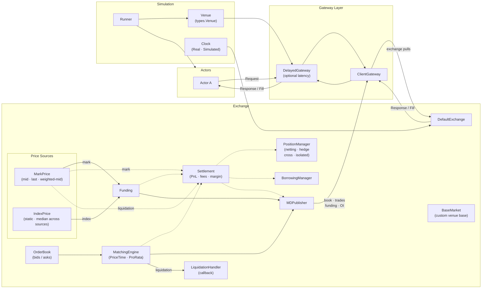
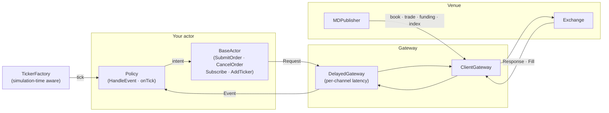
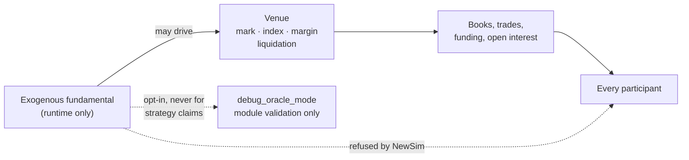

# Exchange Simulation

A Go library for simulating a cryptocurrency exchange. It was built for microstructure research, and it is also usable for backtesting and for multi-actor experiments.

It is a library rather than an application. You write the actors and wire them to exchanges. The library handles the parts you would otherwise rewrite every time: matching, position tracking, margin and borrowing, funding settlement, market data, and the simulation clock.

---

## Architecture


```mermaid
flowchart LR
    subgraph AL["Actors"]
        A1["Actor A"]
    end

    subgraph GL["Gateway Layer"]
        DGW["DelayedGateway</br>(optional latency)"]
        CGW["ClientGateway"]
    end

    subgraph EX["Exchange"]
        DEX["DefaultExchange"]
        BM2["BaseMarket</br>(custom venue base)"]
        OB["OrderBook</br>(bids / asks)"]
        ME["MatchingEngine</br>(PriceTime · ProRata)"]
        ST["Settlement</br>(PnL · fees · margin)"]
        PM["PositionManager</br>(netting · hedge</br>cross · isolated)"]
        FM["Funding"]
        BM["BorrowingManager"]
        MDP["MDPublisher"]
        LH["LiquidationHandler</br>(callback)"]
        subgraph PS["Price Sources"]
            MP["MarkPrice</br>(mid · last · weighted-mid)"]
            IP["IndexPrice</br>(static · median across sources)"]
        end
    end

    subgraph SIM["Simulation"]
        VENUE["Venue</br>(types.Venue)"]
        RUNNER["Runner"]
        CLK["Clock</br>(Real · Simulated)"]
    end

    A1 -- Request --> DGW
    DGW --> CGW
    CGW -- "exchange pulls" --> DEX
    DEX -- "Response / Fill" --> CGW
    CGW --> DGW
    DGW -- "Response / Fill" --> A1

    OB --> ME
    ME .-> ST
    ST .-> PM
    ST .-> BM

    IP -- index --> FM
    MP -- mark --> FM
    MP -. mark .-> ST
    MP -. liquidation .-> ST
    FM .-> ST
    ME --> MDP
    ST .-> MDP
    FM --> MDP
    ME -- liquidation --> LH

    MDP -- "book · trades</br>funding · OI" --> CGW

    CLK ---> DEX
    RUNNER --> VENUE
    RUNNER --> AL
    VENUE --> DGW
```

Actor sends `Request` → `DelayedGateway` (optional per-channel latency) → `ClientGateway` → `Exchange.HandleClientRequests` → order validation → matching engine → settlement → `Response` + `FillNotification` back through the same gateway stack. Market data (book snapshots/deltas, trades, funding, open interest) flows one-way from `MDPublisher` to all subscribed gateways filtered by `MDType`.

`IndexPrice` feeds the funding rate calculator (`Funding`). `MarkPrice` feeds both `Funding` (premium calculation) and `Settlement` (mark-to-market PnL, margin checks). When a margin check fails, `MarkPrice` triggers a force-close through `MatchingEngine` directly. Liquidation margin call and liquidation events are delivered to `LiquidationHandler` — a direct interface callback, not routed through the gateway.

`DelayedGateway` wraps any `ClientGateway` and introduces per-channel (request / response / market data) delay drawn from a pluggable `LatencyProvider`. Six providers ship: constant, uniform random, normal, log-normal (heavy tail), load-scaled, and Hawkes (self-exciting, for queue congestion). Multiple actors on the same exchange can have independent latency profiles.

`Venue` pairs an `Exchange` with a `LatencyConfig`. `Runner` orchestrates any number of venues and actors, advancing a shared `SimulatedClock` (via the `Advanceable` interface) or running in wall-clock time. Gateway channel identity carries venue identity — no tagging needed.

---

## Packages

| Package | Contents |
|---------|----------|
| `exchange/` | `DefaultExchange` (`Exchange` alias), `Client`, `ClientGateway`, `PositionManager`, settlement, funding, borrowing, order routing, automation |
| `types/` | Value types: `Order`, `Side`, `FillNotification`, `AssetBalance`, `PositionSnapshot`, `AccountSnapshot`, interfaces (`Venue`, `SpotExchange`, `PerpExchange`, `FeeModel`, `Instrument`, `PositionStore`, `Logger`, `Clock`, `TickerFactory`) |
| `book/` | `OrderBook` — price-time ordered bid/ask levels with iceberg and hidden order support |
| `matching/` | `PriceTimeMatcher` (FIFO), `ProRataMatcher` |
| `price/` | Mark price calculators (last, mid, weighted-mid, Binance, BitMEX, Bybit) and index price providers (spot-derived, fixed) |
| `instrument/` | `SpotInstrument`, `PerpFutures`, `FundingCalculator` |
| `fee/` | `FixedFee`, `PercentageFee` (maker/taker bps, fee in any asset) |
| `clock/` | `RealClock`, `RealTickerFactory` |
| `marketdata/` | `MDPublisher` — fan-out with per-subscription `MDType` filter |
| `logger/` | NDJSON event logger |
| `simulation/` | `Venue`, `Runner`, `DelayedGateway`, `SimulatedClock`, `Scheduler`, `EventScheduler`, latency providers |
| `actor/` | `Actor` interface, `BaseActor` (order submission helpers, response/fill dispatch, order tracking) |
| `simulations/` | Research scenarios built on the library: `multivenue` (the FFA ecology), `derivsim` (options and dated futures), `feesim`, `executionlab`, `latencylab`, `randomwalk` |

---

## What the library provides

The exchange core has price-time FIFO and pro-rata matching, an order book with iceberg and hidden orders, a position manager covering cross and isolated margin in both netting and hedge mode, perpetual funding settlement, margin borrowing with interest, and NDJSON event logging.

Balances follow the Binance model: `Free`, `Locked`, `Borrowed` and `NetAsset` across spot and perp wallets. `ReqQueryBalance` returns a `BalanceSnapshot`. `ReqQueryAccount` returns the full `AccountSnapshot`, including open positions with mark price, unrealized PnL, leverage and liquidation price.

`FeeModel.CalculateFee(FillContext)` gets the whole execution context and returns `Fee{Amount, Asset}`. The fee asset is arbitrary, so BNB-style fee-in-any-asset needs no special case.

`MDPublisher` delivers `MDSnapshot`, `MDDelta`, `MDTrade`, `MDFunding`, `MDIndex` and `MDOpenInterest` to subscribed gateways. Each subscription carries a type filter, so an actor receives only the streams it asked for.

For simulation there is a `SimulatedClock` that advances deterministically, a `Runner` that manages venues and actors under either a wall-clock duration or an iteration count, and the latency providers above. `SimulatedClock` with a simulation-aware `TickerFactory` runs well over 100,000 times faster than wall time.

`BaseActor` handles channel routing, order tracking, and event dispatch. Embed it for submission helpers (`SubmitOrder`, `CancelOrder`, `Subscribe`, `QueryBalance`, `QueryAccount`). Call `SetHandler(self)` before `Start` to receive events inline via `HandleEvent(ctx, event)` — no second goroutine needed. Call `AddTicker(d, fn)` to register periodic callbacks (TWAP slicing, requoting) driven by the actor's `TickerFactory`, which is simulation-time-aware when using `SimulatedClock`. Multi-venue actors own multiple gateways and multiplex them in a single `select` loop.

---

## Actors

An actor is any type implementing `Actor`. Embed `BaseActor` and you get order
submission, subscription management, order tracking, and event dispatch; you
supply the policy. The library ships no strategies. What follows is the roster
built for the multi-venue research scenario in `simulations/multivenue`, which
doubles as a worked example of the interface.

### How an actor is wired


```mermaid
flowchart LR
    subgraph ACT["Your actor"]
        POL["Policy</br>(HandleEvent · onTick)"]
        BA["BaseActor</br>(SubmitOrder · CancelOrder</br>Subscribe · AddTicker)"]
    end

    subgraph GW["Gateway"]
        DGW["DelayedGateway</br>(per-channel latency)"]
        CGW["ClientGateway"]
    end

    subgraph VEN["Venue"]
        EXCH["Exchange"]
        MDP["MDPublisher"]
    end

    POL -- "intent" --> BA
    BA -- "Request" --> DGW
    DGW --> CGW
    CGW --> EXCH
    EXCH -- "Response · Fill" --> CGW
    MDP -- "book · trade · funding · index" --> CGW
    CGW --> DGW
    DGW -- "Event" --> POL
    TF["TickerFactory</br>(simulation-time aware)"] -- "tick" --> POL
```

### The multi-venue roster


```mermaid
flowchart TB
    subgraph MAKERS["Liquidity providers"]
        SM["spot_maker</br>Avellaneda-Stoikov</br>inventory skew · hedge"]
        PM["perp_maker</br>Stoikov on ABC-PERP"]
        FM["futures_maker</br>fixed spread</br>self-anchored option"]
        OD["option_dealer</br>flat IV + per-lot skew</br>delta hedge"]
        BD["bootstrap_depth</br>rests a ladder</br>never reprices"]
    end

    subgraph TAKERS["Flow"]
        NF["noise_flow</br>random market orders"]
        OF["option_flow</br>random option · futures"]
        MO["metaorder_trader</br>Pareto parent · child slicing"]
        RT["round_trip</br>enter · hold · unwind"]
        ES["elastic_supplier</br>size responds to price"]
        LL["latent_liquidity</br>reveals near the touch"]
    end

    subgraph ARB["Relative value"]
        CA["carry_arb</br>spot vs perpetual"]
        DC["dated_carry_arb</br>spot vs dated future"]
        PA["parity_arb</br>put-call parity"]
    end

    subgraph BOOKS["Books"]
        SPOT["ABC/USD · CDF/USD · ABC/CDF"]
        PERP["ABC-PERP"]
        FUT["ABC-FUT-*"]
        OPT["ABC-*-C · ABC-*-P"]
    end

    SM --> SPOT
    BD --> SPOT
    ES --> SPOT
    LL --> SPOT
    NF --> SPOT
    MO --> SPOT
    RT --> SPOT
    PM --> PERP
    FM --> FUT
    OD --> OPT
    OF --> OPT
    OF --> FUT
    CA --> SPOT
    CA --> PERP
    DC --> SPOT
    DC --> FUT
    PA --> OPT
    OD -- "delta hedge" --> PERP
    SM -- "inventory hedge" --> PERP
```

### Information rules

Participants see the exchange and nothing else. There is no price oracle.


```mermaid
flowchart LR
    FUND["Exogenous fundamental</br>(runtime only)"]
    VENUE["Venue</br>mark · index · margin</br>liquidation"]
    BOOKS2["Books, trades,</br>funding, open interest"]
    PART["Every participant"]
    DBG["debug_oracle_mode</br>module validation only"]

    FUND -- "may drive" --> VENUE
    VENUE --> BOOKS2
    BOOKS2 --> PART
    FUND -. "refused by NewSim" .-> PART
    FUND -. "opt-in, never for</br>strategy claims" .-> DBG
```

A venue computes its own marks for margin and liquidation, as real venues do.
Participants get books, trades, funding and an endogenous index, and every
participant of every market gets the same rights and the same information. Edge
has to come from speed, modelling, order-flow inference or inventory management.
`NewSim` refuses a configuration that pipes the exogenous fundamental to a
participant, whether as a published index or through a trader that reads it
directly. Lagging and adding noise to that feed does not make it legal: a blurred
fundamental still tells its subscriber which way the world will move. The one
exception is `debug_oracle_mode`, which exists so a quoting, risk or liquidation
path can be checked under known-value conditions, and which may never back a
claim about strategy performance.

---

## Extension points

Every non-trivial behavior is injectable:

| Interface | Implementations |
|-----------|-----------------|
| `MatchingEngine` | `PriceTimeMatcher` (FIFO), `ProRataMatcher`, custom |
| `FeeModel` | `FixedFee`, `PercentageFee`, custom (any fee asset) |
| `FundingCalculator` | Custom funding formula per instrument |
| `MarkPriceCalculator` | Last, mid, weighted-mid, Binance, BitMEX, Bybit |
| `PriceSource` | Spot-derived, static, custom |
| `LiquidationHandler` | `OnMarginCall`, `OnLiquidation`, `OnInsuranceFund` callbacks |
| `Clock` / `TickerFactory` | `RealClock`, `SimulatedClock`, historical replay |
| `LatencyProvider` | Constant, uniform, normal, log-normal, Hawkes, load-scaled |
| `Actor` | Any trading strategy — embed `BaseActor` |
| `PositionStore` | `PositionManager` (default), custom (e.g. database-backed) |
| `Instrument` | `SpotInstrument`, `PerpFutures`, custom |

---

## Capability interfaces

`types/` defines composable capability interfaces that `DefaultExchange` satisfies, usable for dependency injection and testing:

| Interface | Methods |
|-----------|---------|
| `Venue` | `ConnectNewClient`, `Shutdown`, `IsRunning` |
| `Instrumentable` | `AddInstrument`, `ListInstruments` |
| `ClientLifecycle` | `CancelAllClientOrders`, `DisconnectClient`, `SetLogger` |
| `MarginLending` | `EnableBorrowing`, `BorrowMargin`, `RepayMargin` |
| `PerpWallet` | `AddPerpBalance`, `Transfer` |
| `SpotExchange` | `Venue` + `Instrumentable` + `ClientLifecycle` + `MarginLending` |
| `PerpExchange` | `Venue` + `Instrumentable` + `ClientLifecycle` + `PerpWallet` |

---

## Logging

The exchange uses NDJSON event logging. Each log line is a JSON object with `sim_time`, `server_time`, `event`, `client_id`, plus event-specific fields. Loggers are assigned per key via `exchange.SetLogger(key, logger)`.

### Logger keys

Two categories: a single `_global` logger for exchange-wide events, and one logger per instrument symbol for trade and book events.

```
exchange.SetLogger("_global", logger.New(globalFile))   // exchange-wide
exchange.SetLogger("BTC/USD", logger.New(spotFile))     // spot instrument
exchange.SetLogger("BTC-PERP", logger.New(perpFile))    // futures instrument
```

### `_global` events

| Event | Description | Key fields |
|-------|-------------|------------|
| `balance_snapshot` | Periodic snapshot of all client balances (spot + perp) | `client_id`, `spot_balances[]`, `perp_balances[]`, `borrowed{}` |
| `balance_change` | Any wallet mutation with no instrument context (funding settlement, transfers) | `client_id`, `reason`, `changes[]{asset, wallet, old_balance, new_balance, delta}` |
| `fee_revenue` | Exchange fee collected per trade | `symbol`, `trade_id`, `taker_fee`, `maker_fee`, `asset` |
| `realized_pnl` | Perp position close PnL (non-zero only) | `client_id`, `symbol`, `trade_id`, `closed_qty`, `entry_price`, `exit_price`, `pnl`, `side` |
| `position_update` | Every perp position state change | `client_id`, `symbol`, `old_size`, `old_entry_price`, `new_size`, `new_entry_price`, `trade_qty`, `trade_price`, `trade_side`, `reason` |
| `margin_interest` | Periodic interest charged on borrowed amounts | `client_id`, `asset`, `amount` |
| `borrow` | Margin loan taken | `client_id`, `asset`, `amount`, `reason`, `margin_mode`, `interest_rate_bps`, `collateral_used` |
| `repay` | Margin loan repaid | `client_id`, `asset`, `principal`, `interest`, `remaining_debt` |
| `liquidation_check` | Debug: margin ratios when maintenance margin breached | `client_id`, `symbol`, `position_size`, `mark_price`, `equity`, `margin_ratio`, `threshold` |

### Per-symbol events (spot: `"BTC/USD"`, futures: `"BTC-PERP"`)

| Event | Description | Key fields |
|-------|-------------|------------|
| `Trade` | Every matched execution | `trade_id`, `price`, `qty`, `side`, `taker_order_id`, `maker_order_id` |
| `OrderFill` | Per-participant fill record (logged twice: taker and maker) | `order_id`, `symbol`, `qty`, `price`, `side`, `position_side`, `filled_qty`, `remaining_qty`, `is_full`, `trade_id`, `role`, `fee_amount`, `fee_asset`, `realized_pnl`, `new_size`, `new_entry_price` |
| `balance_change` | Spot/perp wallet mutation tied to this trade | `client_id`, `reason: "trade_settlement"`, `changes[]{asset, wallet, old_balance, new_balance, delta}` |
| `BookSnapshot` | Periodic full book state (all price levels) | `bids[]`, `asks[]` |

### Futures-only per-symbol events

| Event | Description | Key fields |
|-------|-------------|------------|
| `mark_price_update` | Recalculated mark and index price | `symbol`, `mark_price`, `index_price` |
| `funding_rate_update` | Updated funding rate | `symbol`, `rate`, `next_funding` |

### Wallet names in `balance_change`

| Wallet | Meaning |
|--------|---------|
| `spot` | Spot balance (`client.Balances`) |
| `perp` | Perp margin balance (`client.PerpBalances`) |
| `reserved_spot` | Spot locked in open orders (`client.Reserved`) |
| `reserved_perp` | Perp locked as order margin (`client.PerpReserved`) |
| `borrowed` | Margin loan outstanding (`client.Borrowed`) |

### Setup example

```go
globalLog := logger.New(globalWriter)
spotLog   := logger.New(spotWriter)
perpLog   := logger.New(perpWriter)

ex.SetLogger("_global", globalLog)
ex.SetLogger("BTC/USD",  spotLog)
ex.SetLogger("BTC-PERP", perpLog)

ex.EnableBalanceSnapshots(5 * time.Second) // periodic balance_snapshot to _global
```

---

## Minimal example

```go
ex := exchange.NewExchange(100, &clock.RealClock{})

ex.AddInstrument(exchange.NewSpotInstrument(
    "BTC/USD", "BTC", "USD",
    exchange.BTC_PRECISION, exchange.USD_PRECISION,
    exchange.DOLLAR_TICK, exchange.USD_PRECISION/1000,
))

gw := ex.ConnectNewClient(1, map[string]int64{
    "BTC": 10 * exchange.BTC_PRECISION,
    "USD": 100_000 * exchange.USD_PRECISION,
}, &fee.PercentageFee{MakerBps: 2, TakerBps: 5, InQuote: true})

go ex.HandleClientRequests(gw)

// Implement Actor interface — OnEvent, Start, Stop, ID, Gateway
myActor := mypackage.NewMyActor(1, gw)
myActor.Start(context.Background())
```

## Perpetual futures example

```go
ex := exchange.NewExchange(100, &clock.RealClock{})

perp := exchange.NewPerpFutures(
    "BTC-PERP", "BTC", "USD",
    exchange.BTC_PRECISION, exchange.USD_PRECISION,
    exchange.DOLLAR_TICK, exchange.SATOSHI/100,
)
ex.AddInstrument(perp)

ex.ConfigureAutomation(exchange.AutomationConfig{
    MarkPriceCalc:       exchange.NewMidPriceCalculator(),
    IndexProvider:       exchange.NewStaticPriceOracle(map[string]int64{"BTC-PERP": 50_000_000_000}),
    PriceUpdateInterval: 3 * time.Second,
    LiquidationHandler:  myRiskManager,
})
ex.StartAutomation(context.Background())
defer ex.StopAutomation()

gw := ex.ConnectNewClient(1, map[string]int64{
    "USD": 100_000 * exchange.USD_PRECISION,
}, &fee.PercentageFee{MakerBps: 2, TakerBps: 5, InQuote: true})
```

## Multi-venue with latency

```go
fastEx := exchange.NewExchange(100, simClock)
slowEx := exchange.NewExchange(100, simClock)
// ... add instruments ...

fastVenue := simulation.NewVenue(fastEx, simulation.LatencyConfig{
    Request:  simulation.NewConstantLatency(1 * time.Millisecond),
    Response: simulation.NewConstantLatency(1 * time.Millisecond),
})
slowVenue := simulation.NewVenue(slowEx, simulation.LatencyConfig{
    Request:  simulation.NewLogNormalLatency(5*time.Millisecond, 10*time.Millisecond, 0.5, 42),
    Response: simulation.NewLogNormalLatency(5*time.Millisecond, 10*time.Millisecond, 0.5, 43),
})

runner := simulation.NewRunner(simClock, simulation.RunnerConfig{Duration: 30 * time.Second})
runner.AddVenue(fastVenue)
runner.AddVenue(slowVenue)

fastGW := fastVenue.ConnectNewClient(1, balances, feePlan)
slowGW := slowVenue.ConnectNewClient(1, balances, feePlan)

runner.AddActor(mypackage.NewArbitrageActor(1, fastGW, slowGW))
runner.Run(context.Background())
```

**Gateway = venue identity.** An actor that trades on N venues owns N gateways and multiplexes them in a single `select` loop. Which channel delivers the message tells you which exchange it came from — no tagging needed:

```go
func (a *ArbitrageActor) run(ctx context.Context) {
    for {
        select {
        case resp := <-a.fastGW.Responses():
            a.onFastResponse(resp)
        case resp := <-a.slowGW.Responses():
            a.onSlowResponse(resp)
        case md := <-a.fastGW.MarketDataCh():
            a.onFastMarketData(md)
        case md := <-a.slowGW.MarketDataCh():
            a.onSlowMarketData(md)
        case <-ctx.Done():
            return
        }
    }
}
```

---

## Known gaps

Nothing architectural is currently blocking. Settlement dispatch used to be, and is not any more: `Settleable` and `Margined` live in `types/`, and `PerpFutures` implements both. The exchange dispatches through the interface, and the old `IsPerp()` plus `*PerpFutures` assertions are gone from `settlement.go`, `order_handling.go` and `liquidation.go`. A custom instrument implements `Settleable.Settle(SettlementContext)` in your own package, so options, prediction markets and other payoffs need no change to the library.

---

## Documentation

- [User Guide](docs/USER_GUIDE.md) covers building strategies, configuring exchanges, latency models, custom matching engines, the JSONL event format and multi-venue setups.
- [Debugging Postmortem](docs/howto.md) walks through six bugs found in the randomwalk simulation and how each was tracked down.

---

## Build

```bash
make build          # Build all binaries to bin/
make test           # Run all tests
make test-race      # Run with race detector
make coverage-html  # View coverage in browser
make all            # Format, vet, test, build
```
