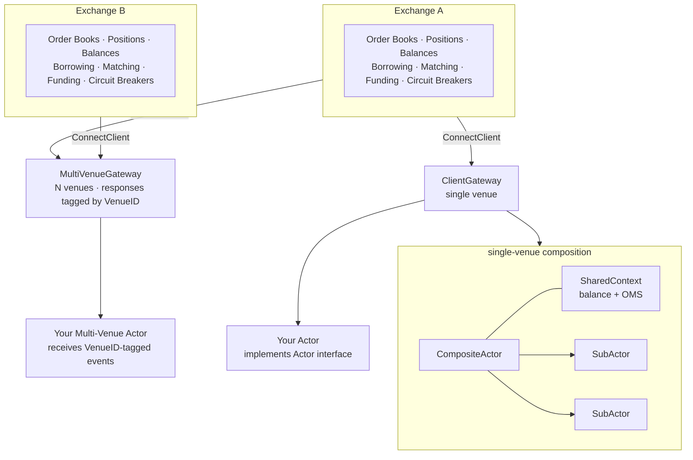

# Exchange Simulation Documentation

High-performance exchange simulator for spot and perpetual futures markets. Built in Go as a library — all customization happens through dependency injection and interface composition, not by modifying library code.

## Prerequisites

- Go 1.21+
- Python 3.8+ (for log analysis scripts)
- Make

---

## Getting Started

| | |
|---|---|
| [First Simulation](quickstart/01-first-simulation.md) | Minimal working simulation from scratch |
| [Random Walk Example](quickstart/02-randomwalk-example.md) | Annotated walkthrough of the reference `randomwalk_v2` simulation |
| [Creating Actors](quickstart/03-creating-actors.md) | Build custom trading actors step by step |

---

## Core Concepts

### Exchange

| | |
|---|---|
| [Exchange Architecture](core-concepts/exchange-architecture.md) | Single-threaded design, gateway model, object pooling, memory layout |
| [Order Matching](core-concepts/order-matching.md) | Price-time-visibility priority, FIFO, pro-rata, circuit breakers, iceberg/hidden orders |
| [Instruments](core-concepts/instruments.md) | Spot vs perpetual futures, precision math, tick size, minimum size |
| [Positions and Margin](core-concepts/positions-and-margin.md) | Position tracking, weighted avg entry, realized PnL, cross/isolated margin, liquidation |
| [Funding Rates](core-concepts/funding-rates.md) | Perpetual funding formula, settlement, mark/index price, configurable calculator |
| [Borrowing](core-concepts/borrowing.md) | Margin lending, auto-borrow, collateral validation, borrow/repay events |
| [Balance Snapshots](core-concepts/balance-snapshots.md) | Point-in-time balance state across spot, perp, and borrowed wallets |

### Actor System

| | |
|---|---|
| [Actor System](actors/actor-system.md) | BaseActor, CompositeActor, SubActor, SharedContext, event loop, order tracking |
| [Market Makers](actors/market-makers.md) | SlowMarketMaker, PureMMSubActor, AvellanedaStoikov optimal quoting |
| [Takers](actors/takers.md) | RandomizedTaker, RandomTakerSubActor, InformedTrader (Kyle/GM model) |
| [Arbitrage](actors/arbitrage.md) | InternalFundingArb (cash-and-carry), TriangleArbitrage |
| [Microstructure Patterns](actors/microstructure-patterns.md) | SimTicker constraints, timer-based vs snapshot-driven MMs, anti-patterns |

### Simulation Infrastructure

| | |
|---|---|
| [Simulated Time](simulation/simulated-time.md) | Clock abstraction, time compression, deterministic scheduling |
| [Ticker Factories](simulation/ticker-factories.md) | Real-time vs simulation-time tickers; how actors stay time-agnostic |
| [Price Processes](simulation/price-processes.md) | GBMProcess as fundamental value, latency models |
| [Multi-Venue Trading](simulation/multi-venue.md) | VenueRegistry, MultiVenueGateway, LatencyArbitrageActor, MultiExchangeRunner |

### Observability

| | |
|---|---|
| [Logging System](observability/logging-system.md) | NDJSON event log format, per-symbol and global loggers, all event schemas |

---

## Advanced Topics

Deep dives and design decisions for non-trivial use cases.

| | |
|---|---|
| [Custom Models](advanced/custom-models.md) | Custom instruments, matching engines, fee models, price oracles, clocks |
| [Mark Price Models](advanced/mark-price-models.md) | LastPrice, MidPrice, BinanceMarkPrice, BitMEX/Bybit/dYdX variants, manipulation resistance |
| [Latency Models](advanced/latency-models.md) | Log-normal RTT, Hawkes self-exciting congestion, model composition guide |
| [OMS and Capital Efficiency](advanced/oms-and-capital.md) | NettingOMS vs HedgingOMS, collateral efficiency, funding arb under each model |
| [Actor Composition](advanced/actor-composition.md) | SharedContext patterns, single vs multi-exchange composition, when to use MultiVenueGateway |
| [Capabilities Reference](advanced/capabilities.md) | Full feature matrix — what is production-ready vs framework-only |
| [Simulation Gaps](advanced/simulation-gaps.md) | Known actor-layer gaps: MM toxicity, impact permanence, latency distributions |
| [Exchange Realism Review](advanced/exchange-realism.md) | Audit of core mechanics against production exchange behavior |

---

## Key Features at a Glance

### Matching Engine
- Price → visibility → time (FIFO) priority — `DefaultMatcher`
- Pro-rata proportional fills at best level — `ProRataMatcher` (CME/Euronext style)
- Circuit breakers: `PercentBandCircuitBreaker`, `AsymmetricBandCircuitBreaker`, `TieredCircuitBreaker`, `CompositeCircuitBreaker`
- Self-trade prevention, iceberg, hidden orders, GTC/IOC/FOK
- Pluggable via `MatchingEngine` interface

### Perpetual Futures
- Configurable funding formula: base rate + premium × damping, clamped to max
- Mark price: last, mid, weighted-mid, Binance (median-of-three), BitMEX, Bybit, dYdX variants
- Index price: spot-derived, GBM process, fixed (for testing)
- Cross-margin and isolated-margin modes
- Automatic liquidation with insurance fund

### Borrowing
- Manual `BorrowMargin` / `RepayMargin`
- Auto-borrow triggered at order placement when balance is short
- Cross-margin collateral validation via `CollateralPriceOracle`
- Per-asset rates, per-asset limits, full event logging

### Multi-Venue Trading
- `VenueRegistry` holds named exchanges
- `MultiVenueGateway`: one client across N venues, responses and market data tagged by `VenueID`
- `LatencyArbitrageActor`: reference cross-venue actor with fast/slow venue price monitoring
- `MultiExchangeRunner`: full multi-exchange simulation with configurable overlap, actors, and logging

### Simulation Fidelity
- Simulated clock with `TickerFactory` abstraction — same actor code works in real-time and simulation
- `DelayedGateway` adds configurable latency to market data, requests, or responses
- Latency providers: constant, uniform, normal, load-scaled
- 100x–300x time compression achieved in practice
- Money conservation verified by `conservation_test.go` (all operations zero-sum)

### Actors (17 implementations in `realistic_sim/actors/`)
- Market makers: `PureMarketMaker`, `AvellanedaStoikov`, `SlowMarketMaker`, `MultiSymbolLP`, `MultiSymbolMM`
- Takers: `RandomizedTaker`, `RandomTakerSubActor`, `InformedTrader`, `NoisyTrader`, `EnhancedRandom`
- Arbitrageurs: `InternalFundingArb`, `FundingArbitrage`, `TriangleArbitrage`, `LatencyArbitrageActor`
- Directional: `MomentumTrader`, `CrossSectionalMR`

### Observability
- NDJSON event logs: trades, fills, funding settlements, OI changes, balance changes, balance snapshots
- Per-symbol and global (`_global`) loggers
- `BalanceChangeTracker` logs every mutation with before/after values
- Periodic market data snapshots (top-20 L2) and balance snapshots

---

## Architecture



---

## Building

```bash
make build          # Build all binaries to bin/
make test           # Run all tests
make test-race      # Run with race detector
make coverage-html  # View coverage report in browser
```

See [BUILD.md](../BUILD.md) for full documentation.

## Project Structure

```
exchange_simulation/
├── exchange/           # Exchange core: matching, positions, funding, borrowing
├── actor/              # Actor interface, BaseActor, CompositeActor, SubActor, OMS
├── simulation/         # Clock, ticker factories, multi-venue, latency, runner
├── realistic_sim/
│   ├── actors/         # 17 concrete actor implementations
│   ├── math/           # Indicators, volatility, returns
│   ├── position/       # Position risk management
│   └── signals/        # Signal generation (horizon, cross-section)
├── logger/             # NDJSON event logging
├── cmd/                # Runnable simulations
│   ├── randomwalk_v2/  # Reference single-exchange simulation
│   └── multisim/       # Reference multi-exchange simulation
└── docs/               # This documentation
```
