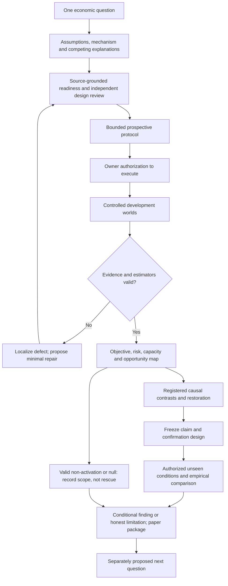

# Next-study readiness packet — composition-conditioned execution capacity

Date: 2026-09-23

Status: **DESIGN/READINESS ONLY — NOT AUTHORIZED TO IMPLEMENT OR RUN**

Consolidated baseline: `a878dca984911ab379fa5d619efc274ae43736a6`

Baseline tree: `36998b0cdcf8b80822500ea0eacdf1ac69ca98d5`

## Decision in one paragraph

The cleanest first market-ecology pilot is not the initially suggested
post-only Stoikov maker. On current `main`, its scale and endowment are not
isolated from other instruments and participants, and the multivenue harness
requires a three-venue derivative population. The smallest source-grounded
alternative is the existing one-venue `executionlab`: hold one immediate
parent-order policy fixed, vary its order size, and replace background adaptive
makers with delayed random takers while holding the background account count
and nominal initial endowment constant. This can answer a narrow question about
**execution-scale capacity conditional on population composition**. It cannot
answer market-maker profitability, capital capacity, equilibrium, or empirical
realism. Two bounded, non-economic implementation prerequisites remain before
execution: a provenance/config adapter and an independently reconstructible
execution/opportunity evidence contract.

The R2/SV1D line remains closed at its valid non-activation boundary. Nothing
in this packet reopens, rescues, supersedes, or rescales that result.

## 1. Research contract

### Question

> How does replacement of background liquidity providers by delayed random
> takers change the economically admissible execution scale and implementation
> shortfall of one fixed immediate-execution policy?

The proposed pilot is a deliberately small instance of the wider question:
how participant objectives, resources, information, and constraints jointly
shape another participant's opportunity set and outcome.

### Mechanism hypothesis

With total background account count and nominal endowment fixed, a population
with fewer adaptive makers and more random takers should generally expose less
resting ask depth to a buy parent at its decision time. At larger parent sizes
this should lower completion and/or raise all-in target implementation
shortfall. The reverse should hold for a maker-richer population. This is a
conditional simulator hypothesis, not a prediction about all real markets.

### Prospective falsifier and identification failure

- **Opportunity separation:** for each composition contrast, use the median of
  the three seed-paired differences in delivered five-level ask depth. The
  maker-rich channel is separated only when its median difference from C0 is
  positive; the flow-rich channel is separated only when its median difference
  from C0 is negative. Zero is not separation. No effect-size threshold is
  claimed in this screening pilot.
- **Descriptive economic falsifier:** when one channel is opportunity-separated,
  all three size-specific target-shortfall contrasts are defined, and none of
  their median differences has the predicted sign, that directional channel
  is unsupported by this pilot. For C+ the predicted sign is negative; for C−
  it is positive. Any mixture is reported as a response map, not forced into a
  binary verdict.
- **Identification failure:** delivered pre-decision depth is not measurably
  different across compositions, is unavailable, or cannot be joined to the
  parent request and exchange fills. A missing eligible opportunity is an
  assigned-world outcome, not a row to discard, and is not an economic null.
- **Implementation failure:** config, schedule, quantity, fee, terminal mark,
  or exchange/actor reconciliation fails. This invalidates the cell rather
  than counting as poor strategy performance.

### Verification tier

| Claim class | Tier | Meaning here |
|---|---|---|
| arithmetic, order identity, quantity and fee reconstruction | A | exact independent replay is required |
| composition effect within the simulated setting | B screening | three independent seed blocks; descriptive paired contrasts, no strong generalization |
| transfer to real markets | C / unsupported by the pilot | requires a separate compatible empirical comparison |

## 2. Current scientific boundary

The authoritative navigation is [`README.md`](README.md), the repository
integration record is [`REPOSITORY-CONSOLIDATION.md`](REPOSITORY-CONSOLIDATION.md),
and the closed line is documented in
[`v2-r2-sv1d-iteration-closeout.md`](v2-r2-sv1d-iteration-closeout.md).

- R2 predecessor: `NON-VIABLE AT THE 24H MARKET-SURVIVAL GATE`.
- Retained seed-659 treatment: evidence-valid, supplier active,
  `TREATMENT_NOT_ACTIVATED`.
- No formal tri-arm promotion, completed successor 24-hour campaign, freeze,
  or holdout validation followed.
- This packet proposes a separate one-venue execution study and consumes no
  R2/SV1D artifact or seed.

Consolidated `main` is a development baseline, not a scientific freeze. Old
runs are not runs of `a878dca` merely because their source now exists in its
history.

## 3. Candidate selection

### Why the post-only Stoikov maker is not the first pilot

The policy is implemented and mechanically tested in
[`simulations/multivenue/stoikov.go`](../simulations/multivenue/stoikov.go),
with population wiring in
[`simulations/multivenue/sim.go`](../simulations/multivenue/sim.go). It is a
valuable later subject, but the present harness confounds the first capacity
question:

1. `multivenue.Config.normalize` requires exactly three venues.
2. The harness constructs spot, perpetual, dated-future, and option actors even
   when the desired question concerns one spot book.
3. `MakerQuoteQty` and `MakerInventoryLimit` configure a family of Stoikov
   makers rather than one uniquely identified focal maker; changing scale can
   also change the perpetual maker and other enabled spot books.
4. Stoikov maker spot and margin endowments are hard-coded in the constructor,
   so assigned capital cannot be varied independently from quote/risk scale.
5. Existing role equity includes inventory revaluation and is explicitly an
   outcome description, not skill or causal PnL attribution
   ([`analysis/ecology.go`](../analysis/ecology.go)).
6. The control has not been calibrated to empirical fill-arrival intensity;
   the existing audit correctly calls it Avellaneda–Stoikov-inspired rather
   than optimal or empirically calibrated.

Using it now would require a source amendment and a broader population audit,
which is contrary to the purpose of a smallest first pilot.

### Selected focal policy

The selected policy is `executionlab.Immediate`: after receiving a delayed
two-sided snapshot and reaching its decision time, the actor submits one market
child for the declared target quantity. Its economic objective is not trading
profit. It is to complete a mandated buy at low all-in implementation
shortfall. The implementation is in
[`simulations/executionlab/execution.go`](../simulations/executionlab/execution.go)
and its one-venue wiring is in
[`simulations/executionlab/sim.go`](../simulations/executionlab/sim.go).

This choice changes the object called “capacity”: it is **execution-scale
capacity** (target quantity acceptable under a completion/cost mandate), not
capital capacity or a profitable-strategy frontier.

### Alternative retained for later

A focal post-only Stoikov maker remains a defensible later study after a
separate per-participant configuration/endowment seam and focal PnL/benchmark
contract exist. It should not be approximated by changing family-wide fields
and calling the resulting difference focal capacity.

## 4. Actual capability map

The columns deliberately distinguish software presence from scientific
evidence.

| Capability | Implemented | Exercised in tests | Historical world | Independently reconstructed | Causally tested | Replicated | Empirically compared |
|---|---|---|---|---|---|---|---|
| one-venue ABC/USD deterministic execution lab | yes | yes | 2026-08-15 execution studies | report arithmetic partly | immediate vs TWAP | 20 historical seeds | no |
| immediate parent request/fill/completion report | yes | yes | 0.2/2/5 ABC studies | child rows internally reconcile | policy contrast only | 20 seeds | no |
| all-in quote-fee implementation shortfall | yes | adversarial arithmetic fixtures | historical execution studies | from actor child rows, not independent exchange evidence | immediate vs TWAP | 20 seeds | formula is literature-consistent, parameters are not calibrated |
| target residual marked at terminal two-sided midpoint | yes | yes, including invalid foreign fee | historical execution studies | not yet from a separate evidence stream | sensitivity not tested | 20 seeds | no |
| configurable target quantity | yes in library and CLI | yes | three historical sizes | no provenance-bound matrix adapter | yes, historical size comparison | 20 seeds | no |
| configurable maker/noise counts | yes in library `SimConfig` | indirectly | only 4/8 historical composition | no | no composition intervention | no | no |
| constant per-class latency | yes | deterministic tests | 2 ms background / 1 ms parent | no independent delivery replay in executionlab | not in this study | yes for historical policy worlds | no |
| equal nominal per-account endowment | yes, hard-coded common balance map | construction path | historical worlds | not emitted in current report | no | no | no |
| fixed-total-account replacement design | possible through library config | not specifically tested | not run | no | no | no | no |
| pre-decision delivered-depth denominator | actor observes it | no report contract | not retained in summary | no | no | no | no |
| provenance-bound config/source/toolchain manifest | multivenue has one; executionlab does not | no | no | no | no | no | no |
| exchange-side independent execution reconstruction | exchange events exist in platform | broad exchange tests | not retained for executionlab studies | no | no | no | no |
| focal capital utilization and return | balances exist; no executionlab report | no | no | no | no | no | no |
| empirical composition benchmark | no participant-type labels in proposed data | no | no | no | no | no | no |

The historical 20-seed studies are useful prior software evidence, not pilot
results. They used the 4-maker/8-noise composition and old source identities.

## 5. Actor and market contracts

The table records current executable behavior, not an idealized economic role.
Every account receives 100,000 ABC and USD 100,000,000. No actor borrows,
receives replenishment, or uses margin in this laboratory.

| Dimension | Focal immediate parent | Adaptive background maker | Delayed random taker |
|---|---|---|---|
| objective/model role | complete one fixed buy target; evaluated by all-in target implementation shortfall | maintain five bid/ask levels around a weighted public-book midpoint; no explicit utility | create symmetric stochastic liquidity-taking flow; no liability, alpha, or welfare objective |
| capital, inventory, debt | common initial balances; focal capital is fixed and nonbinding; resulting base/cash position is retained | common initial balances; own-fill inventory is tracked, but executionlab sets inventory skew to zero and has no inventory/risk limit | common initial balances; fills change balances, with no actor-level inventory target or limit |
| financing | none | none | none |
| observations | delayed public ABC/USD snapshots | direct public snapshots and trades | delayed public snapshots and trades |
| latency | 1 ms request, response, and market data | direct mount | 2 ms request, response, and market data |
| decision clock | polls every 1 ms; decides no earlier than 1 s and only after a positive two-sided snapshot | five deterministic per-level schedules; maker index `i` has base/outer intervals `10+i`/`30+i` ms | 25 ms periodic tick; first tick subscribes and returns |
| pricing/execution | one market child for `TargetQty`; no direct book read or hidden oracle | ordinary limit orders at $10, $30, $50, $70, and $90 offsets from weighted mid; not post-only | random side and uniform size in `[0.025,0.075)` ABC; caps to delivered facing depth when positive, but an empty delivered side still produces a request whose outcome depends on the book when it reaches the venue |
| fees | 5 bp taker fee in USD | zero configured fee | 5 bp taker fee in USD |
| constraints | no resubmission after cancelled residual | fixed 0.25 ABC per level; no configured skew, withdrawal policy, or explicit risk constraint | delivered-depth cap when facing depth is positive; finite balances; no resubmission |
| entry/exit | one decision after warm-up; residual remains unexecuted and is terminal-marked only for measurement | subscribes on first base tick, refreshes until the fixed horizon, then simulation shutdown | subscribes on first tick, evaluates on later ticks until the fixed horizon, then simulation shutdown |

The terminal midpoint is controller-side evaluation after the final fixed
point. It is not information available to the actor and must never be fed back
into its decision.

The maker class is “adaptive” only in its weighted-book midpoint and selective
level refresh. Because `SkewTicksPerLot` is zero in `executionlab`, its quoted
mid does not respond to its recorded inventory. Calling this policy an
inventory-sensitive or economically optimizing dealer would be false. The
random-taker class supplies background consumption, not welfare-maximizing
end-user demand.

### Market

One ABC/USD continuous limit-order book uses deterministic ingress and phase
ordering. Tick, base precision, matching, actor class code, and each class's
fee and latency schedule remain fixed across proposed cells. Composition adds
or removes indexed actor instances, so the set of maker refresh phases and
client IDs changes with the treatment; that is part of the declared class
replacement rather than a separately identified coefficient. The pilot does
not activate margin, derivatives, funding, settlement, liquidation, multiple
venues, or the R2 calendar.

## 6. Scale-to-outcome dependency

```text
TargetQty (0.5 / 2 / 5 ABC)
  -> one requested market-child quantity
  -> either rejected/unadmitted quantity or admitted order against resting asks
  -> for admission, fills plus any cancelled residual
  -> executed notional, quote fee, completion ratio
  -> target implementation shortfall using an explicit terminal mark only for residual measurement
```

This path is real and direct. By contrast, increasing the focal account's cash
would not change its request, order, or risk limit at all under current code.
A lower return on more assigned cash would therefore be denominator dilution,
not capacity. The pilot keeps focal capital fixed and varies **order scale**.

The proposed 0.5/2/5 ABC grid follows the executable depth scale rather than
the old five-minute SV1D horizon. Each maker initially requests 0.25 ABC at
each of five levels. With 2/4/6 makers, nominal initial same-price touch depth
is 0.5/1.0/1.5 ABC and total five-level depth per side is 2.5/5.0/7.5 ABC,
before endogenous refresh, noise, and queue effects. Thus the grid contains a
touch-scale request, a book-walking request, and a request at or beyond the
five-level capacity of the thinner populations.

## 7. Payoff and formula register

Let side sign `s=+1` for a buy and `s=-1` for a sell; `B` is base precision;
`Q` is target quantity; `Q_f` is filled quantity; `U=Q-Q_f`; `M_0` is the
decision midpoint; `M_T` is the terminal two-sided midpoint; `C` is exact
executed quote notional; and `F` is the sum of quote-denominated fees.

| Formula / hypothesis | Units and domain | Kind | Implementation/reference | Required test/falsifier | Allowed interpretation |
|---|---|---|---|---|---|
| `C = Σ(q_k p_k / B)` with fixed-point checked arithmetic | quote units; positive admitted fills | identity | `execution.go`, `types.TryMulDiv` | independent exchange-fill replay equals child and total notional; overflow fails | executed notional only |
| `S_fill = s(C - Q_f M_0/B) + F` | quote units; `M_0>0`, quote-priced fees | identity | `reportWithTerminalMark` | hand examples for buy/sell, partial fills and fee asset | cost on filled quantity, not completion |
| `C* = C + U M_T/B` | quote units; `M_T` must be two-sided and positive | measurement convention | current target-shortfall report | absent/one-sided terminal mark or unpriced fee makes result invalid | marked residual obligation, not a fictitious fill |
| `S_target = s(C* - Q M_0/B) + F` | quote units | identity plus declared mark convention | current report; implementation-shortfall literature | independent arithmetic and mutation tests | primary cost outcome conditional on mark convention |
| `IS_bps = 10,000 S_target / (Q M_0/B)` | basis points; nonzero target reference | identity | current report | exact rounding tolerance declared before run | normalized simulated execution cost |
| `completion = Q_f/Q` | unitless `[0,1]` | identity | requested/fill/cancel lifecycle | exchange and actor quantities reconcile | observed completion |
| more makers → more delivered depth → lower cost at large `Q` | conditional on this population and clocks | mechanism hypothesis | not encoded in focal policy | depth denominator present; outcome ordering may falsify | causal composition effect only within tested intervention |
| real impact follows a fixed power law | undefined for this pilot | empirical regularity, **not assumed** | Bouchaud–Farmer–Lillo motivates later comparison | compare alternatives on unseen data | no exponent claim from three sizes |

The primary economic acceptability rule proposed for screening is: valid
evidence, exact quantity/fee reconciliation, full completion, and target
shortfall no greater than **10 bp**. Ten basis points is a prospective all-in
execution mandate, not an empirical universal. The configured 5 bp fee
motivates its order of magnitude but is not an exact five-plus-five
decomposition: fees apply to executed notional while the target-shortfall
denominator uses target reference notional. Every cell is still reported as a
complete response map; no threshold crossing is hidden.

Allocated capital and utilized capital must be reported separately. In this
pilot allocated capital is intentionally fixed and nonbinding; utilized quote
capital is executed notional plus quote fees. There is no annualization and no
claim of strategy return.

## 8. Proposed research lifecycle



Failure branches are substantive. Invalid evidence licenses only localized
repair with new provenance. No qualifying opportunity is an identification
limit. A valid null or loss is retained. A confounded design is redesigned
prospectively. A real-data mismatch is reported as a limitation rather than
automatically tuned away.

## 9. Candidate mechanism map and competing explanations

| Channel | Pilot status | Competing explanation or confound |
|---|---|---|
| maker count → resting depth/replenishment → completion and shortfall | primary hypothesis | quote synchronization, matching priority, or common weighted-mid feedback rather than “liquidity supply” broadly |
| random-taker count → background consumption → depth at parent arrival | primary hypothesis | more takers also means more fee-paying actors and different actor/client ordering |
| delayed observations → stale state → depth-bounded random orders | held fixed within each class | class replacement bundles objective, latency, and fee schedule by design |
| weighted-book-mid maker response → later depth | implemented background mechanism | executionlab sets inventory skew to zero; the maker has no explicit utility and is not post-only |
| leverage/margin → stress amplification | excluded | no inference |
| options/hedging → underlying feedback | excluded | no inference |

The first pilot identifies the effect of replacing complete participant
classes, not a pure maker-count coefficient. Decomposing objective, latency,
fee, and account priority would be a later factorial study.

## 10. Randomness, uncertainty, and valid statistical unit

The proposed design uses three independent seed worlds and matched seed/scale
blocks across compositions. Each random taker owns a stream derived from the
world seed and participant index; maker policies are deterministic. Common
indices preserve common streams where the roster overlaps. The endogenous
book path is expected to diverge after composition changes.

Equal world seeds are not claimed to hold all random events fixed. Actor IDs,
queue priority, and the number of random streams differ as part of the
composition intervention. Event rows within a world are not independent
samples. The unit for uncertainty is the seed world. With three seeds, report
all paired differences, median, and range; do not use event-count standard
errors or make tail-risk/generalization claims. Six predeclared composition
contrasts (two contrasts at three scales) are reported without selective
significance claims.

## 11. Opportunity denominator and evidence readiness

The required join is:

```text
public two-sided book state
  -> snapshot actually delivered to focal actor
  -> feasible target under balance/order constraints
  -> focal market request
  -> venue admission and ordered fills/cancel residual
  -> child report and terminal valuation
```

Current code retains the last delivered bid and ask in the actor but reports
only the midpoint. Current historical JSON output is therefore insufficient to
independently distinguish “composition had no effect” from “the parent saw no
different opportunity.” The future evidence contract must retain the delivered
decision snapshot or a digest/join to it, exact request/order/trade IDs,
exchange timestamps, fills, fees, cancellation, and terminal mark source.

No aggregate absence may be interpreted as absence from raw evidence. Missing
or malformed joins fail closed. A separate reconstructor must reproduce every
report field and reject dropped, duplicated, mismatched, late, overfilled,
foreign-fee, and one-sided-terminal mutations.

## 12. Two bounded prerequisites

### F1 — external pilot adapter and immutable provenance

Create an adapter outside the reusable simulation library that accepts the
variable matrix fields: maker count, noise count, target quantity, seed,
duration, latencies, and policy. It must bind and emit the compiled endowment
and fee constants, validate the fixed 12-account background roster and equal
nominal aggregate endowment, write exact config/source/toolchain identities,
and refuse output reuse. Because endowments and fees are currently hard-coded
inside `NewSim`, either the adapter must reject any value other than those
constants or a separately reviewed, default-preserving `SimConfig` seam must
expose them; duplicating unchecked constants in the adapter is not acceptable.

Acceptance test: all 27 draft cells render distinct canonical plans; changing
only output path does not change the plan digest; changing an economic field
does; unregistered fields and malformed normalization fail before simulator
startup.

### F2 — independent execution/opportunity evidence contract

Persist a canonical decision-to-exchange packet sufficient to reconstruct the
delivered depth, feasibility, requested quantity, rejected/unadmitted quantity,
admitted quantity, fills, fees, cancelled residual, terminal mark, completion,
and both shortfall measures without calling actor report code. A rejected
request has no order or cancellation and must not be forced through the
accepted-order quantity identity. Add exact differential tests against
`ExecutionReport`, fresh-process determinism/evidence-neutrality checks, and
adversarial mutation tests, including empty-facing-depth submission. Preserve
the existing policy and matching semantics.

Acceptance test: independent reconstruction equals the report on complete,
partial, fully rejected, and zero-facing-depth fixtures; accepted quantities
reconcile to fills plus cancelled residual, rejected quantities reconcile to
requests with no admitted order, every listed mutation fails closed, and
evidence on/off leaves the economic execution digest unchanged.

These are instrumentation/adapter fixes. They do not authorize a population,
parameter, threshold, policy, or run.

## 13. Primary literature and empirical-reference plan

The literature pass is bounded to sources that directly constrain the pilot or
the later ecology program.

| Primary source | Relevant assumption or method | Current platform support / difference | Use in this pilot or a future result |
|---|---|---|---|
| [Farmer, “Market force, ecology and evolution” (2002)](https://doi.org/10.1093/icc/11.5.895) | profitability and market force depend on strategy abundance and price formation | composition is executable; evolutionary capital dynamics are not part of the pilot | motivates conditional response maps, not a universal ranking |
| [Scholl, Calinescu & Farmer, “How market ecology explains market malfunction” (2021)](https://doi.org/10.1073/pnas.2015574118) | strategy returns can be density-dependent and population interaction matters | pilot changes class counts at fixed resources but has no wealth evolution | tests a small composition-conditioned outcome, not ecological equilibrium |
| [Almgren & Chriss, “Optimal execution of portfolio transactions” (2001)](https://doi.org/10.21314/JOR.2001.041) | execution trades expected cost against risk over a schedule | selected policy is immediate and has no timing-risk utility | supplies the distinction between execution objective and trading PnL; no optimality claim |
| [Kissell, “The Expanded Implementation Shortfall” (2006)](https://doi.org/10.3905/jot.2006.644083) | separate execution cost, delay/opportunity cost, and explicit fees | report marks residual quantity at a declared terminal midpoint | supports transparent component reporting; terminal mark remains a model convention |
| [Bouchaud, Farmer & Lillo, “How markets slowly digest changes in supply and demand” (2009)](https://doi.org/10.1016/B978-012374258-2.50006-3) | persistent order flow, adaptive liquidity, and nonlinear impact are joint phenomena | current flow is short-memory and policy-generated; three sizes cannot identify a law | motivates later unseen-data alternatives and warns against forcing a square-root exponent |
| [Byrd, Hybinette & Balch, ABIDES (2020)](https://doi.org/10.1145/3384441.3395986) | message-level discrete-event markets with configurable agent latency | this platform has deterministic messages/latency but a much smaller first ecology | motivates explicit communication and reproducibility contracts, not fidelity equivalence |
| [Wellman, Tuyls & Greenwald, EGTA survey (2025)](https://doi.org/10.1613/jair.1.16146) | simulation-derived games require explicit strategy/profile sampling and uncertainty | no payoff game is estimated in the pilot | guides the later fixed-population-to-restricted-response sequence |
| [Omidshafiei et al., α-Rank (2019)](https://doi.org/10.1038/s41598-019-45619-9) | evolutionary ranking applies to an empirical payoff system over specified profiles | no profile-complete payoff table exists yet | later method only; not evidence for equilibrium, cycles, or ranking now |

For an empirical microstructure benchmark, the accessible starting point is
the [LOBSTER sample dataset](https://data.lobsterdata.com/info/DataSamples.php),
whose message and synchronized order-book files are documented
[here](https://data.lobsterdata.com/info/DataStructure.php). A future
comparison can compute displayed depth, spread, and hypothetical immediate
sweep cost in compatible basis-point/quantity units on one liquid Nasdaq name.
The samples are short and do not identify trader objectives or counterparty
classes; therefore they cannot validate the composition treatment. Full
Nasdaq TotalView or NYSE TAQ data require licensed access, and TAQ lacks full
order-level depth. Until a dataset, date, symbol, corporate-action policy, and
cost convention are prospectively selected, the pilot's claim remains
simulation-internal.

## 14. Staged game-theory extension — paper design only

If the execution response map is valid, later work may proceed through:

```text
population-conditioned payoff/utility surfaces
  -> restricted policy comparisons
  -> rare-policy invasion tests
  -> response graph and non-transitivity checks
  -> explicit capital allocation / entry / exit rule
  -> long-horizon coexistence, stability, cycles, or extinction
```

Market payoffs need not be zero-sum. Policy choice, execution scale, capital,
and institution are different axes. A restricted best response is not global
Nash. Pairwise non-transitivity does not establish a persistent population
cycle. Stationary market statistics, stable capital shares, metastability,
calendar periodicity, and strategic equilibrium are distinct objects.

## 15. Paper outline

### Methods ready to describe now

1. Development platform and exact consolidated identity.
2. One-venue deterministic matching and latency boundary.
3. Focal immediate-execution policy and background actor contracts.
4. Fixed-resource composition replacement and target-quantity scale.
5. Implementation-shortfall identities and validity classifications.
6. Prospective evidence reconstruction and seed-block uncertainty design.

### Results not obtained

1. No proposed pilot cell has run.
2. No composition contrast, capacity region, null, or loss has been measured.
3. No new source has passed the two prerequisite acceptance gates.
4. No independent result reconstruction exists for the proposed packet.
5. No empirical corridor or market-realism conclusion exists.
6. No confirmation seed, freeze, equilibrium, or holdout claim is authorized.

## 16. Claim ledger

| Claim | Evidence | Falsifier | Status |
|---|---|---|---|
| target quantity directly changes the focal request | source trace in `execution.go` | request differs from target outside declared rounding/slicing | mechanically supported |
| 2/4/6 maker replacement can preserve 12 background accounts and nominal endowment | common balance map and configurable counts in `sim.go` | adapter emits unequal count/endowment | implementable, not yet tested as a protocol |
| current historical report is insufficient for independent opportunity reconstruction | decision depth is not serialized; no exchange-side packet | existing retained artifact reconstructs all joins | supported gap |
| composition changes execution-scale capacity | hypothesis only | valid ordered opportunity with no outcome change, or opposite robust result | untested |
| pilot transfers to real markets | no compatible participant-labelled data | prospective empirical comparison | unsupported |

## 17. Independent bounded reviews

Two fresh Luna-xhigh read-only reviewers inspected exact initial draft commit
`0440e26628f2bfe0f0b4a2ce0d1c35d3e80546bb` against the named source paths.
Neither reviewer edited files, ran simulations or tests, inspected protected
outcomes, certified empirical realism, or authorized execution.

| review | execution | initial verdict | required changes incorporated here |
|---|---|---|---|
| economic/mechanical execution-to-payoff path | `COMPLETED` | `ACCEPT_WITH_REQUIRED_CHANGES` | describe the configured maker rather than latent inventory-skew features; bind rounded per-index cadences and actual quote offsets; separate rejected from admitted/cancelled quantities; treat 10 bp as an all-in mandate; label residual valuation horizon-specific |
| causal identification/statistical scope | `COMPLETED` | `ACCEPT_WITH_REQUIRED_CHANGES` | define all-assigned-world reporting and when a paired contrast is undefined; declare clock/client-ID changes part of the bundled treatment; make the directional screening falsifier explicit |

The initial findings do not add a third implementation prerequisite. They
tighten the protocol that F1 must bind and the cases that F2 must reconstruct.
The corrected draft requires one bounded delta check before it is presented as
reviewed; a failure of that check remains an unresolved design issue, not an
execution authorization.

## 18. Readiness decision

**READY AFTER 2 SPECIFIC BOUNDED FIXES**

The economic policy, intervention, finite matrix, primary outcome, falsifier,
and resource boundary are specific enough for owner review. Execution is not
ready because F1 and F2 are required to prevent an internally generated report
from serving as its own oracle.

Next three actions, each requiring separate owner authorization:

1. **Implement F1.** Complete when the adapter renders and validates all 27
   canonical plans with immutable source/config/toolchain identity and no
   economic-library change.
2. **Implement F2.** Complete when an independent reconstructor exactly matches
   complete/partial fixtures, all corruptions fail closed, and evidence is
   behavior-neutral across fresh processes.
3. **Prospectively preregister the reviewed pilot.** Complete when the owner
   accepts the exact threshold, candidate seed set after an untouched-status
   check, matrix, estimator, budget, and development/confirmation boundary.

No seed is reserved, no config is active, and no simulation is authorized by
this packet.
