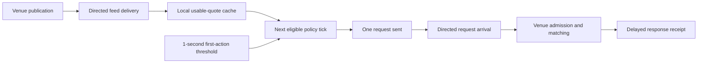
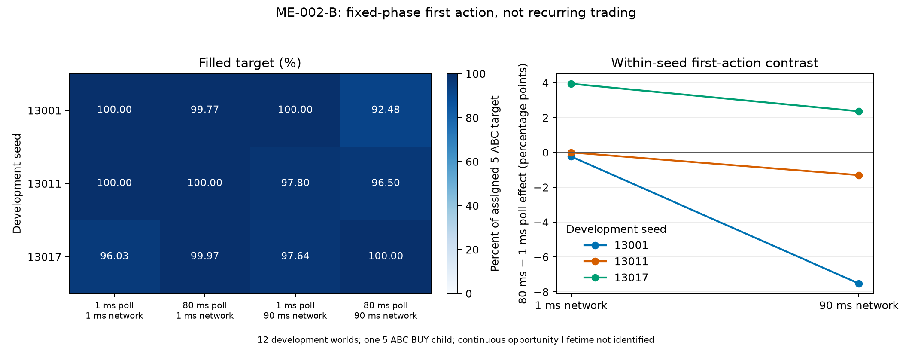

# ME-002-B — first-action cadence × directed network delay

Status: **REVIEWED 12-CELL DEVELOPMENT RESPONSE MAP**.
This is a fixed-phase, one-child execution experiment, not a recurrent
high-frequency policy, a profitability study, confirmation, or empirical
validation. The registered matrix and endpoint are in [protocol P2](protocol.md);
the [prospective lock](development-lock-20260926.md) predates every technical
control and economic outcome.

## Question and bounded result

For a finite immediate buyer in the same one-venue ABC/USD background
population, does changing its first-action poll interval from 1 to 80 ms
move the order and alter the 5-ABC filled fraction? Does that response depend
on a fixed 1 versus 90 ms directed feed/request/response network assignment?

The answer in these **three development seeds** is mechanically clear but
economically mixed. The 80-ms poll shifts the first send and venue arrival
by exactly 40 simulated ms at either network setting. The network change
shifts arrival by 89 ms at either poll setting. Filled-fraction poll effects
have both signs across seeds: at the 1-ms network they are −0.002304580,
0, and +0.039386454; at the 90-ms network they are −0.075156910,
−0.013017892, and +0.023585406. The per-seed interaction is negative in
this finite grid, but three seeds and one gate phase do not establish its
frequency, sign in other ecologies, or a general speed law.

Every assigned world sent one order and received fills: five were fully
filled and seven partly filled. No unassessable or excluded economic cell
is hidden in the denominator. A continuous executable opportunity lifetime
and exact pre-match book are **NOT RECONSTRUCTIBLE** from the sampled public
snapshots retained here. Those missing quantities are not zeros.

## Fixed model, timing path and scope

The P2 effective plans specify one ABC/USD price-time venue, four makers,
eight random takers and focal client 13. The finite focal actor begins with
100,000 ABC and 100,000,000 USD (100,000,000 base atoms per ABC;
100,000 quote atoms per USD), pays a 5-bp quote-denominated taker fee and
sends one market-GTC BUY child for 5 ABC. Its policy will not act before
1.000 simulated second; it uses the latest locally delivered positive
two-sided quote. The world lasts four simulated seconds. The background
composition, endowments, fee rules, venue and matching rules, target,
policy, one-second gate, zero added processing delay and 1-ms runner step
remain fixed. The plan's legacy slice fields do not make this
`Immediate` policy repeatedly trade.



The network factor applies the same 1 or 90 ms logical delay separately
to feed, request and response; it is not measured geography. The poll
factor is 1 or 80 ms. Since 80 ms does not divide the one-second threshold,
its first eligible tick is 1.040 s. Thus the study tests a declared
**fixed gate/poll phase**, not the average effect of an arbitrary decision
cadence. The policy reads a cached, delayed local view, not a current
global oracle. Simulation time is independent of host load.

At 1-ms network delay, a usable quote first entered the cache at 0.012 s;
at 90 ms it entered at 0.180 s. Both are before the gate. For all seeds,
P1 sent at 1.000 s and P80 at 1.040 s. Venue arrivals were 1.001,
1.041, 1.090 and 1.130 s for P1-N1, P80-N1, P1-N90 and P80-N90
respectively. Selected quote ages at decision were 100, 40, 100 and
140 ms in those arms. The fast-network P80 arm selected later snapshot
sequence IDs than P1 in all three seeds; under slow network the P1 and
P80 arms selected the same sequence ID within each seed. Information
selection, send time, arrival time and fill are therefore distinct
observations. The later action deliberately faces a later endogenous
market state; no pure computation-speed effect is isolated.

## Registered endpoint and complete matrix

The primary endpoint is `Y = exchange-filled ABC base atoms / 500000000
assigned base atoms`. A valid no-send, rejection or accepted-unfilled
world would contribute zero; invalid/incomplete evidence would be
`UNASSESSABLE`. None occurred. The unit of replication is a paired
seed quartet, not each fill or quote update. Fractions below are raw
all-assigned values, with no survival selection.

| Development seed | P1-N1 | P80-N1 | P1-N90 | P80-N90 |
|---:|---:|---:|---:|---:|
| 13001 | 1.000000000 | 0.997695420 | 1.000000000 | 0.924843090 |
| 13011 | 1.000000000 | 1.000000000 | 0.977992752 | 0.964974860 |
| 13017 | 0.960288758 | 0.999675212 | 0.976414594 | 1.000000000 |

For seed `s`, the registered poll contrast at network `n` is
`Y(P80,n,s) − Y(P1,n,s)`, the network contrast at poll `p` is
`Y(p,N90,s) − Y(p,N1,s)`, and the interaction is the difference of the
two poll contrasts. All effects below are **filled-fraction units**;
multiply by 100 for percentage points.

| Seed | Poll at N1 | Poll at N90 | Network at P1 | Network at P80 | Interaction |
|---:|---:|---:|---:|---:|---:|
| 13001 | −0.002304580 | −0.075156910 | 0 | −0.072852330 | −0.072852330 |
| 13011 | 0 | −0.013017892 | −0.022007248 | −0.035025140 | −0.013017892 |
| 13017 | +0.039386454 | +0.023585406 | +0.016125836 | +0.000324788 | −0.015801048 |

The three-seed median and observed range, produced by the Go surface,
are: poll at N1, 0 [−0.002304580, +0.039386454]; poll at N90,
−0.013017892 [−0.075156910, +0.023585406]; network at P1, 0
[−0.022007248, +0.016125836]; network at P80, −0.035025140
[−0.072852330, +0.000324788]; interaction, −0.015801048
[−0.072852330, −0.013017892]. These ranges are the observed seed
values, **not** confidence or population bounds. No p-value,
equivalence margin or tail-risk estimate was registered.



Figure: 12 development cells, one 5-ABC child per world. The left panel
shows every full and partial outcome; the right panel shows the two
registered poll contrasts separately by seed. Axes are percent of assigned
target and percentage points, respectively. The figure reads the
[corrected Go surface](figure-provenance.json); no smooth law was fitted.

## Evidence, independent reconstruction and the diagnostic correction

The executed source C is `404091350440daf8ee0d1299730a932b1bc105af`
(tree `0e947767e723f48c872b1945136fa9ccad57f61e`), with a clean
Go 1.27.0 simulator/analyzer binary SHA-256
`09eb76c255f633164e033fa7b777ef4ac11abdcedd6252c11814f9366e221421`.
The P2 protocol is commit `18dcb77147fa15b5c8880456aaa1dac8906de3cb`,
blob `96884a3be38d0e82c2d0f828143604bf462edabb`.
The 12 raw-plan SHA-256 values are in the pre-outcome lock. The external
retained namespace is
`/home/vlad/ExchangeSimulation-me002b-development-4040913`.
This local location is not a claim of remote backup.

The pre-run independent reviewers accepted the exact C/P2 candidate for
their limited mechanics/evidence and causal-design scopes. Clean full
`make test`, `go vet ./...`, targeted race, skill validation and
fresh-process controls passed. The g1/g7 controls had byte-identical
evidence, actor report, manifest and reconstructed result; they are
technical controls, **not** extra economic seed observations.
All 12 worlds and 12 individual replays exited zero in finite
4-GiB/zero-swap scopes; no OOM event was recorded. Total retained economic
evidence is 58,017,887 bytes, measured world wall time sums to about 3.78 s,
and maximum sampled cgroup memory was 37,945,344 bytes. Operational
measurement details are in [the control gate](technical-controls-20260926.md)
and external `measurements/` records.

The exact-C v1 per-cell results retain a problematic *secondary* field:
the generic replay called some runs of **sampled publication snapshots**
`selected_opportunity.complete` and calculated
`action_delay_over_duration`. Eight of the 12 original cells emitted
that sampled-interval ratio. The first post-result mechanics reviewer
substantively rejected treating it as a continuous executable
opportunity lifetime under P2. The old result files and raw evidence
remain unchanged. Analyzer-only commit
`b85df5eb86e7865e74de5317cc86c003249dd4f6` replays
**all 12** streams separately from their stored v1 result files, using
the same Go reconstruction contract. It verifies plans/manifests/file digests, actor/ledger
outcomes and finite resource measurements, then emits a versioned
`cadence-surface-v2.json` with the sampled selected-state flag but
without v1 duration/completion/ratio. Every cell explicitly states
`NOT_RECONSTRUCTIBLE_FROM_SAMPLED_SNAPSHOTS` for opportunity lifetime.
Its SHA-256 is
`117db2414b2866fefb938a2a9f81b0f6273f35823b1c082a7d85dda88aac5945`;
the analysis binary SHA-256 is
`71b5d2666c5f60295cdb5af62e0e20fd5c1d29c2acc3743a4e64b87fbe386890`.
This is an offline correction of interpretation/output, **not** a
simulator-trajectory repair or source-C relabeling. Exact pre-match
executable book depth also remains `NOT_RECONSTRUCTIBLE` here.

To reproduce the corrected *offline* result from a clean checkout of
`b85df5e` and Go 1.27.0, build `./cmd/mecadencesurface`, compare its
binary digest above, and use a **fresh** output path:

```bash
mecadencesurface \
  -root /home/vlad/ExchangeSimulation-me002b-development-4040913 \
  -repo <clean-b85df5e-checkout> \
  -execution-source 404091350440daf8ee0d1299730a932b1bc105af \
  -out <new-surface-json-path>
```

The corrected Go surface is the machine-readable source for every
numeric table and the versioned matplotlib figure. Original v1 result
files, original raw evidence, control records and the review rejection
remain retained. Do not overwrite them or describe the new aggregation
commit as the original simulator source.

## Interpretation, limits and next question

The treatment acted through the intended first-action timing channel:
P80 waited 40 ms beyond the common gate, and N90 added 89 ms to request
arrival relative to N1. The resulting fill responses were not uniformly
favorable to either assignment. For the registered all-assigned endpoint,
this is a **bounded simulation-internal causal development response map**
under one background ecology, one 5-ABC BUY child and one gate phase.
It is not evidence that a continuously adapting fast actor is profitable,
that a slower deployment is universally worse, or that three seeds
replicate a population law. Equal seed labels couple initial conditions;
the intervention can change later event/RNG consumption, so they do not
prove identical downstream background paths.

We can distinguish the selected local snapshot from the order's actual
send, venue arrival and fill, but not infer exact at-arrival depth from
the selected snapshot. We cannot compute a valid continuous
opportunity-lifetime denominator, an empirical real-market latency
effect, or a general strategy-capacity frontier. The short horizon and
one-child policy preclude long-run inventory, repeated decision,
financing, profit and equilibrium claims. Fee and ledger arithmetic
are evidence checks, not a registered profit objective.

The separately authorized ME-005 retained-evidence diagnostic remains
[exploratory](../ME-005/exploratory-public-stages-20260926.md): its
registered no-opportunity/no-router-order verdict is unchanged, and no
conditional arbitrage profit was estimated. ME-002 and ME-003 retain
their own source, protocols and development conclusions. No ME-001,
ME-002, ME-003, ME-005, R2/SV1D or holdout world was rerun here.

The next study is proposed, not authorized. A **known-opportunity mechanical
two-venue fixture** is the
smallest useful next question because ME-005 did not exercise an
arbitrage attempt, while ME-002-B already establishes the first-action
timing channel for this one-child policy. Such a fixture could verify
leg accounting, residual closeout and information delivery; it would
not estimate endogenous opportunity frequency or profitability. It is
**proposed only, not authorized or run**. Repeated-decision cadence and
informed-maker/arbitrage interaction remain later, separate designs.

## Post-result review status

The [bounded review ledger](../../reviews/me002b-result-20260926.md)
preserves the mechanics reviewer's substantive **REJECT** of the
original v1 secondary lifetime label and its subsequent **ACCEPT** of
the versioned correction. A fresh causal/statistical attempt was
`UNAVAILABLE / NOT_ISSUED`, not an acceptance or a scientific rejection.
One permitted independent Sol-6 medium fallback then **ACCEPTED** the
arithmetic and scope of this bounded development interpretation.
Neither reviewer independently replayed all raw streams or ran worlds,
tests or holdouts. Their acceptance does not authorize confirmation,
economic retuning or the proposed next study.
