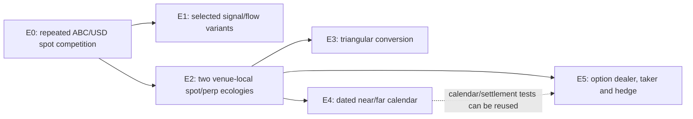

# Repeated-strategy market ecology: development plan (NOT AUTHORIZED TO RUN)

Planning source: `main` at `ef61b4cb6e0124aa797f281e379ab143e847646e` (2026-09-26); locally observed compiler `go1.27.0 linux/amd64`, while `go.mod` declares Go 1.25. No executable candidate or binary is pinned by this planning record. This is a design and readiness record, not a locked protocol, simulator result, scientific freeze, or permission to allocate seeds. See the [policy contracts](policy-contracts.md), [mathematical notes](mathematical-notes.md), [E0 draft](config-drafts/e0-repeated-spot.md), [E2 draft](config-drafts/e2-two-venue-funding.md), and [readiness record](readiness.json).

## Question and boundary

The first economic question is whether inventory-aware quoting changes the distribution of carried inventory, fee-net benchmark-relative wealth, and liquidity when four finite makers compete for recurring finite-resource demand in one spot book. A mixed population tests competition within the same order book; pure-only worlds are not enough. The second question is whether an explicit finite-life spot/perpetual carry desk is economically viable and changes basis under two different funding clocks, without assuming profitable arbitrage or a shared wallet.

These questions start a repeated-interaction platform. They are not another first-action execution study, and they do not establish equilibrium, stationary price levels, capital capacity, or empirical realism. The completed [ME-001](../ideas/ME-001/report.md), [ME-002](../ideas/ME-002/report.md), [ME-003](../ideas/ME-003/report.md), [ME-002-B](../ideas/ME-002-B/report.md), and [ME-005](../ideas/ME-005/report.md) screens remain development results of their own source/config/analyzer revisions. ME-005 had no qualifying executable route in its retained cells. [R2/SV1D](../../v2-r2-sv1d-iteration-closeout.md) stays closed at a valid non-activation boundary. None is a current-`main` long-run world.

Strongest intended claim after future authorization: **simulation-internal causal development contrast** between a small, pinned set of policy rosters. At this planning stage the claim is only mechanical/design readiness. A valid null, loss, no-trade, one-sided book, or unavailable terminal valuation stays in the inventory.

## Verified platform inventory and precise gaps

Statuses apply to the proposed E0/E2 use, not to the existence of a named class. “Implemented” below never means independently reconstructed in these new worlds. The current multivenue builder in [`simulations/multivenue/sim.go`](../../../simulations/multivenue/sim.go) defaults `SpotMakerCount` to two and `FuturesMakerCount` to one and validates positive option/noise populations; a one-book E0 cannot be expressed by setting its counts to zero. Its central builder is an experiment adapter, not an extensible library contract.

| Needed capability | Source and present evidence | E0/E2 disposition and acceptance check |
|---|---|---|
| Deterministic actor/venue assembly and delayed gateways | [`simulation/runner.go`](../../../simulation/runner.go), [`simulation/venue.go`](../../../simulation/venue.go), [`actor/actor.go`](../../../actor/actor.go); ME-002/002-B timing evidence | Usable as-is as primitives. A bounded, externally composed scenario adapter must assemble one book or two venue-local books without changing core defaults. Compare identical-policy replicas under swapped slot IDs to test ordering bias. |
| FIFO matching, admission, fees and ledgers | [`exchange/exchange.go`](../../../exchange/exchange.go), [`matching/default.go`](../../../matching/default.go); ME-000/001/003 mechanical coverage | Usable as-is, with explicit price/lot/fee configuration. Independently reconcile orders, fills, cancels, cash/base transfers and fee sink in the new roster. |
| Symmetric recurring maker | [`simulations/multivenue/naive.go`](../../../simulations/multivenue/naive.go) `FixedDistanceMaker` | Bounded adapter. It quotes repeatedly on a delivered midpoint, but its cap checks filled inventory, not worst-case outstanding plus in-flight buy/sell exposure. Enforce one shared hard working cap; test simultaneous pending orders and delayed cancel/ack. |
| AS-style recurring maker | [`simulations/multivenue/stoikov.go`](../../../simulations/multivenue/stoikov.go) `StoikovMM`, `CalculateStoikovQuote` | Bounded adapter and evidence test. The implemented approximation has a rolling risk horizon and EWMA log-variance; configured fill decay is not a fitted delivered-data estimator, and `InventoryLimit` clamps skew rather than enforcing a hard position ceiling. No claim of AS optimality. |
| Imbalance maker | [`simulations/multivenue/naive.go`](../../../simulations/multivenue/naive.go) `ImbalanceMaker` | Deferred E1. It is a fixed-distance lean/suppression control, **not** an imbalance-adjusted AS solution. Need a separate zero-signal nesting test for any new AS variant. |
| Recurring demand and finite round trips | [`simulations/feesim/taker.go`](../../../simulations/feesim/taker.go) `RandomTaker`; [`simulations/multivenue/roundtrip.go`](../../../simulations/multivenue/roundtrip.go) | Usable with bounded spot-only roster adapter. Delivered visible-depth truncation means attempted demand is not guaranteed execution; retain no-order decisions. Round trips close actual residual, subject to horizon censoring. |
| Initial liquidity | [`simulations/multivenue/bootstrap.go`](../../../simulations/multivenue/bootstrap.go) | Current `BootstrapDepth` refills missing levels until withdrawal. Incorrect for a finite one-time seed. Add a seed-once wrapper and prove no replenishment after a fill. Seed contributions remain attributed separately. |
| Spot/perp carry lifecycle | [`simulations/multivenue/term_carry.go`](../../../simulations/multivenue/term_carry.go) `TermCarryAllocator` | Candidate for E2, not ready as-is. It has entry/active/unwind states and partial-leg evidence; add a common post-warmup start and prove repeated finite terms or report non-activation. Do not substitute the estimate-only `FundingCarryArbitrageur` in [`funding_carry.go`](../../../simulations/multivenue/funding_carry.go). |
| Funding and borrowing | [`instrument/funding.go`](../../../instrument/funding.go), [`exchange/funding.go`](../../../exchange/funding.go), [`exchange/collateral_interest.go`](../../../exchange/collateral_interest.go) | E2 compressed schedule needs versioned rate precision, averaging, per-venue phases, exact settlement/rounding and missing-mark behavior. Current integer-bp latest-premium formula is not a time-scaled compressed contract. Regime A has no borrowing; Regime B needs a separate financing gate. |
| Dated/options lifecycle and calendar | [`instrument/calendar.go`](../../../instrument/calendar.go), [`simulations/derivsim/optionmm.go`](../../../simulations/derivsim/optionmm.go) | Deferred E4/E5. Existing mechanics and old historical activation do not prove a new integrated lifecycle. Reuse expiry identity and validate new actor/settlement chains. |
| Canonical evidence and independent reconstruction | [`evstream/reader.go`](../../../evstream/reader.go), existing ME result analyzers | Existing format usable. Need E0/E2 account- and market-series reconstruction, observation frontier, funding/payment identities, failed valuation labels, and corruption fixtures. No serialization migration. |

## Entity contract and dependency ladder

Policy means objective, signal, state and action rule; actor means a policy instance with endowment, liabilities, account and finite limits; deployment means feed/order/response paths, processing and clocks; venue means matching, fees, admission and lifecycle. A policy type never implies fast access, a larger bankroll, or a particular venue. These components must be composed from outside reusable library internals. The scenario adapter may configure them; adding a user-defined policy must not require a core enum or a central source registry.

Only E0 and E2 have concrete designs now. E1 is a selected panel of existing imbalance lean, short/long momentum, and short/long rolling-price mean reversion after their conditional policy tests—not a full Cartesian product. E3 needs ABC/USD, CDF/USD and ABC/CDF executable bid/ask paths, fee assets, minimum lots, three non-atomic legs, residual closeout and genuine demand for both risky assets. Prior CDF survival results remain historical constraints, not an outcome prediction. E4 uses overlapping near/far expiry identities, finite carry, roll and multiple settlement cycles; no price-convergence force. E5 starts with one expiry/three strikes, one dealer, one explicit end-user motive and actual delta hedge; flat/model volatility is an assumption, not observed market IV. E3 and E4 are sibling extensions, not prerequisites for each other. No extension is authorized to run by this plan.

## E0: chosen first baseline

The [draft](config-drafts/e0-repeated-spot.md) declares one ABC/USD FIFO book, a finite seed-once opening quote, four equal-resource maker slots, four recurring spot random takers and two finite round-trip demand actors. Pure fixed-distance, pure AS, two mirrored mixed assignments, and a capital-only idle-funding control make five proposed arms. No derivatives, funding, cross-venue router, perpetual mark or option flow is silently present. All orders go through the same venue and delayed gateways. The pure maker is a competent risk-limited opponent, not a deliberately disabled straw man.

Spot actors receive local public snapshots only after the same synthetic directed delay. Both makers use the same delivered own-book midpoint and matching/admission rules. Pure quotes a declared fixed distance; AS uses a rolling risk horizon and variance estimate from delivered history. Its fill-decay prior/estimator and hard cap are readiness work, not accomplished facts. Random demand is an intentionally uninformed benchmark; a round-trip actor has a finite holding mandate. The seed actor posts once and is included as a measured, finite third-party liquidity source.

Observation: 10 simulated minutes fixed warm-up plus 45 minutes measurement, with a later 90-minute robustness horizon requiring separate authority. World rather than fill is the uncertainty unit. The 5-arm × at most 3 development-seed screen would be 15 economic worlds plus 2 technical controls, **not reserved or authorized now**. The primary outcome is fee-net change in maker wealth relative to simply retaining the initial endowment, with inventory and valuation availability reported. Per-actor inventory, working-capital use, depth contribution and conditional fills are necessary to interpret a negative or zero contrast. A higher idle-cash denominator alone is not “capacity.”

Falsifier of the narrow inventory-response hypothesis: with valid delivered information and matched feasible exposure, the AS policy fails the declared signed-inventory/quote-skew relation in synthetic and production-path fixtures; or the production intervention does not materially change realized inventory-risk distribution within this tested ecology. The latter is a development null, not proof of policy equivalence. No price-level stationarity is assumed or required.

## E2: chosen next integrated baseline

The [draft](config-drafts/e2-two-venue-funding.md) retains repeated spot competition on each of two separately funded venues, adds recurring perp makers/takers, and introduces one finite lifecycle-bearing carry account per venue only in ON. OFF keeps identical endowed idle accounts and background actor IDs. No automatic inventory transfer or shared wallet exists. Venue N settles every 5 simulated minutes; venue S every 8 minutes with a +60-second phase. Twenty minutes of warm-up precede 120 minutes of observation: roughly 24 versus 15 scheduled observation-window payments *if* the clocks settle, not 24 versus 15 observed cashflows. Carry terms span six N payments (30 minutes) or four S payments (32 minutes); entry and unwind remain exposed to fills, fees, missing marks and horizon censoring.

The compressed contract must scale rates and caps by time, average venue-local premiums over an explicit window, and carry sub-basis-point/payment remainders deterministically. Merely lowering `FundingIntervalSeconds` would be an economic change with no accepted rate normalization. Borrow is disabled in Regime A. The OFF/ON contrast is about costed, completed term cashflows and their local basis response. An ON desk that never enters is valid evidence of limited natural opportunity, not an invalid process. A profitable term does not by itself prove venue synchronization. Proposed screen: OFF/ON × at most 3 development seeds = 6 economic worlds plus 2 controls, **not authorized**.

Native-time alternative: retain an 8-hour and 12-hour settlement schedule and observe roughly 96 hours after warm-up. This avoids compressed-rate semantics but is currently a much larger resource and market-survival question. It is not the chosen first implementation. The compressed world is a research model, not a literal accelerated real exchange.

## Capital, time and causal discipline

Regime A is fixed-roster abundant **finite** cash/base/collateral with a separately fixed working limit and no recapitalization. Balance, inventory, realized/marked PnL and limitations persist across ticks. A doubled *idle* funding control holds quote size and hard limit fixed; only a denominator should change unless ordinary balance constraints were unexpectedly binding. This is a check, not a capital-capacity frontier. Random takers may lose trading PnL under an exogenous execution motive; that loss is not an implementation error. Initial risky endowments require a passive/endowment benchmark.

Regime B is a separate later study in which a documented `capital -> order/risk/exposure` mapping binds. It must distinguish added capital, fixed-total redistribution, actor-count fragmentation and competitor capital. Regime C—reinvestment, allocator entry/exit and learned adaptation—is still later. Neither is included in E0/E2. Ledger assets/cash/debt reconcile with explicit sinks; aggregate marked wealth need not remain constant.

E0 and E2 use one-second logical steps for the draft. All order, feed, response and computation delays are simulated events, not host sleeps. Equal-deployment controls isolate policy first; only a later contrast swaps deployment classes across actor slots. Slower processing must specify a fixed information frontier, queued/coalesced intervening messages, overlap policy and service-time-overrun behavior before it becomes an experiment. No geographic latency claim is made.

Initial `$50,000/ABC` and finite seed orders are explicit primitives. Subsequent prices arise from order interaction; no permanently refilled depth, hidden fair-value oracle or scripted price path maintains a result. An optional private-value benchmark would be a new, labeled external anchor condition, not evidence of emergent mean reversion. Market survival, sufficient two-sided valuation and absolute price stationarity are separate outcomes. The current own-mid policies may have no absolute restoring anchor; inspect drift rather than assume it away.

## Evidence, interpretation and bounded future execution

Reconstruct for each actor/venue: delivered observation frontier and age; scheduled/realized decision and order-arrival times; request/admission/rejection/cancel/fill identities; quote lifetime and displayed/resting depth; cash/base/debt/collateral/fees/funding; working-capital headroom and denied actions; realized plus marked trading wealth against passive initial holdings; actual unwind versus hypothetical executable terminal closeout. For the market: valid two-sided mid, transaction price, spread, depth, imbalance, volume, return dependence across horizons, one-sided duration, basis, funding eligibility/payment, and class concentration. No-event, rational abstention, economic loss, unpriceable mark and invalid evidence are different states. Signed-price log/ratio statistics are unavailable outside their declared positive domain. Markout is not automatically causal impact, and quote-mediated response is distinct from a fill-mediated one.

Registered contrasts need matched rosters and explicit RNG stream alignment; equal world seeds alone do not ensure common shocks if an intervention changes draw consumption. Analyze three independent worlds as three screen observations, not thousands of fills. Keep all cells, including failed valuation and no-trade, and do not select a profitable seed. A future freeze/confirmation set and compatible primary empirical benchmark require separate protocol and authorization; development seed variation alone is not empirical validation.

Old 30-minute integrated profiling reported about 30 seconds wall, 0.8 GiB RSS and 0.64 GiB raw evidence; the [ME-005 five-minute report](../ideas/ME-005/report.md) recorded about 189 MB of retained output across its cells. These are **not** measured E0/E2 scaling coefficients. A planning envelope is at most 4 CPU workers/8 GiB RAM, sequential cells, ≤1.5 GiB E0 and ≤4 GiB E2 retained output per future cell, ≤20/45 minutes wall per cell, and ≥10 GiB free-disk reserve after accounting for extraction staging. At 15+6 proposed economic worlds, a pessimistic output ceiling is 46.5 GiB before controls/staging; current free space does not itself certify that campaign. A future measured capacity preflight must replace these estimates. No cleanup, evidence deletion or guard reduction is implied.

## Prioritized implementation and validation sequence (future authority required)

1. **PR1, first milestone:** an externally composed one-book E0 scenario adapter; finite seed-once actor; equal-resource pure/AS/taker/round-trip roster; immutable effective-config export; integrated fixture proving repeated decisions, ordinary fills/cancels, no derivative books, finite seed and no hidden replenishment. This is one reusable environment, not an all-strategy world.
2. **PR2:** shared worst-case working-position guard including live and in-flight orders; delivered-past AS estimator with declared sparse-data prior; matched cancel/post-only lifecycle; account/PnL/endowment and observation evidence plus corruption tests. Validate exact policy behavior, race/determinism and evidence neutrality. Any source change is reviewed before economic worlds.
3. **PR3:** E2 composition extension to two segregated venues, venue-local spot/perp marks, versioned funding-rate precision and window, deterministic remainder accounting, explicit phase, lifecycle-bearing term desk with post-warmup start and actual unwind. Test multiple settlement boundaries and conservation on both venues before proposing worlds.
4. **Registered development only after separate owner authorization:** lock a protocol, obtain bounded mechanics and causal-design reviews, measure capacity, run the finite matrix and reconstruct evidence independently. A valid null is retained. Later E1/E3/E4/E5 and Regime B/C get separate child studies.

An earlier independent Sol-6 medium **source-only planning review** found E0 plausible but execution-blocked by cap/pending semantics, one-book assembly, seed replenishment, common quote lifecycle and arm-neutral evidence. It found E2 plausible but execution-blocked by time-scaled funding/precision/window, lifecycle-bearing desk, equal OFF/ON accounts and payment coverage. One reviewer inspected two scopes; that conversational feedback is not a retained signed review of this completed package. A fresh reviewer of these exact documents was unavailable because the agent thread limit was reached; execution `UNAVAILABLE`, verdict `NOT_ISSUED`. No code, candidate protocol or world was approved. See `readiness.json` for the scoped findings. The next owner decision is whether to authorize PR1 only, with its acceptance tests—not to authorize a world from these draft numbers.
