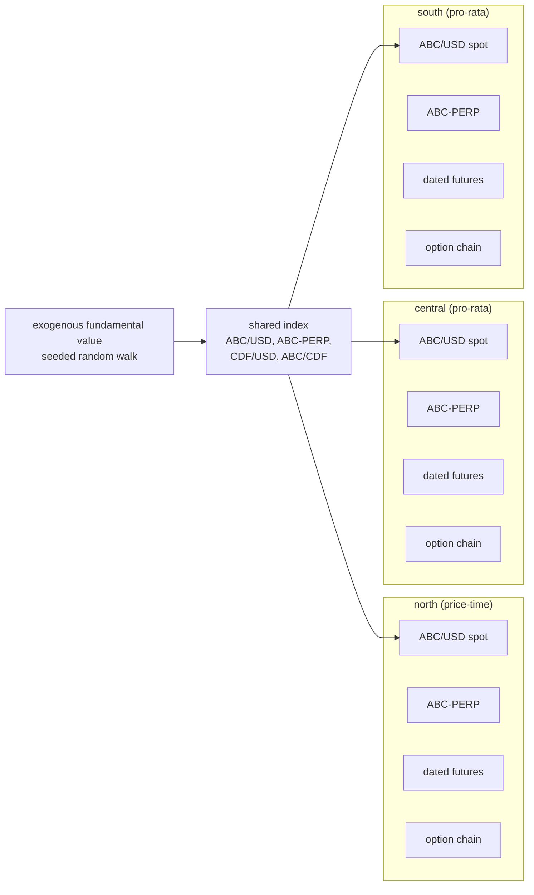
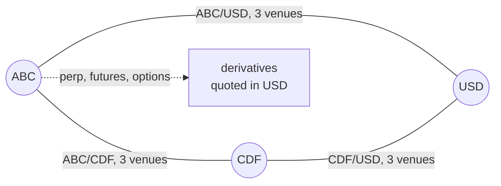
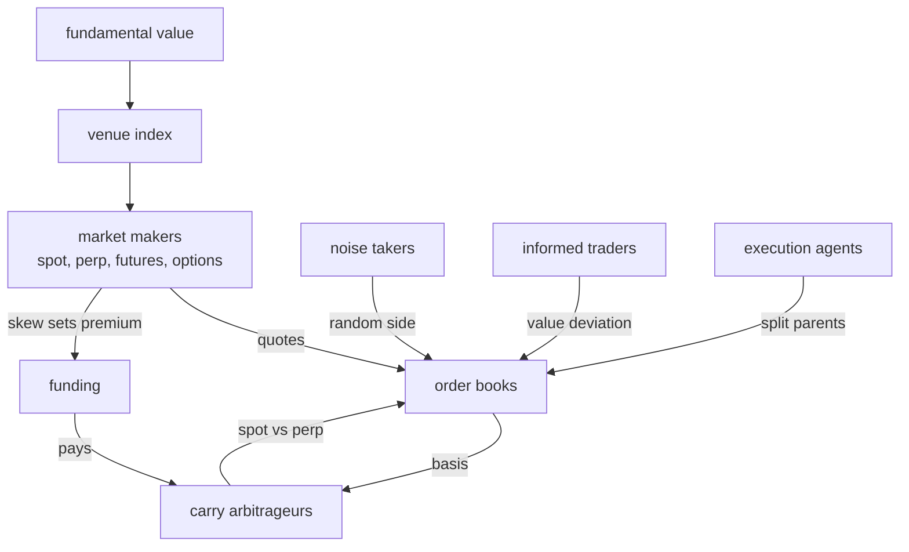

# What the simulation currently is

Scenario package `simulations/multivenue`, driven by `cmd/multivenue` with a
JSON config. Everything below is the default unless a config field is named.

## Venues

Three independent exchanges on one deterministic clock: **north**, **central**,
**south**. They share no accounts, no balances and no clearing. A participant
that wants to be on two venues holds a separate funded account on each.

Matching rule is per venue (`venue_rules`): the campaign's control runs north
on price-time and central and south on pro-rata.

## Assets and markets

Three assets: **ABC** (the traded base), **CDF** (a second base), **USD** (the
numeraire). Precisions are 1e8 for ABC and CDF, 1e5 for USD.

| market | type | listed | quote | note |
| --- | --- | --- | --- | --- |
| ABC/USD | spot | always, on all three venues | USD | the main pair; the campaign's measurements are on it |
| ABC-PERP | perpetual | always, on all three venues | USD | funding every 8h by default, capped at 75bps |
| ABC-FUT-\<expiry\> | dated future | rolling | USD | two tenors live at a time |
| ABC-\<expiry\>-\<strike\>-C/P | European option | rolling | USD | cash settled |
| CDF/USD | spot | only with `cross_asset_spot_graph` | USD | |
| ABC/CDF | spot | only with `cross_asset_spot_graph` | CDF | the cross-listed pair |

**Cross listing.** ABC is the only cross-listed asset, and in two senses: it
trades against USD on all three venues, and against CDF as well when the cross
graph is enabled. CDF trades only against USD and against ABC. There is no
CDF perpetual, no CDF future and no CDF option, so CDF has spot markets only.

## Derivative schedules

Both listers roll: a contract is created for its full configured tenor from the
moment of listing, and a fresh generation appears once the previous one
expires. There is no calendar alignment, which was a defect fixed earlier in
the campaign.

| contract | tenors | strikes |
| --- | --- | --- |
| dated futures | 8h and 72h | — |
| options | 6h and 48h | 5 per expiry: at the money and two either side, 1,000 USD apart |

Options are European and cash settled against the venue's settlement price.
The chain recentres as spot moves, subject to a cap of
`option_max_strikes_per_expiry` live strikes per expiry, so a drifting price
does not grow the board without bound.

At the default of 5 strikes over 2 expiries, both calls and puts, a venue
carries **20 live option contracts** plus 2 dated futures and 1 perpetual, so
23 derivative books per venue and 69 across the scenario.

## Participants

All are venue-local unless stated. Counts are per venue.

| class | default count | what it does |
| --- | --- | --- |
| spot maker | 2 | Avellaneda-Stoikov quoting on ABC/USD around the index |
| CDF and cross makers | 2 each | the same on CDF/USD and ABC/CDF, when the cross graph is on |
| perpetual maker | 1 | quotes ABC-PERP; absorbs one-sided derivative flow |
| futures maker | 1 | quotes the dated ladder |
| option dealer | 1 | quotes the whole chain from Black-76, hedges delta on spot |
| noise takers | 8 | independent side each interval |
| informed value traders | 2 | trade the spot book against the fundamental |
| carry arbitrageurs | 2 | long spot against short perpetual, delta neutral |
| round-trip traders | configurable | open a position and unwind it after a hold |
| elastic suppliers | configurable | target position falls as price rises |
| execution agents | configurable | split Pareto-sized parent orders at a participation rate |
| latent liquidity | configurable | diffusing reservation prices that become orders |
| cross-venue routers | configurable | two-leg arbitrage across venues, with modeled latency |

## Known limitation to read the numbers against

In a population of two spot makers and eight noise takers, the makers
accounted for 29,632 and 29,566 units of fills over three simulated hours
while each noise taker traded about three. Over 99.5% of volume is the two
makers crossing each other. Any statistic taken from the trade tape — traded
volume, the sign autocorrelation, the supply curve — is therefore dominated by
maker-to-maker crossing rather than by directional demand, and this is being
investigated next.

## Status of the derivative and linear markets (2026-08-16, later)

This section updates the one above. The limitation described there has since
been diagnosed and is largely resolved; read this section in preference.

### The linear (spot and perpetual) side

The spot books were not continuously quoted. The Stoikov makers cancelled and
resubmitted their quotes inside the same simulation step, so 99.5% of steps
contained an instant with both sides of the book empty. Because the runtime is
phase-ordered, an actor whose turn falls in that instant meets it every step.

The measured effect was that most participants could not trade at all. Fraction
of submitted orders that filled, per class:

| class | order style | cancel-first | atomic replacement |
|---|---|---|---|
| spot makers, option dealers | resting limit | normal | normal |
| noise flow | market | 44.9% | 99.9% |
| dated carry desk | IOC limit | 11.2% | 101.5% |
| carry arbitrage | IOC limit | 3.4% | 102.8% |
| metaorder traders | IOC limit | 4.1% | 99.7% |
| round-trip traders | IOC limit | 0.008% | 4.2% |

`spot_maker_submit_before_cancel` submits replacement quotes before cancelling
the previous ones. It repairs the whole population, and flips the sign of five
classes' payoffs — perpetual makers from −68,864 to +490,289 per member, noise
flow from +10,123 to −9,570, elastic suppliers from +29,940 to −190,692. The
economics improve: noise traders were profitable only because they could not
trade, and a random taker paying five basis points should lose.

Two distinct failure modes turned out to be involved. A passive ladder that
never reprices (`bootstrap_depth_count`) drives the empty-step fraction to zero
and repairs market-order takers, while leaving IOC-limit takers broken. Market
orders need depth to exist; IOC limits need depth at the price they targeted,
which only continuous presence of the touch provides.

The maker share of volume was largely an artifact of size, not behaviour.
Pairing fills by trade identifier, maker-versus-maker crossings are 9.5% of
trades under cancel-first quoting and 19.8% under atomic replacement, against
89.8–95.4% of volume, because makers quote five units while takers trade small
lots. Setting `maker_inventory_skew_bps` to zero cuts the crossing rate to 5.6%
of trades, confirming skew divergence between two makers sharing an index
anchor as the driver.

### The derivative side

Derivatives were unaffected by the spot execution failure, because option flow
trades against dealer quotes on option books rather than through the spot
makers. The three dealer-competition arms re-run after the fix reproduce to
within about one percent.

**Options are now many-against-many.** `option_dealer_count` and
`option_flow_count` are configurable, defaulting to one and two per venue.
Competing dealers price rather than merely split the rent:

| dealers/venue | flow/venue | dealer per member | option taker per member |
|---|---|---|---|
| 1 | 2 | 229,848 | −119,216 |
| 3 | 2 | 39,415 | −63,062 |
| 3 | 6 | 234,800 | −121,843 |

Dealer income is set by the flow-to-dealer ratio rather than the dealer count:
predicting (flow ÷ dealers) × per-flow loss gives 238,432, 42,041 and 243,686
against the measured values. With flow held fixed, tripling the dealers halves
what each option taker loses, so the rent is transferred to the flow rather
than redistributed among dealers.

**Dated futures are alive but thin.** They were economically inert until this
week for a structural reason: the futures maker quoted its mid at exactly the
spot mid, so the basis was identically zero and no carry desk could fire at any
positive edge. `futures_maker_self_anchored` lets each dated book price from its
own trades, which takes the futures maker from −0.94 to +12,799 per member.
`dated_carry_arb_count` and `parity_arb_count` populate the classes that take
the other side; both existed in `derivsim` and had simply never been wired into
this population. The dated ladder still carries far less flow than the option
chain.

**The option dealer is not yet a Black–Scholes dealer.** It quotes a flat
configured implied volatility with a per-lot skew, so there is no volatility
surface and no smile dynamics. This is the largest remaining gap on the
derivative side.

### What the environment does not yet model

- A pure fixed-spread market maker competing on spot. One exists as the futures
  maker, but the spot books carry only Stoikov makers.
- Cancel and new latency. Quote replacement currently resolves inside one phase,
  which is what created the failure mode above; real asymmetric latency would
  smear it across phases and has not been tested.
- Realistic index quality. The published index is a zero-lag, noise-free channel
  to the exogenous fundamental, so an actor quoting directly on it holds perfect
  information. A never-repricing ladder that does exactly that earns 191,447 per
  member at baseline volatility and 23,212,665 at twenty times that volatility,
  which is a property of the feed rather than of the strategy. A degradable feed
  (`degraded_index`, lag and observation noise) has just been added and the
  falsification run is in flight.

### A regime boundary worth knowing about

At twenty times baseline fundamental volatility every maker class is destroyed
and every taker class profits: perpetual makers −30,716,702 per member, option
dealers from +233,013 to −517,114, futures makers from +13,585 to −382,527,
noise flow from +19 to +213,232. Conservation checks out against fees, so this
is a real regime change rather than an accounting artifact. Market making in
this environment has a volatility carrying capacity, and the payoff tables
reported elsewhere describe the low-volatility side of that boundary.
