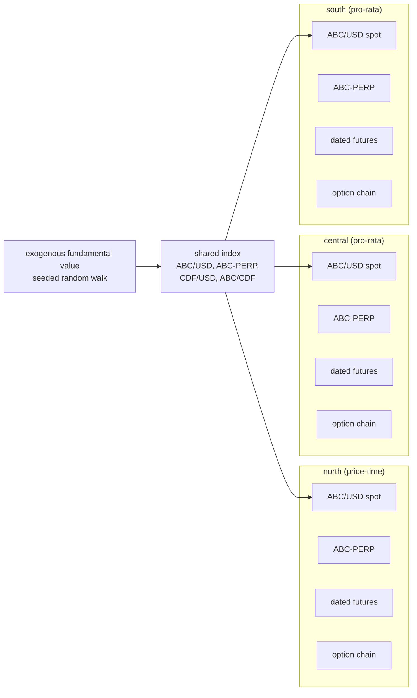
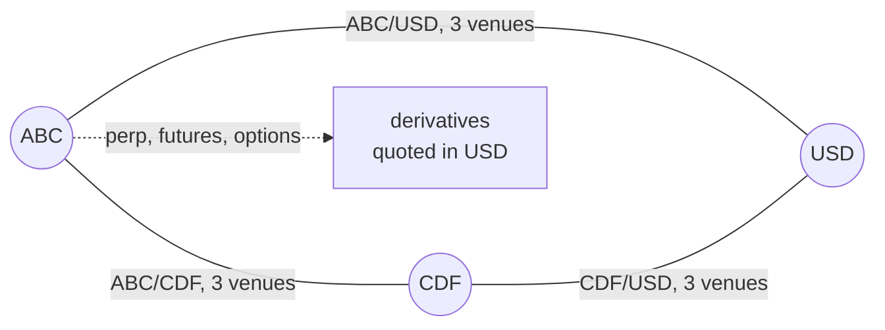
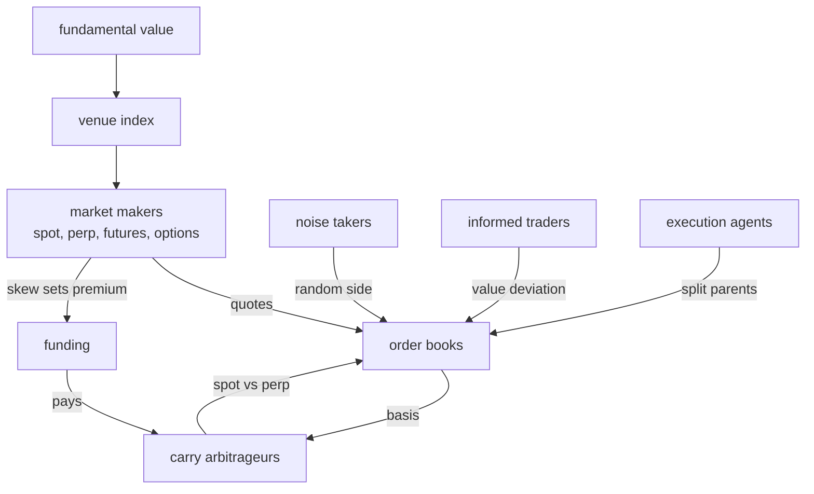

# What the simulation currently is

Scenario package `simulations/multivenue`, driven by `cmd/multivenue` with a
JSON config. Everything below is the default unless a config field is named.

## Venues

Three independent exchanges on one deterministic clock: **north**, **central**,
**south**. They share no accounts, no balances and no clearing. A participant
that wants to be on two venues holds a separate funded account on each.

Matching rule is per venue (`venue_rules`): the campaign's control runs north
on price-time and central and south on pro-rata.

## Assets and markets

Three assets: **ABC** (the traded base), **CDF** (a second base), **USD** (the
numeraire). Precisions are 1e8 for ABC and CDF, 1e5 for USD.

| market | type | listed | quote | note |
| --- | --- | --- | --- | --- |
| ABC/USD | spot | always, on all three venues | USD | the main pair; the campaign's measurements are on it |
| ABC-PERP | perpetual | always, on all three venues | USD | funding every 8h by default, capped at 75bps |
| ABC-FUT-\<expiry\> | dated future | rolling | USD | two tenors live at a time |
| ABC-\<expiry\>-\<strike\>-C/P | European option | rolling | USD | cash settled |
| CDF/USD | spot | only with `cross_asset_spot_graph` | USD | |
| ABC/CDF | spot | only with `cross_asset_spot_graph` | CDF | the cross-listed pair |

**Cross listing.** ABC is the only cross-listed asset, and in two senses: it
trades against USD on all three venues, and against CDF as well when the cross
graph is enabled. CDF trades only against USD and against ABC. There is no
CDF perpetual, no CDF future and no CDF option, so CDF has spot markets only.

## Derivative schedules

Both listers roll: a contract is created for its full configured tenor from the
moment of listing, and a fresh generation appears once the previous one
expires. There is no calendar alignment, which was a defect fixed earlier in
the campaign.

| contract | tenors | strikes |
| --- | --- | --- |
| dated futures | 8h and 72h | — |
| options | 6h and 48h | 5 per expiry: at the money and two either side, 1,000 USD apart |

Options are European and cash settled against the venue's settlement price.
The chain recentres as spot moves, subject to a cap of
`option_max_strikes_per_expiry` live strikes per expiry, so a drifting price
does not grow the board without bound.

At the default of 5 strikes over 2 expiries, both calls and puts, a venue
carries **20 live option contracts** plus 2 dated futures and 1 perpetual, so
23 derivative books per venue and 69 across the scenario.

## Participants

All are venue-local unless stated. Counts are per venue.

| class | default count | what it does |
| --- | --- | --- |
| spot maker | 2 | Avellaneda-Stoikov quoting on ABC/USD around the index |
| CDF and cross makers | 2 each | the same on CDF/USD and ABC/CDF, when the cross graph is on |
| perpetual maker | 1 | quotes ABC-PERP; absorbs one-sided derivative flow |
| futures maker | 1 | quotes the dated ladder |
| option dealer | 1 | quotes the whole chain from Black-76, hedges delta on spot |
| noise takers | 8 | independent side each interval |
| informed value traders | 2 | trade the spot book against the fundamental |
| carry arbitrageurs | 2 | long spot against short perpetual, delta neutral |
| round-trip traders | configurable | open a position and unwind it after a hold |
| elastic suppliers | configurable | target position falls as price rises |
| execution agents | configurable | split Pareto-sized parent orders at a participation rate |
| latent liquidity | configurable | diffusing reservation prices that become orders |
| cross-venue routers | configurable | two-leg arbitrage across venues, with modeled latency |

## Known limitation to read the numbers against

In a population of two spot makers and eight noise takers, the makers
accounted for 29,632 and 29,566 units of fills over three simulated hours
while each noise taker traded about three. Over 99.5% of volume is the two
makers crossing each other. Any statistic taken from the trade tape — traded
volume, the sign autocorrelation, the supply curve — is therefore dominated by
maker-to-maker crossing rather than by directional demand, and this is being
investigated next.
